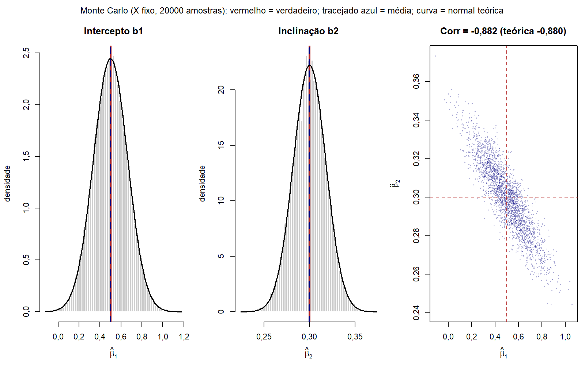
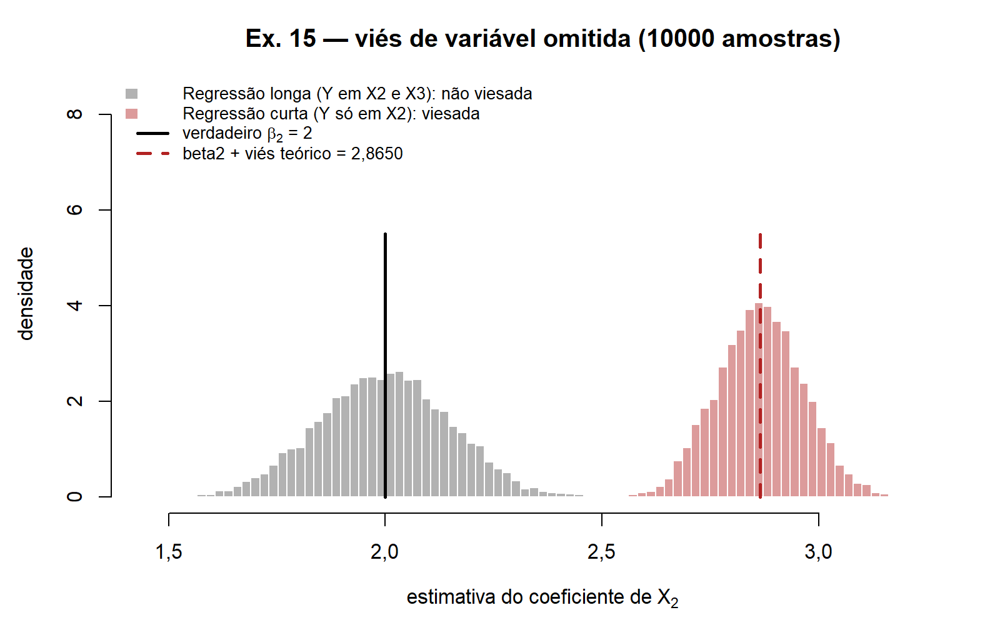
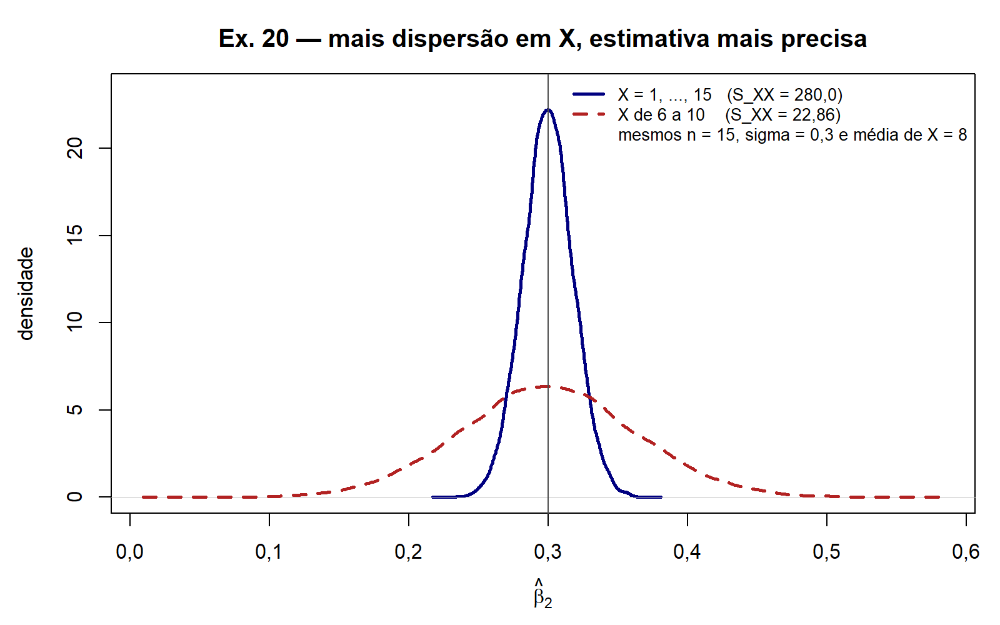
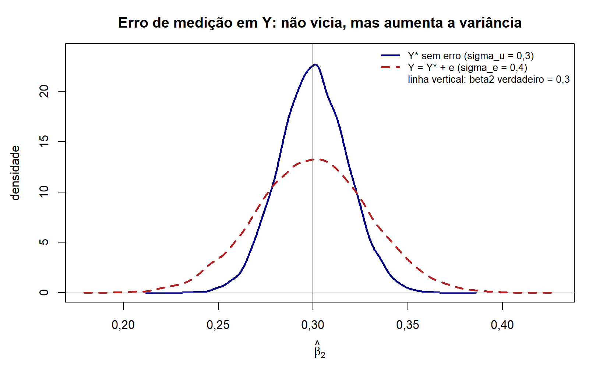
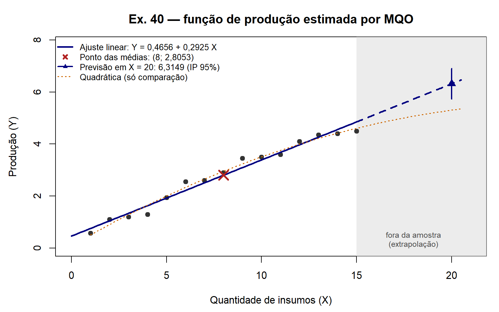
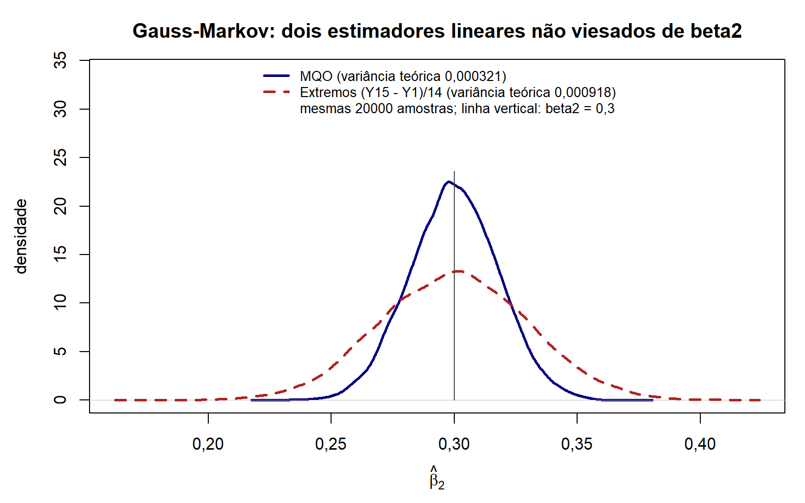

# Módulo 02 — MQO na regressão simples: teoria e demonstrações

Hub: [README](README.md) · Exercícios: [02_lista1.md](02_lista1.md) · Script: [02_mqo_simples.R](02_mqo_simples.R) · Notas antigas do aluno: [MQO — regressão simples](mqo-regressao-simples.md) e [Derivação completa](mqo-derivacao-completa-passo-a-passo.md) · Núcleo D0–D16: [demonstrações do 1º mês](../demonstracoes/econometria-i-demonstracoes-mes-1-1.md)

## 0. Mapa

> [!NOTE]
> **O que este módulo entrega**
> A regressão simples completa na notação da Lista 1 ($\beta_1$ é o intercepto). O núcleo já escrito (D3–D11: equações normais, $\hat\beta$, não-viés e variância da inclinação, Gauss-Markov) é citado e não repetido. Aqui entra o que falta para a P1: solução por Cramer, não-viés **do intercepto**, $\operatorname{Var}(\hat\beta_1)$, $\operatorname{Cov}(\hat\beta_1,\hat\beta_2)$, não-viés de $\hat\sigma^2$, viés de omissão, $t^2=F$, $F$ via $R^2$, $R^2=r^2$, erro de medição em $Y$, previsão e elasticidade, e Gauss-Markov para o intercepto.

| D | Resultado | Hipóteses | Lista 1 / prova |
|---|---|---|---|
| D02.1 | Equações normais em somas e solução por Cramer | A2 | ex. 13b, 40; Q3 P1 2025/2 |
| D02.2 | Propriedades algébricas de $\hat u_i$ e $\hat Y_i$ | A2 + constante | ex. 17, 21 |
| D02.3 | Regressão em desvios da média | A2 + constante | ex. 22 |
| D02.4 | $\hat\beta_1=\sum w_iY_i$ e $\hat\beta_2=\sum k_iY_i$: pesos e propriedades | A2 | base de D02.5–D02.16 |
| D02.5 | Não-viés de $\hat\beta_2$ **e** de $\hat\beta_1$ | A1–A3 | ex. 14 |
| D02.6 | $\operatorname{Var}(\hat\beta_2)$ e $\operatorname{Var}(\hat\beta_1)$ | A1–A4 | ex. 16 |
| D02.7 | $\operatorname{Cov}(\hat\beta_1,\hat\beta_2)=-\bar X\sigma^2/S_{XX}$ | A1–A4 | ex. 16 |
| D02.8 | $E[\hat\sigma^2]=\sigma^2$ com $\hat\sigma^2=\sum\hat u_i^2/(n-2)$ | A1–A4 | ex. 18 (o MSQRES) |
| D02.9 | Viés de variável omitida: $\beta_3\sum x_2x_3/\sum x_2^2$ | A1–A3 (modelo verdadeiro) | ex. 15 |
| D02.10 | SQT = SQE + SQR e $R^2=r_{XY}^2$ | A2 + constante | ex. 19, 41c |
| D02.11 | $t^2=F$ | A1–A6 | ex. 18 |
| D02.12 | $F=R^2/[(1-R^2)/(n-2)]$ | A2 + constante | ex. 19 |
| D02.13 | Dispersão de $X$, precisão e consistência de $\hat\beta_2$ | A1–A4 | ex. 20 |
| D02.14 | Erro de medição em $Y$: não vicia, aumenta a variância | A1–A4 + hipóteses do erro | Q4 P1 2025/2; ex. 70 |
| D02.15 | Previsão (média e individual) e elasticidade no ponto médio | A1–A4 (A6 para o intervalo) | ex. 40d–e |
| D02.16 | Gauss-Markov para o intercepto e para $\lambda_1\beta_1+\lambda_2\beta_2$ | A1–A4 | ex. 13c |

**Dependências.** D3 → D02.1 → D02.2 → D02.3 → D02.10 → D02.11, D02.12. D9 → D02.4 → D02.5 → D02.6 → D02.7 → D02.15, D02.16. D02.5 + D02.6 → D02.8. D02.4 → D02.9 e D02.14.

> [!WARNING]
> **A letra minúscula muda de sentido entre as notas**
> No núcleo D0–D16 e nas notas antigas, $x_i$ é a variável em nível e o intercepto é $\beta_0$. Na Lista 1 (e aqui), $x_i=X_i-\bar X$ é o **desvio** e o intercepto é $\beta_1$. Quando citar "ver D9", troque $\beta_1\to\beta_2$ e $x_i\to X_i$. Na prova, use a notação do enunciado.

## 1. Notação e hipóteses

- Modelo: $Y_i=\beta_1+\beta_2X_i+u_i$, $i=1,\dots,n$. Ajuste: $\hat Y_i=\hat\beta_1+\hat\beta_2X_i$; resíduo $\hat u_i=Y_i-\hat Y_i$.
- Desvios: $x_i=X_i-\bar X$, $y_i=Y_i-\bar Y$, $\hat y_i=\hat Y_i-\bar Y$.
- Somas: $S_{XX}=\sum x_i^2$, $S_{XY}=\sum x_iy_i$, $S_{YY}=\sum y_i^2$.
- Pesos: $k_i=x_i/S_{XX}$ (inclinação) e $w_i=1/n-\bar Xk_i$ (intercepto), ver D02.4.
- "Dado $X$" significa condicionado ao vetor inteiro $X=(X_1,\dots,X_n)$. Com $X$ fixo em amostras repetidas (a hipótese do Gujarati, que a Lista segue), o condicionamento é trivial e $E[\cdot\mid X]=E[\cdot]$.
- Graus de liberdade: $n-2$ (convenção da Lista; é o $n-K$ do Greene com $K=2$).

**Hipóteses na forma escalar** (as mesmas A1–A6 da [CONVENCOES](../CONVENCOES.md), com $X=[\iota\;\;X]$ de dimensão $n\times 2$):

| Id | Forma escalar | Para que serve aqui |
|---|---|---|
| A1 | $Y_i=\beta_1+\beta_2X_i+u_i$ | substituir o modelo dentro de $\hat\beta$ |
| A2 | $S_{XX}>0$ ($X$ não é constante), equivalente a posto$[\iota\;\;X]=2$ | existência e unicidade de $\hat\beta$ |
| A3 | $E[u_i\mid X]=0$ para todo $i$ | não-viés |
| A4 | $\operatorname{Var}(u_i\mid X)=\sigma^2$ e $\operatorname{Cov}(u_i,u_j\mid X)=0$ para $i\neq j$ | fórmulas de variância, Gauss-Markov |
| A5 | $X$ fixo, ou gerado independentemente de $u$ | justifica tratar $k_i,w_i$ como constantes |
| A6 | $u\mid X\sim N(0,\sigma^2I_n)$ | distribuições exatas $t$ e $F$ |

> [!IMPORTANT]
> **O kit que resolve o módulo inteiro**
> Identidades de soma (D5): $\sum x_i=0$, $\sum x_iX_i=S_{XX}=\sum X_i^2-n\bar X^2$, $\sum x_iY_i=\sum x_iy_i=S_{XY}=\sum X_iY_i-n\bar X\bar Y$.
> Pesos (D9): $\sum k_i=0$, $\sum k_iX_i=1$, $\sum k_i^2=1/S_{XX}$.
> Identidade fundamental (D9): $\hat\beta_2=\beta_2+\sum k_iu_i$. Para o intercepto (D02.5): $\hat\beta_1-\beta_1=\bar u-\bar X(\hat\beta_2-\beta_2)=\sum w_iu_i$.

**Somas de quadrados: as siglas trocam de sentido.** Aqui se usa SQT, SQE, SQR, como no [módulo 05](../05_ajuste_restricoes/05_teoria.md).

| Objeto | Aqui | Lista 1, ex. 19 | Lista 1, ex. 18 | Wooldridge |
|---|---|---|---|---|
| $\sum y_i^2$ | SQT | — | — | SST |
| $\sum \hat y_i^2$ | SQE (explicada) | **SSR** ("regressão") | — | SSE |
| $\sum \hat u_i^2$ | SQR (resíduos) | **SSE** ("resíduos") | — | SSR |
| $\sum \hat u_i^2/(n-2)$ | $\hat\sigma^2$ | — | MSQRES | $\hat\sigma^2$ |

## 2. Demonstrações

### D02.1 · Equações normais em somas e solução por Cramer

> [!NOTE]
> **O que se quer provar**
> Sob [A2], as condições de 1ª ordem de D3 formam o sistema $\sum Y_i=n\hat\beta_1+\hat\beta_2\sum X_i$ e $\sum X_iY_i=\hat\beta_1\sum X_i+\hat\beta_2\sum X_i^2$, cuja solução única é $\hat\beta_2=\dfrac{n\sum X_iY_i-\sum X_i\sum Y_i}{n\sum X_i^2-(\sum X_i)^2}=\dfrac{S_{XY}}{S_{XX}}$ e $\hat\beta_1=\dfrac{\sum X_i^2\sum Y_i-\sum X_i\sum X_iY_i}{n\sum X_i^2-(\sum X_i)^2}=\bar Y-\hat\beta_2\bar X$.

**Por que importa.** É a Q3 da P1 2025/2 e o ex. 13b; a chave do professor responde o 13b exatamente com essas duas frações. A forma de Cramer usa só somas brutas: é o caminho mais rápido quando a prova dá uma tabela de dados (ex. 40). D3, D4 e D6 fazem o mesmo por substituição; aqui se fecha o sistema de uma vez e se prova que as duas formas coincidem.

**Passo a passo.**

1. Minimizar $\mathrm{SQR}(\hat\beta_1,\hat\beta_2)=\sum_i(Y_i-\hat\beta_1-\hat\beta_2X_i)^2$ dá as duas CPO de D3. Distribuindo a soma e usando $\sum_i\hat\beta_1=n\hat\beta_1$: *[D3; linearidade de $\sum$]*

$$
\begin{aligned}
\text{(EN-1)}\quad & \textstyle\sum Y_i = n\hat\beta_1 + \hat\beta_2\sum X_i\\
\text{(EN-2)}\quad & \textstyle\sum X_iY_i = \hat\beta_1\sum X_i + \hat\beta_2\sum X_i^2
\end{aligned}
$$

2. Em forma matricial, é $X'Xb=X'y$ com $X=[\iota\;\;X]$ ($n\times 2$): $(2\times 2)(2\times 1)=(2\times 1)$. *[D13]*

$$
\begin{bmatrix} n & \sum X_i\\ \sum X_i & \sum X_i^2\end{bmatrix}
\begin{bmatrix}\hat\beta_1\\ \hat\beta_2\end{bmatrix}
=\begin{bmatrix}\sum Y_i\\ \sum X_iY_i\end{bmatrix}
$$

3. O determinante é $\Delta=n\sum X_i^2-(\sum X_i)^2=n(\sum X_i^2-n\bar X^2)=nS_{XX}$. Sob [A2], $\Delta>0$ e a solução é única. *[$\sum X_i=n\bar X$; D5]*

4. Regra de Cramer (troca-se a coluna da incógnita pelo lado direito):

$$
\hat\beta_2=\frac{1}{\Delta}\det\begin{bmatrix} n & \sum Y_i\\ \sum X_i & \sum X_iY_i\end{bmatrix}=\frac{n\sum X_iY_i-\sum X_i\sum Y_i}{\Delta},
\qquad
\hat\beta_1=\frac{1}{\Delta}\det\begin{bmatrix} \sum Y_i & \sum X_i\\ \sum X_iY_i & \sum X_i^2\end{bmatrix}=\frac{\sum X_i^2\sum Y_i-\sum X_i\sum X_iY_i}{\Delta}
$$

5. Numerador de $\hat\beta_2$: $n\sum X_iY_i-(n\bar X)(n\bar Y)=n(\sum X_iY_i-n\bar X\bar Y)=nS_{XY}$. Dividindo por $\Delta=nS_{XX}$: $\hat\beta_2=S_{XY}/S_{XX}$. *[D5]*

6. Numerador de $\hat\beta_1$: com $\sum Y_i=n\bar Y$ e $\sum X_i=n\bar X$, fica $n(\bar Y\sum X_i^2-\bar X\sum X_iY_i)$. Somando e subtraindo $n\bar X^2\bar Y$ dentro do parêntese:

$$
\bar Y\textstyle\sum X_i^2-\bar X\sum X_iY_i=\bar Y(\sum X_i^2-n\bar X^2)-\bar X(\sum X_iY_i-n\bar X\bar Y)=\bar YS_{XX}-\bar XS_{XY}
$$

   Dividindo por $S_{XX}$ (o $n$ cancela com o de $\Delta$): $\hat\beta_1=\bar Y-\bar X\,S_{XY}/S_{XX}=\bar Y-\hat\beta_2\bar X$. *[passo 5; D4]*

7. Mínimo: a Hessiana é $2X'X$, com $2n>0$ e determinante $4nS_{XX}>0$. É positiva definida sob [A2]. *[D7]*

$$
\boxed{\hat\beta_2=\frac{n\sum X_iY_i-\sum X_i\sum Y_i}{n\sum X_i^2-(\sum X_i)^2}=\frac{S_{XY}}{S_{XX}},\qquad \hat\beta_1=\frac{\sum X_i^2\sum Y_i-\sum X_i\sum X_iY_i}{n\sum X_i^2-(\sum X_i)^2}=\bar Y-\hat\beta_2\bar X}
$$

> [!TIP]
> **Como o professor pode torcer**
> - **Outra notação** ($y_i=a+bx_i+\varepsilon_i$, como na Q3 de 2025/2): mesmo roteiro, trocando os nomes. Não traduza o enunciado para a sua notação.
> - **Regressão pela origem** ($Y_i=\beta X_i+u_i$): só existe a EN-2, e $\tilde\beta=\sum X_iY_i/\sum X_i^2$, que **não** é $S_{XY}/S_{XX}$. Os resíduos deixam de somar zero (D02.2).
> - **"E se todos os $X_i$ forem iguais?"** Então $\Delta=0$ e há infinitas soluções: [A2] falha e $\beta_2$ não é identificado.
> - **Regressão inversa** ($X$ em $Y$): a inclinação é $S_{XY}/S_{YY}$, e não $1/\hat\beta_2$. O produto das duas inclinações é $r_{XY}^2$ (D02.10).

| chave_R | nota |
|---|---|
| m02_ex40_det | 4200 |
| m02_ex40_Sxx | 280 |
| m02_ex21_semconst_b | 0,3375 |
| m02_ex40_b2 | 0,2925 |

### D02.2 · Propriedades algébricas dos resíduos e dos ajustados

> [!NOTE]
> **O que se quer provar**
> Com intercepto e sob [A2], em **qualquer** amostra: (a) $\sum\hat u_i=0$; (b) $\sum X_i\hat u_i=0$; (c) $\sum x_i\hat u_i=0$; (d) $\sum\hat Y_i\hat u_i=0$; (e) $\bar{\hat Y}=\bar Y$; (f) a reta passa por $(\bar X,\bar Y)$. Nenhuma hipótese estatística (A3–A6) é usada.

**Por que importa.** (a) e (b) são o ex. 17; (e) é o ex. 21; (d) é o que faz SQT = SQE + SQR (D02.10). D8 já provou (a), (b) e a covariância nula; aqui entram (d) e (e) e o que quebra sem intercepto.

**Passo a passo.**

1. (a) e (b) são EN-1 e EN-2 reescritas com $\hat u_i=Y_i-\hat\beta_1-\hat\beta_2X_i$. O ex. 17 escreve (a) como $\sum(Y_i-\hat Y_i)=0$: é a mesma coisa, porque $\hat u_i=Y_i-\hat Y_i$. *[D3]*

2. (c): $\sum x_i\hat u_i=\sum X_i\hat u_i-\bar X\sum\hat u_i=0-0=0$. *[(b) e (a)]*

3. (d): $\sum\hat Y_i\hat u_i=\sum(\hat\beta_1+\hat\beta_2X_i)\hat u_i=\hat\beta_1\sum\hat u_i+\hat\beta_2\sum X_i\hat u_i=0$. *[linearidade de $\sum$; (a) e (b)]*

4. (e): de $Y_i=\hat Y_i+\hat u_i$, somando em $i$, $\sum Y_i=\sum\hat Y_i+\sum\hat u_i=\sum\hat Y_i$. Dividindo por $n$, $\bar{\hat Y}=\bar Y$. *[(a)]*
   Rota alternativa: $\sum\hat Y_i=n\hat\beta_1+\hat\beta_2 n\bar X=n(\bar Y-\hat\beta_2\bar X)+n\hat\beta_2\bar X=n\bar Y$. *[D4]*

5. (f) é D4 relido: $\hat\beta_1+\hat\beta_2\bar X=\bar Y$.

$$
\boxed{\textstyle\sum\hat u_i=0,\quad \sum X_i\hat u_i=0,\quad \sum\hat Y_i\hat u_i=0,\quad \bar{\hat Y}=\bar Y}
$$

> [!WARNING]
> **O que depende do intercepto, e o que é do resíduo (não do erro)**
> - (a), (c), (e) e (f) exigem a EN-1, que só existe se $\beta_1$ for estimado. Pela origem, só (b) sobrevive. No ex. 40, a regressão pela origem dá $\sum\hat u_i=1{,}5771$ e $\bar{\hat Y}=2{,}7002\neq\bar Y=2{,}8053$.
> - São fatos sobre **resíduos**. Não escreva $\sum u_i=0$: o erro populacional não soma zero em amostra nenhuma; $E[u_i]=0$ é hipótese sobre a população.

> [!TIP]
> **Como o professor pode torcer**
> - "Prove que $\sum\hat u_i\hat Y_i=0$" ou "que a covariância amostral entre $\hat u$ e $\hat Y$ é zero": passo 3, mais (a).
> - "A média dos resíduos é sempre zero?" Só com intercepto.
> - "Sem intercepto, o $R^2$ ainda está entre 0 e 1?" Não necessariamente, ver D05.2–D05.3 no [módulo 05](../05_ajuste_restricoes/05_teoria.md).

| chave_R | nota |
|---|---|
| m02_ex17_soma_u | 0,0000 |
| m02_ex17_soma_Xu | 0,0000 |
| m02_ex21_soma_Yhat_u | 0,0000 |
| m02_ex21_media_Yhat | 2,8053 |
| m02_ex40_Ybar | 2,8053 |
| m02_ex21_semconst_soma_u | 1,5771 |
| m02_ex21_semconst_media_Yhat | 2,7002 |

### D02.3 · Regressão em desvios da média

> [!NOTE]
> **O que se quer provar**
> Com intercepto, $Y_i=\hat\beta_1+\hat\beta_2X_i+\hat u_i$ equivale a $y_i=\hat\beta_2x_i+\hat u_i$, com **o mesmo** $\hat\beta_2$ e **os mesmos** resíduos. Além disso, MQO de $y$ em $x$ sem intercepto reproduz $\hat\beta_2=\sum x_iy_i/\sum x_i^2$.

**Por que importa.** É o ex. 22 e o atalho de quase todas as provas deste módulo: centrar elimina o intercepto e deixa só a inclinação (D02.8, D02.10). É também o primeiro contato com Frisch-Waugh-Lovell: centrar é "tirar o efeito da constante", ver o [módulo 04](../04_fwl_particionada/04_teoria.md).

**Passo a passo.**

1. Tire a média da equação ajustada em $i$: $\bar Y=\hat\beta_1+\hat\beta_2\bar X+\tfrac1n\sum\hat u_i=\hat\beta_1+\hat\beta_2\bar X$. *[D02.2(a)]*

2. Subtraia da equação da observação $i$. O intercepto some:

$$
Y_i-\bar Y=\hat\beta_2(X_i-\bar X)+\hat u_i\quad\Longrightarrow\quad y_i=\hat\beta_2x_i+\hat u_i
$$

3. Volta: minimizando $\sum(y_i-bx_i)^2$ em $b$, a única CPO é $\sum x_i(y_i-\tilde bx_i)=0$, logo $\tilde b=\sum x_iy_i/\sum x_i^2=S_{XY}/S_{XX}=\hat\beta_2$. *[D6]*

4. Os resíduos coincidem: $y_i-\hat\beta_2x_i=Y_i-(\bar Y-\hat\beta_2\bar X)-\hat\beta_2X_i=Y_i-\hat\beta_1-\hat\beta_2X_i=\hat u_i$. *[D4]*

$$
\boxed{y_i=\hat\beta_2x_i+\hat u_i,\qquad \hat\beta_2=\frac{\sum x_iy_i}{\sum x_i^2}}
$$

> [!TIP]
> **Como o professor pode torcer**
> - "Na regressão em desvios não há constante; os resíduos ainda somam zero?" Sim, porque são os mesmos resíduos do modelo com constante (passo 4).
> - **Graus de liberdade:** continuam $n-2$, porque a média já foi estimada ao centrar. Rodar `lm(y ~ 0 + x)` nos desvios usa $n-1$ e dá erro-padrão errado. Na prova, divida por $n-2$.
> - "Recupere $\hat\beta_1$ da regressão em desvios": $\hat\beta_1=\bar Y-\hat\beta_2\bar X$ (passo 1).

| chave_R | nota |
|---|---|
| m02_ex22_b2_desvios | 0,292464 |
| m02_ex22_max_dif_resid | 0,0000 |

### D02.4 · Os dois estimadores como combinações lineares de Y

> [!NOTE]
> **O que se quer provar**
> Sob [A2], $\hat\beta_2=\sum k_iY_i$ e $\hat\beta_1=\sum w_iY_i$, com $k_i=x_i/S_{XX}$ e $w_i=\tfrac1n-\bar Xk_i$. Os pesos dependem só de $X$ e satisfazem
> (k1) $\sum k_i=0$; (k2) $\sum k_iX_i=1$; (k3) $\sum k_i^2=1/S_{XX}$;
> (w1) $\sum w_i=1$; (w2) $\sum w_iX_i=0$; (w3) $\sum w_i^2=\tfrac1n+\tfrac{\bar X^2}{S_{XX}}=\tfrac{\sum X_i^2}{nS_{XX}}$; (w4) $\sum w_ik_i=-\bar X/S_{XX}$.

**Por que importa.** Com esses sete fatos, não-viés, variâncias, covariância e Gauss-Markov do intercepto viram contas de uma linha. D9 fez (k1)–(k3); os pesos $w_i$ do intercepto são o que falta no núcleo.

**Passo a passo.**

1. $\hat\beta_2=S_{XY}/S_{XX}=\sum x_iY_i/S_{XX}=\sum k_iY_i$. *[D6; D5: $\sum x_i(Y_i-\bar Y)=\sum x_iY_i$ porque $\bar Y\sum x_i=0$]*

2. $\hat\beta_1=\bar Y-\hat\beta_2\bar X=\sum\tfrac1nY_i-\bar X\sum k_iY_i=\sum(\tfrac1n-\bar Xk_i)Y_i=\sum w_iY_i$. *[D4; passo 1]*

3. (w1): $\sum w_i=n\cdot\tfrac1n-\bar X\sum k_i=1-0=1$. *[(k1)]*

4. (w2): $\sum w_iX_i=\tfrac1n\sum X_i-\bar X\sum k_iX_i=\bar X-\bar X\cdot 1=0$. *[(k2)]*

5. (w3): expanda o quadrado e use (k1) e (k3); a segunda forma sai de $S_{XX}+n\bar X^2=\sum X_i^2$ (D5):

$$
\sum w_i^2=\sum\Big(\frac1{n^2}-\frac{2\bar X}{n}k_i+\bar X^2k_i^2\Big)=\frac1n-\frac{2\bar X}{n}\underbrace{\sum k_i}_{0}+\bar X^2\underbrace{\sum k_i^2}_{1/S_{XX}}=\frac1n+\frac{\bar X^2}{S_{XX}}=\frac{\sum X_i^2}{nS_{XX}}
$$

6. (w4): $\sum w_ik_i=\tfrac1n\sum k_i-\bar X\sum k_i^2=-\bar X/S_{XX}$. *[(k1), (k3)]*

$$
\boxed{\hat\beta_2=\sum k_iY_i,\quad \hat\beta_1=\sum w_iY_i,\quad \sum w_i=1,\ \sum w_iX_i=0,\ \sum w_i^2=\frac1n+\frac{\bar X^2}{S_{XX}},\ \sum w_ik_i=-\frac{\bar X}{S_{XX}}}
$$

**Leitura matricial.** As linhas de $(X'X)^{-1}X'$ ($2\times n$), com $X=[\iota\;\;X]$, são exatamente $(w_1,\dots,w_n)$ e $(k_1,\dots,k_n)$. (w1)–(w2) e (k1)–(k2) são as quatro entradas de $(X'X)^{-1}X'X=I_2$.

> [!TIP]
> **Como o professor pode torcer**
> - "Mostre que $\hat\beta_1$ é linear em $Y$": passo 2.
> - (w1)–(w2) são exatamente as condições para $\sum c_iY_i$ ser não viesado para $\beta_1$ quaisquer que sejam $\beta_1,\beta_2$ (D02.16). Com (k1)–(k2), vale o mesmo para $\beta_2$.
> - No ex. 40, $\sum w_i^2=1/15+64/280=0{,}2952$: a parcela $\bar X^2/S_{XX}=0{,}2286$ domina, porque $\bar X=8$ está longe de zero.

| chave_R | nota |
|---|---|
| m02_ex40_fator_b1 | 0,2952 |
| m02_ex40_Xbar2_Sxx | 0,2286 |

### D02.5 · Não-viés do intercepto e da inclinação

> [!NOTE]
> **O que se quer provar**
> Sob [A1], [A2] e [A3]: $E[\hat\beta_2\mid X]=\beta_2$ e $E[\hat\beta_1\mid X]=\beta_1$. Pela lei das expectativas iteradas, também $E[\hat\beta_2]=\beta_2$ e $E[\hat\beta_1]=\beta_1$.

**Por que importa.** É o ex. 14, que pede **os dois**. O núcleo (D9) só faz a inclinação. O intercepto é onde se erra: esquece-se de que $\hat\beta_1$ carrega $\bar u$, ou se acha que ele herda algum viés de $\hat\beta_2$.

**Passo a passo — inclinação** (D9 na notação da Lista).

1. Substitua o modelo nos pesos: *[A1; D02.4 (k1), (k2)]*

$$
\hat\beta_2=\sum k_i(\beta_1+\beta_2X_i+u_i)=\beta_1\underbrace{\sum k_i}_{0}+\beta_2\underbrace{\sum k_iX_i}_{1}+\sum k_iu_i=\beta_2+\sum k_iu_i
$$

2. Dado $X$, os $k_i$ são constantes: $E[\hat\beta_2\mid X]=\beta_2+\sum k_iE[u_i\mid X]=\beta_2$. *[linearidade de $E[\cdot\mid X]$; A3]*

**Passo a passo — intercepto, rota 1 (pelas médias).**

3. Tire a média do modelo em $i$: $\bar Y=\beta_1+\beta_2\bar X+\bar u$, com $\bar u=\tfrac1n\sum u_i$. *[A1]*

4. Substitua em $\hat\beta_1=\bar Y-\hat\beta_2\bar X$: *[D4]*

$$
\hat\beta_1=\beta_1+\beta_2\bar X+\bar u-\hat\beta_2\bar X\quad\Longrightarrow\quad \hat\beta_1-\beta_1=\bar u-\bar X(\hat\beta_2-\beta_2)
$$

5. Tome $E[\cdot\mid X]$. $\bar X$ é constante dado $X$, $E[\hat\beta_2-\beta_2\mid X]=0$ pelo passo 2, e $E[\bar u\mid X]=\tfrac1n\sum E[u_i\mid X]=0$: *[linearidade; A3]*

$$
E[\hat\beta_1\mid X]=\beta_1+E[\bar u\mid X]-\bar X\,E[\hat\beta_2-\beta_2\mid X]=\beta_1+0-\bar X\cdot 0=\beta_1
$$

**Passo a passo — intercepto, rota 2 (pelos pesos).**

6. $\hat\beta_1=\sum w_i(\beta_1+\beta_2X_i+u_i)=\beta_1\sum w_i+\beta_2\sum w_iX_i+\sum w_iu_i=\beta_1+\sum w_iu_i$. *[A1; D02.4 (w1), (w2)]*

7. $E[\hat\beta_1\mid X]=\beta_1+\sum w_iE[u_i\mid X]=\beta_1$. *[A3]*

8. Sem condicionar: $E[\hat\beta_j]=E\big[E[\hat\beta_j\mid X]\big]=E[\beta_j]=\beta_j$, $j=1,2$. *[lei das expectativas iteradas]*

$$
\boxed{E[\hat\beta_1\mid X]=\beta_1,\qquad E[\hat\beta_2\mid X]=\beta_2}
$$

> [!WARNING]
> **Quais hipóteses entram, e quais não**
> - Só [A1], [A2] e [A3]. Homocedasticidade e normalidade **não** entram: com heterocedasticidade ou autocorrelação, MQO continua não viesado.
> - [A3] é exogeneidade **estrita**: $E[u_i\mid X_1,\dots,X_n]=0$. Com amostra aleatória, $E[u_i\mid X_i]=0$ basta, porque as observações são independentes. Em séries de tempo com $Y_{t-1}$ como regressor ela falha, e MQO fica viesado em amostra finita.
> - Se $E[u_i\mid X]=\mu\neq 0$ (constante), a inclinação continua não viesada ($\mu\sum k_i=0$), mas $E[\hat\beta_1\mid X]=\beta_1+\mu$: o intercepto absorve a média do erro.

> [!TIP]
> **Como o professor pode torcer**
> - "Prove com $X$ fixo" (Gujarati): os mesmos passos com $E[\cdot]$ no lugar de $E[\cdot\mid X]$, citando "X não estocástico".
> - "Prove o não-viés de $\hat\beta_1$ sem usar pesos": rota 1. É a mais curta de escrever.
> - "E se faltar uma variável relevante?" Ver D02.9. "E se $Y$ vier medido com erro?" Ver D02.14.

**Conferência por Monte Carlo** ($X$ do ex. 40 fixo, $u_i\sim N(0,\sigma^2)$, 20000 amostras; figura [m02_mc_nao_vies_covariancia.png](figuras/m02_mc_nao_vies_covariancia.png)):

| chave_R | nota |
|---|---|
| m02_mc_R | 20000 |
| m02_mc_beta1 | 0,5 |
| m02_mc_media_b1 | 0,5001 |
| m02_mc_beta2 | 0,3 |
| m02_mc_media_b2 | 0,29995 |
| m02_mc_sigma | 0,3 |



### D02.6 · Variâncias da inclinação e do intercepto

> [!NOTE]
> **O que se quer provar**
> Sob [A1]–[A4]: $\operatorname{Var}(\hat\beta_2\mid X)=\dfrac{\sigma^2}{S_{XX}}$ (D10) e $\operatorname{Var}(\hat\beta_1\mid X)=\sigma^2\Big(\dfrac1n+\dfrac{\bar X^2}{S_{XX}}\Big)=\dfrac{\sigma^2\sum X_i^2}{nS_{XX}}$.

**Por que importa.** É o ex. 16. É também o erro-padrão da linha "Constant" de todo output, e peça da variância da previsão (D02.15).

**Passo a passo — rota dos pesos.**

1. De D02.5 (passo 6), $\hat\beta_1-\beta_1=\sum w_iu_i$, com $w_i$ constante dado $X$. *[D02.4]*

2. Variância de forma linear: *[$\operatorname{Var}(\sum a_iZ_i)=\sum a_i^2\operatorname{Var}(Z_i)+\sum_{i\neq j}a_ia_j\operatorname{Cov}(Z_i,Z_j)$]*

$$
\operatorname{Var}(\hat\beta_1\mid X)=\sum_i w_i^2\operatorname{Var}(u_i\mid X)+\sum_{i\neq j}w_iw_j\operatorname{Cov}(u_i,u_j\mid X)
$$

3. Sob [A4], a primeira soma vale $\sigma^2\sum w_i^2$ e a segunda é zero. *[A4]*

4. Por (w3), $\operatorname{Var}(\hat\beta_1\mid X)=\sigma^2\big(\tfrac1n+\tfrac{\bar X^2}{S_{XX}}\big)$. A inclinação é igual, com $k_i$ e (k3): $\sigma^2\sum k_i^2=\sigma^2/S_{XX}$. *[D02.4; D10]*

**Passo a passo — rota das médias** (mostra de onde vem cada parcela).

5. De D02.5 (passo 4), $\hat\beta_1-\beta_1=\bar u-\bar X(\hat\beta_2-\beta_2)$. Então, com $\bar X$ constante dado $X$:

$$
\operatorname{Var}(\hat\beta_1\mid X)=\operatorname{Var}(\bar u\mid X)+\bar X^2\operatorname{Var}(\hat\beta_2\mid X)-2\bar X\operatorname{Cov}(\bar u,\hat\beta_2\mid X)
$$

6. $\operatorname{Var}(\bar u\mid X)=\sigma^2/n$ (ex. 2 da Lista, sob [A4]). E a covariância é nula: *[bilinearidade de Cov; A4; (k1)]*

$$
\operatorname{Cov}(\bar u,\hat\beta_2\mid X)=\operatorname{Cov}\Big(\tfrac1n\sum_iu_i,\ \sum_jk_ju_j\;\Big|\;X\Big)=\frac{\sigma^2}{n}\sum_ik_i=0
$$

7. Logo $\operatorname{Var}(\hat\beta_1\mid X)=\sigma^2/n+\bar X^2\sigma^2/S_{XX}$, o mesmo resultado. *[passos 5–6; D10]*

$$
\boxed{\operatorname{Var}(\hat\beta_2\mid X)=\frac{\sigma^2}{S_{XX}},\qquad \operatorname{Var}(\hat\beta_1\mid X)=\sigma^2\Big(\frac1n+\frac{\bar X^2}{S_{XX}}\Big)=\frac{\sigma^2\sum X_i^2}{nS_{XX}}}
$$

> [!IMPORTANT]
> **Dois fatos para sair de cabeça**
> - $\bar Y$ e $\hat\beta_2$ são não correlacionados (passo 6, pois $\bar Y-\beta_1-\beta_2\bar X=\bar u$). É o atalho de D02.7 e D02.15.
> - O intercepto é uma extrapolação do ponto $(\bar X,\bar Y)$ até $X=0$. A parcela $\sigma^2/n$ é a incerteza sobre o nível médio; a parcela $\bar X^2\sigma^2/S_{XX}$ é a incerteza da inclinação, multiplicada pela distância até zero. Com $\bar X=0$, $\operatorname{Var}(\hat\beta_1\mid X)=\sigma^2/n$.

**Na prática** troca-se $\sigma^2$ por $\hat\sigma^2$ (D02.8). No ex. 40: $\hat\sigma^2=0{,}046775$, $\widehat{\operatorname{Var}}(\hat\beta_1)=0{,}046775\times 0{,}2952=0{,}013810$ e $\text{ep}(\hat\beta_1)=0{,}11751$; $\widehat{\operatorname{Var}}(\hat\beta_2)=0{,}046775/280=0{,}00016705$ e $\text{ep}(\hat\beta_2)=0{,}012925$.

> [!TIP]
> **Como o professor pode torcer**
> - **Heterocedasticidade** ($\operatorname{Var}(u_i\mid X)=\sigma_i^2$): o passo 3 muda e $\operatorname{Var}(\hat\beta_2\mid X)=\sum x_i^2\sigma_i^2/S_{XX}^2$. A fórmula $\sigma^2/S_{XX}$ fica inválida (é o erro-padrão robusto de White, [módulo 08](../08_assintotica/08_teoria.md)).
> - **Autocorrelação**: a soma cruzada do passo 2 não zera.
> - "Reparametrize para ter um intercepto com variância mínima": $Y_i=\alpha+\beta_2x_i+u_i$ dá $\hat\alpha=\bar Y$, com variância $\sigma^2/n$ e covariância zero com $\hat\beta_2$.

| chave_R | nota |
|---|---|
| m02_ex40_s2 | 0,046775 |
| m02_ex40_var_b1 | 0,013810 |
| m02_ex40_ep_b1 | 0,11751 |
| m02_ex40_var_b2 | 0,00016705 |
| m02_ex40_ep_b2 | 0,012925 |
| m02_mc_var_b1 | 0,026737 |
| m02_mc_var_b1_teo | 0,026571 |
| m02_mc_var_b2 | 0,00032338 |
| m02_mc_var_b2_teo | 0,00032143 |

### D02.7 · Covariância entre os estimadores

> [!NOTE]
> **O que se quer provar**
> Sob [A1]–[A4]: $\operatorname{Cov}(\hat\beta_1,\hat\beta_2\mid X)=-\bar X\,\dfrac{\sigma^2}{S_{XX}}$. As três fórmulas de D02.6–D02.7 são as entradas de $\sigma^2(X'X)^{-1}$ (D14).

**Por que importa.** Última parte do ex. 16. Sem ela não se calcula a variância da previsão (D02.15) nem se testa uma hipótese como $\beta_1+\beta_2=1$.

**Passo a passo.**

1. Os dois estimadores são não viesados (D02.5), então $\operatorname{Cov}(\hat\beta_1,\hat\beta_2\mid X)=E[(\hat\beta_1-\beta_1)(\hat\beta_2-\beta_2)\mid X]$.

2. Com $\hat\beta_1-\beta_1=\sum_iw_iu_i$ e $\hat\beta_2-\beta_2=\sum_jk_ju_j$: *[D02.5; linearidade; pesos constantes dado $X$]*

$$
E\Big[\Big(\sum_iw_iu_i\Big)\Big(\sum_jk_ju_j\Big)\;\Big|\;X\Big]=\sum_i\sum_jw_ik_j\,E[u_iu_j\mid X]
$$

3. Sob [A4], $E[u_iu_j\mid X]=\sigma^2$ se $i=j$ e $0$ se $i\neq j$. Sobra $\sigma^2\sum w_ik_i$. *[A3 e A4]*

4. Por (w4), $\sigma^2\sum w_ik_i=-\bar X\sigma^2/S_{XX}$. *[D02.4]*
   Pela rota das médias: $\operatorname{Cov}(\bar u-\bar X(\hat\beta_2-\beta_2),\hat\beta_2\mid X)=\operatorname{Cov}(\bar u,\hat\beta_2\mid X)-\bar X\operatorname{Var}(\hat\beta_2\mid X)=0-\bar X\sigma^2/S_{XX}$. *[D02.6, passo 6; D10]*

5. Conferência matricial. Com $X=[\iota\;\;X]$ ($n\times 2$): $X'X=\begin{bmatrix} n & n\bar X\\ n\bar X & \sum X_i^2\end{bmatrix}$ ($2\times 2$), com determinante $n\sum X_i^2-n^2\bar X^2=nS_{XX}$. Então: *[inversa de $2\times 2$; D14]*

$$
\sigma^2(X'X)^{-1}=\frac{\sigma^2}{nS_{XX}}\begin{bmatrix}\sum X_i^2 & -n\bar X\\ -n\bar X & n\end{bmatrix}
=\begin{bmatrix}\sigma^2\dfrac{\sum X_i^2}{nS_{XX}} & -\bar X\dfrac{\sigma^2}{S_{XX}}\\[2mm] -\bar X\dfrac{\sigma^2}{S_{XX}} & \dfrac{\sigma^2}{S_{XX}}\end{bmatrix}
$$

$$
\boxed{\operatorname{Cov}(\hat\beta_1,\hat\beta_2\mid X)=-\bar X\,\frac{\sigma^2}{S_{XX}}}
$$

**Leitura.** O sinal da covariância é o oposto do sinal de $\bar X$. A reta ajustada gira em torno de $(\bar X,\bar Y)$: com $\bar X>0$, uma inclinação superestimada vem junto com um intercepto subestimado. A correlação, $-\bar X/\sqrt{\sum X_i^2/n}$, depende só de $X$. No ex. 40 ela vale $-0{,}8799$; no Monte Carlo, $-0{,}8822$. A covariância estimada do ex. 40 é $-0{,}0013364$.

> [!TIP]
> **Como o professor pode torcer**
> - "Quando a covariância é zero?" Quando $\bar X=0$ (desenho ortogonal, ou $X$ centrado).
> - "Calcule $\operatorname{Var}(\hat\beta_1+\hat\beta_2X_0)$": precisa do termo $2X_0\operatorname{Cov}$ (D02.15).
> - "Teste $H_0:\beta_1+\beta_2=1$": $t=(\hat\beta_1+\hat\beta_2-1)/\sqrt{\widehat{\operatorname{Var}}(\hat\beta_1)+\widehat{\operatorname{Var}}(\hat\beta_2)+2\widehat{\operatorname{Cov}}}$, ver o [módulo 07](../07_testes_hipoteses/07_teoria.md).

| chave_R | nota |
|---|---|
| m02_ex40_cov_b1b2 | -0,0013364 |
| m02_ex40_corr_b1b2 | -0,8799 |
| m02_mc_cov | -0,0025942 |
| m02_mc_cov_teo | -0,0025714 |
| m02_mc_corr | -0,8822 |
| m02_mc_corr_teo | -0,8799 |

### D02.8 · Não-viés do estimador da variância do erro

> [!NOTE]
> **O que se quer provar**
> Sob [A1]–[A4], $E\big[\sum\hat u_i^2\mid X\big]=(n-2)\sigma^2$. Logo $\hat\sigma^2=\sum\hat u_i^2/(n-2)$ é não viesado para $\sigma^2$, e $\sum\hat u_i^2/n$ é viesado para baixo, com $E=\tfrac{n-2}{n}\sigma^2$.

**Por que importa.** Todo erro-padrão usa $\hat\sigma^2$ (o MSQRES do ex. 18). A versão matricial $s^2=e'e/(n-K)$, pelo truque do traço, está no [módulo 06](../06_amostra_finita_multicol/06_teoria.md). Aqui a prova é escalar e não usa traço.

**Passo a passo.**

1. Modelo em desvios: tirando a média de [A1], $\bar Y=\beta_1+\beta_2\bar X+\bar u$; subtraindo, $y_i=\beta_2x_i+(u_i-\bar u)$. *[A1]*

2. Resíduo em desvios: $\hat u_i=y_i-\hat\beta_2x_i=(u_i-\bar u)-(\hat\beta_2-\beta_2)x_i$. *[D02.3; passo 1]*

3. Eleve ao quadrado e some:

$$
\sum\hat u_i^2=\sum(u_i-\bar u)^2-2(\hat\beta_2-\beta_2)\sum x_i(u_i-\bar u)+(\hat\beta_2-\beta_2)^2\sum x_i^2
$$

4. O termo do meio: $\sum x_i(u_i-\bar u)=\sum x_iu_i-\bar u\sum x_i=\sum x_iu_i=S_{XX}(\hat\beta_2-\beta_2)$. *[$\sum x_i=0$; D02.5: $\hat\beta_2-\beta_2=\sum x_iu_i/S_{XX}$]*

5. Substituindo:

$$
\sum\hat u_i^2=\sum(u_i-\bar u)^2-2S_{XX}(\hat\beta_2-\beta_2)^2+S_{XX}(\hat\beta_2-\beta_2)^2=\sum(u_i-\bar u)^2-S_{XX}(\hat\beta_2-\beta_2)^2
$$

6. Primeira parcela: $\sum(u_i-\bar u)^2=\sum u_i^2-n\bar u^2$ (D5 com $u$ no lugar de $X$). Como $E[\bar u\mid X]=0$, $E[\bar u^2\mid X]=\operatorname{Var}(\bar u\mid X)=\sigma^2/n$: *[A3; A4]*

$$
E\Big[\sum(u_i-\bar u)^2\;\Big|\;X\Big]=n\sigma^2-n\cdot\frac{\sigma^2}{n}=(n-1)\sigma^2
$$

7. Segunda parcela: $E[S_{XX}(\hat\beta_2-\beta_2)^2\mid X]=S_{XX}\operatorname{Var}(\hat\beta_2\mid X)=S_{XX}\cdot\sigma^2/S_{XX}=\sigma^2$. *[D02.5: $\hat\beta_2$ não viesado; D10]*

8. $E[\sum\hat u_i^2\mid X]=(n-1)\sigma^2-\sigma^2=(n-2)\sigma^2$. Dividindo por $n-2$, $E[\hat\sigma^2\mid X]=\sigma^2$; pela lei das expectativas iteradas, $E[\hat\sigma^2]=\sigma^2$.

$$
\boxed{E\Big[\frac{\sum\hat u_i^2}{n-2}\;\Big|\;X\Big]=\sigma^2}
$$

**Leitura.** Perde-se um grau de liberdade por parâmetro estimado: um pela média (passo 6, o $\bar u$) e um pela inclinação (passo 7). Pelo lado algébrico, os resíduos obedecem a duas restrições lineares (D02.2 (a) e (b)) e só $n-2$ deles são livres.

> [!WARNING]
> **$\hat\sigma^2$ é não viesado, $\hat\sigma$ não é**
> Pela desigualdade de Jensen, $E[\sqrt{\hat\sigma^2}]\le\sqrt{E[\hat\sigma^2]}=\sigma$. No Monte Carlo ($\sigma=0{,}3$), a média de $\hat\sigma$ é $0{,}2941$. O erro-padrão é consistente, mas não é não viesado.

> [!TIP]
> **Como o professor pode torcer**
> - "Qual o viés de $\sum\hat u_i^2/n$?" $E=\tfrac{n-2}{n}\sigma^2$, viés $-2\sigma^2/n$, que some quando $n\to\infty$ (consistente).
> - **Sem intercepto:** $E[\sum\hat u_i^2]=(n-1)\sigma^2$, e divide-se por $n-1$.
> - **Múltipla:** $n-K$ ([módulo 06](../06_amostra_finita_multicol/06_teoria.md)).
> - "Precisa de normalidade?" Não. [A6] só entra para $(n-2)\hat\sigma^2/\sigma^2\sim\chi^2(n-2)$.

| chave_R | nota |
|---|---|
| m02_mc_sigma2 | 0,09 |
| m02_mc_media_s2 | 0,0899 |
| m02_mc_s2n_teo | 0,078 |
| m02_mc_media_s2n | 0,0779 |
| m02_mc_media_s | 0,2941 |

### D02.9 · Viés de variável omitida na regressão simples

> [!NOTE]
> **O que se quer provar**
> O modelo verdadeiro é $Y_i=\beta_1+\beta_2X_{i2}+\beta_3X_{i3}+u_i$, com $E[u_i\mid X_2,X_3]=0$. Estima-se a regressão curta de $Y$ só em $X_2$. Então
> $E[\hat\beta_2\mid X_2,X_3]=\beta_2+\beta_3\,\dfrac{\sum x_{i2}X_{i3}}{\sum x_{i2}^2}=\beta_2+\beta_3\,d_{32}$,
> em que $d_{32}=\sum x_{i2}x_{i3}/\sum x_{i2}^2$ é a inclinação da regressão auxiliar de $X_3$ em $X_2$. Há viés, exceto se $\beta_3=0$ ou $\sum x_{i2}x_{i3}=0$.

**Por que importa.** É o ex. 15; a chave dá o viés como $\beta_3\sum(X_{i2}-\bar X_2)X_{i3}/\sum(X_{i2}-\bar X_2)^2$, que é a mesma expressão. A versão matricial é o ex. 25 ([módulo 04](../04_fwl_particionada/04_lista1.md)). O mesmo esqueleto (substituir o modelo **verdadeiro** no estimador **usado**) resolve erro de medição (D02.14) e endogeneidade ([módulo 10](../10_endogeneidade_iv/10_teoria.md)).

**Passo a passo.**

1. O pesquisador só regride $Y$ em $X_2$: $\hat\beta_2=\sum k_iY_i$, com $k_i=x_{i2}/\sum x_{i2}^2$ e $x_{i2}=X_{i2}-\bar X_2$. *[D02.4, aplicado a $X_2$]*

2. Substitua o modelo **verdadeiro**: *[A1 do modelo verdadeiro; (k1) e (k2) relativos a $X_2$]*

$$
\hat\beta_2=\beta_1\underbrace{\sum k_i}_{0}+\beta_2\underbrace{\sum k_iX_{i2}}_{1}+\beta_3\sum k_iX_{i3}+\sum k_iu_i=\beta_2+\beta_3\sum k_iX_{i3}+\sum k_iu_i
$$

3. $\sum k_iX_{i3}=\sum x_{i2}X_{i3}/\sum x_{i2}^2=\sum x_{i2}x_{i3}/\sum x_{i2}^2=d_{32}$, pois $\bar X_3\sum x_{i2}=0$. Por D6, $d_{32}$ é a inclinação de MQO de $X_3$ em $X_2$. *[D5; D6]*

4. Tome $E[\cdot\mid X_2,X_3]$. $d_{32}$ é função só dos regressores: *[linearidade; A3 do modelo verdadeiro]*

$$
E[\hat\beta_2\mid X_2,X_3]=\beta_2+\beta_3d_{32}+\sum k_iE[u_i\mid X_2,X_3]=\beta_2+\beta_3d_{32}
$$

$$
\boxed{\text{viés}(\hat\beta_2)=\beta_3\,\frac{\sum x_{i2}x_{i3}}{\sum x_{i2}^2}=\beta_3\,d_{32}}
$$

5. **Sinal do viés.** O sinal de $d_{32}$ é o da correlação amostral entre $X_2$ e $X_3$:

| | $\operatorname{corr}(X_2,X_3)>0$ | $\operatorname{corr}(X_2,X_3)\lt 0$ |
|---|---|---|
| $\beta_3>0$ | viés positivo (superestima) | viés negativo |
| $\beta_3\lt 0$ | viés negativo | viés positivo |

6. **O intercepto também fica viesado.** $\hat\beta_1=\bar Y-\hat\beta_2\bar X_2$ e $\bar Y=\beta_1+\beta_2\bar X_2+\beta_3\bar X_3+\bar u$. Logo $E[\hat\beta_1\mid X_2,X_3]=\beta_1+\beta_3(\bar X_3-d_{32}\bar X_2)=\beta_1+\beta_3d_{31}$, em que $d_{31}$ é o **intercepto** da regressão auxiliar. Mesmo com $d_{32}=0$ sobra $\beta_3\bar X_3$. *[D4; passo 4]*

7. **Variância** (sob [A4]): $\operatorname{Var}(\hat\beta_2^{\text{curta}}\mid X)=\sigma^2/\sum x_{i2}^2$, que é **menor** que a da longa, $\sigma^2/[\sum x_{i2}^2(1-r_{23}^2)]$ (D15). Omitir compra precisão ao preço de viés. Mas o $\hat\sigma^2$ da regressão curta é viesado para cima, porque absorve a parte $\beta_3x_{i3}$ não explicada.

8. **Não some com $n$:** com amostra aleatória, $\operatorname{plim}\hat\beta_2=\beta_2+\beta_3\operatorname{Cov}(X_2,X_3)/\operatorname{Var}(X_2)$. O estimador é inconsistente. *[LGN; Slutsky]*

> [!TIP]
> **Como o professor pode torcer**
> - **Exemplo econômico:** salário em educação, omitindo habilidade. Habilidade eleva o salário ($\beta_3>0$) e está positivamente correlacionada com educação, logo o retorno da educação é superestimado.
> - **Incluir variável irrelevante** ($\beta_3=0$ e $X_3$ incluída): não há viés, mas a variância sobe pelo fator $1/(1-r_{23}^2)$ (SL06, p. 20–25).
> - **Matricial** (ex. 25): $E[b_1\mid X]=\beta_1+(X_1'X_1)^{-1}X_1'X_2\beta_2$. A coluna de $(X_1'X_1)^{-1}X_1'X_2$ que corresponde à inclinação é o $d_{32}$ daqui.
> - "O viés some se $X_2$ e $X_3$ forem não correlacionados na amostra?" Some para a inclinação, não para o intercepto (passo 6).

**Conferência por Monte Carlo** ($n=50$, $X_2$ e $X_3$ fixos, 10000 amostras; figura [m02_ex15_vies_omitida.png](figuras/m02_ex15_vies_omitida.png)):

| chave_R | nota |
|---|---|
| m02_ex15_n | 50 |
| m02_ex15_R | 10000 |
| m02_ex15_beta1 | 1 |
| m02_ex15_beta2 | 2 |
| m02_ex15_beta3 | 1,5 |
| m02_ex15_sigma | 2 |
| m02_ex15_r23 | 0,7450 |
| m02_ex15_d_aux | 0,5767 |
| m02_ex15_vies_teo | 0,8650 |
| m02_ex15_vies_mc | 0,8650 |
| m02_ex15_media_b2_curta | 2,8650 |
| m02_ex15_media_b2_longa | 1,9985 |
| m02_ex15_var_curta_teo | 0,010021 |
| m02_ex15_var_curta | 0,009922 |
| m02_ex15_var_longa_teo | 0,022525 |
| m02_ex15_var_longa | 0,023123 |
| m02_ex15_fiv | 2,2476 |
| m02_ex15_d1_aux | 2,2356 |
| m02_ex15_vies_b1_teo | 3,3534 |
| m02_ex15_vies_b1_mc | 3,3530 |



### D02.10 · Decomposição da variação e R² igual a r² na regressão simples

> [!NOTE]
> **O que se quer provar**
> Com intercepto: $\sum y_i^2=\sum\hat y_i^2+\sum\hat u_i^2$ (SQT = SQE + SQR), com $\hat y_i=\hat\beta_2x_i$ e $\text{SQE}=\hat\beta_2^2S_{XX}=S_{XY}^2/S_{XX}$. Em consequência, $R^2=\text{SQE}/\text{SQT}=r_{XY}^2$.

**Por que importa.** Base de D02.11 (usa SQE $=\hat\beta_2^2S_{XX}$) e de D02.12 (usa SQR/SQT $=1-R^2$). Explica também a pergunta recorrente "diferença entre $R^2$ e correlação" (ex. 41c, [módulo 07](../07_testes_hipoteses/07_lista1.md)).

**Passo a passo.**

1. $y_i=\hat y_i+\hat u_i$, com $\hat y_i=\hat Y_i-\bar Y=\hat\beta_2x_i$. *[D02.3; D02.2(e)]*

2. $\sum y_i^2=\sum\hat y_i^2+2\sum\hat y_i\hat u_i+\sum\hat u_i^2$, e o termo cruzado é $\hat\beta_2\sum x_i\hat u_i=0$. *[D02.2(c)]*

3. $\text{SQE}=\sum\hat y_i^2=\hat\beta_2^2\sum x_i^2=\hat\beta_2^2S_{XX}=(S_{XY}/S_{XX})^2S_{XX}=S_{XY}^2/S_{XX}$. *[D6]*

4. $R^2=\dfrac{\text{SQE}}{\text{SQT}}=\dfrac{S_{XY}^2}{S_{XX}S_{YY}}=\Big(\dfrac{S_{XY}}{\sqrt{S_{XX}S_{YY}}}\Big)^2=r_{XY}^2$. *[definição de correlação amostral]*

$$
\boxed{\text{SQT}=\text{SQE}+\text{SQR},\qquad \text{SQE}=\hat\beta_2^2S_{XX},\qquad R^2=r_{XY}^2}
$$

**Leituras.** (i) Na regressão simples o $R^2$ é simétrico: regredir $X$ em $Y$ dá o mesmo $R^2$, e o produto das duas inclinações é $(S_{XY}/S_{XX})(S_{XY}/S_{YY})=r_{XY}^2$. (ii) $\hat\beta_2=r_{XY}\,s_Y/s_X$. (iii) Na múltipla, o análogo é $R^2=r^2_{Y\hat Y}$ (D05.3 do [módulo 05](../05_ajuste_restricoes/05_teoria.md)).

> [!WARNING]
> **$r$ tem sinal; $R^2$ não**
> $r_{XY}=\operatorname{sinal}(\hat\beta_2)\sqrt{R^2}$. No output do ex. 41 ($R^2=0{,}834920$, inclinação positiva), $r=+0{,}9137$. Com inclinação negativa, $r$ seria negativo. Não escreva $r=\sqrt{R^2}$ sem olhar o sinal.

| chave_R | nota |
|---|---|
| m02_ex40_SQT | 24,5580 |
| m02_ex40_SQE | 23,9499 |
| m02_ex40_SQR | 0,60807 |
| m02_ex40_R2 | 0,975239 |
| m02_ex40_rXY | 0,987542 |
| m02_ex40_r2XY | 0,975239 |
| m02_ex41_r | 0,9137 |

### D02.11 · t ao quadrado igual a F na regressão simples

> [!NOTE]
> **O que se quer provar**
> Para $H_0:\beta_2=0$, com $t_0=\hat\beta_2/\text{ep}(\hat\beta_2)$, $\text{ep}(\hat\beta_2)=\sqrt{\hat\sigma^2/S_{XX}}$, $\hat\sigma^2=\text{SQR}/(n-2)$ (o MSQRES do ex. 18) e $F_0=\text{SQE}/[\text{SQR}/(n-2)]$, vale $t_0^2=F_0$. Sob [A6] e $H_0$, $t_0\sim t(n-2)$, $F_0\sim F(1,n-2)$, e os valores críticos satisfazem $t_{\alpha/2}(n-2)^2=F_\alpha(1,n-2)$.

**Por que importa.** É o ex. 18. Explica por que o teste F global de uma regressão simples e o teste t da inclinação dão sempre a mesma decisão e o mesmo p-valor.

**Passo a passo.**

1. $t_0^2=\dfrac{\hat\beta_2^2}{\hat\sigma^2/S_{XX}}=\dfrac{\hat\beta_2^2S_{XX}}{\hat\sigma^2}$. *[definição de ep]*

2. $\hat\beta_2^2S_{XX}=\text{SQE}$. *[D02.10, passo 3]*

3. $t_0^2=\dfrac{\text{SQE}}{\hat\sigma^2}=\dfrac{\text{SQE}/1}{\text{SQR}/(n-2)}=F_0$. *[definição de $\hat\sigma^2$; o numerador do F tem 1 g.l.]*

4. Distribuições. Se $T\sim t(m)$, então $T=Z/\sqrt{V/m}$, com $Z\sim N(0,1)$ e $V\sim\chi^2(m)$ independentes. Logo $T^2=(Z^2/1)/(V/m)\sim F(1,m)$, porque $Z^2\sim\chi^2(1)$. Daí $P(\lvert T\rvert>c)=P(T^2>c^2)$: o valor crítico de F é o quadrado do de $t$ bicaudal, e os p-valores coincidem. *[A6; definição das distribuições $t$ e $F$]*

$$
\boxed{t_0^2=\frac{\hat\beta_2^2S_{XX}}{\hat\sigma^2}=\frac{\text{SQE}}{\text{SQR}/(n-2)}=F_0}
$$

**No ex. 40:** $t=22{,}628$ e $t^2=512{,}03=F$; $t_{0{,}025}(13)=2{,}1604$ e $2{,}1604^2=4{,}6672=F_{0{,}05}(1,13)$. **No output impresso do ex. 41:** $t=11{,}24462$ dá $t^2=126{,}4415$; o F refeito com o $R^2$ impresso dá $126{,}4417$. A diferença vem só do arredondamento do output.

> [!WARNING]
> **Onde $t^2=F$ vale e onde não vale**
> - Vale para **uma** restrição e teste $t$ **bicaudal**. Um teste $t$ unicaudal não tem equivalente F.
> - Na regressão múltipla, o F global testa todas as inclinações juntas e não é o $t^2$ de nenhum coeficiente. O F da restrição $\beta_j=0$ isolada continua sendo $t_j^2$ (SL07, p. 31; D05.6 no [módulo 05](../05_ajuste_restricoes/05_teoria.md)).

| chave_R | nota |
|---|---|
| m02_ex40_t_b2 | 22,628 |
| m02_ex40_t2 | 512,03 |
| m02_ex40_F | 512,03 |
| m02_ex40_tcrit | 2,1604 |
| m02_ex40_tcrit2 | 4,6672 |
| m02_ex40_Fcrit | 4,6672 |
| m02_ex41_t2 | 126,4415 |
| m02_ex41_F_R2 | 126,4417 |

### D02.12 · Estatística F escrita com o R²

> [!NOTE]
> **O que se quer provar**
> Com intercepto, $F=\dfrac{\text{SQE}}{\text{SQR}/(n-2)}=\dfrac{R^2}{(1-R^2)/(n-2)}$. É o ex. 19, em que a Lista chama de SSR a soma da regressão e de SSE a dos resíduos.

**Passo a passo.**

1. Divida numerador e denominador por $\text{SQT}>0$ ($Y$ não constante): $F=\dfrac{\text{SQE}/\text{SQT}}{(\text{SQR}/\text{SQT})/(n-2)}$.

2. $\text{SQE}/\text{SQT}=R^2$ por definição, e $\text{SQR}/\text{SQT}=1-R^2$. *[D02.10: SQT = SQE + SQR, que exige intercepto]*

$$
\boxed{F=\frac{R^2}{(1-R^2)/(n-2)}=\frac{(n-2)R^2}{1-R^2}}
$$

3. Junto com D02.11: $t^2=(n-2)R^2/(1-R^2)$, logo $R^2=t^2/(t^2+n-2)$. No ex. 41, $11{,}24462^2/(11{,}24462^2+25)=0{,}83492$, exatamente o $R^2$ impresso (D05.6 no [módulo 05](../05_ajuste_restricoes/05_teoria.md)).

> [!TIP]
> **Como o professor pode torcer**
> - Dar só $R^2$ e $n$ e pedir o teste F: calcule $F=(n-2)R^2/(1-R^2)$ e compare com $F_\alpha(1,n-2)$.
> - Versão múltipla (ex. 27): $F=[R^2/(K-1)]/[(1-R^2)/(n-K)]$. Aqui $K=2$.
> - Sem intercepto a identidade SQT = SQE + SQR falha, e a fórmula com $R^2$ não vale.

| chave_R | nota |
|---|---|
| m02_ex40_F_R2 | 512,03 |
| m02_ex41_R2_de_t | 0,83492 |

### D02.13 · Dispersão de X, precisão e consistência da inclinação

> [!NOTE]
> **O que se quer provar**
> $\operatorname{Var}(\hat\beta_2\mid X)=\sigma^2/S_{XX}$ decresce com a dispersão de $X$ em torno de $\bar X$: com $n$ e $\sigma^2$ fixos, mais dispersão dá mais precisão. Se $S_{XX}\to\infty$, $\hat\beta_2$ é consistente.

**Por que importa.** É o ex. 20. A chave responde com uma frase ("maior dispersão, maior precisão"); na prova, vale mostrar a derivada e dar a intuição. A consistência liga com a Q5 da P1 2025/2 ([módulo 08](../08_assintotica/08_teoria.md)).

**Passo a passo.**

1. $\dfrac{\partial}{\partial S_{XX}}\Big(\dfrac{\sigma^2}{S_{XX}}\Big)=-\dfrac{\sigma^2}{S_{XX}^2}\lt 0$. *[D10]*

2. Escrevendo $S_{XX}=n\,\hat\sigma_X^2$, com $\hat\sigma_X^2=S_{XX}/n$, a variância é $\sigma^2/(n\hat\sigma_X^2)$: três alavancas, menos ruído ($\sigma^2$), mais observações ($n$) e mais dispersão ($\hat\sigma_X^2$).

3. **Intuição.** A inclinação é identificada pela variação de $X$. Com $X$ concentrado, pequenas perturbações em $Y$ giram muito a reta; com $X$ espalhado, os pontos extremos "seguram" a inclinação.

4. **Consistência, rota de $X$ fixo.** $E[\hat\beta_2\mid X]=\beta_2$ e $\operatorname{Var}(\hat\beta_2\mid X)\to 0$ quando $S_{XX}\to\infty$. Por Chebyshev, $P(\lvert\hat\beta_2-\beta_2\rvert>\epsilon)\le\operatorname{Var}(\hat\beta_2\mid X)/\epsilon^2\to 0$: convergência em média quadrática e, portanto, em probabilidade. *[D02.5; D10; desigualdade de Chebyshev]*

5. **Consistência, rota de amostra aleatória.** Escreva $\hat\beta_2-\beta_2=\dfrac{n^{-1}\sum x_iu_i}{n^{-1}S_{XX}}$. $\operatorname{plim}n^{-1}S_{XX}=\operatorname{Var}(X)>0$ (LGN). E $n^{-1}\sum x_iu_i=n^{-1}\sum X_iu_i-\bar X\bar u$ tem plim $E[Xu]-E[X]\cdot 0=0$, porque $E[Xu]=E\big[X\,E[u\mid X]\big]=0$. Por Slutsky, $\operatorname{plim}(\hat\beta_2-\beta_2)=0/\operatorname{Var}(X)=0$. *[LGN; lei das expectativas iteradas; A3; Slutsky]*

$$
\boxed{\operatorname{Var}(\hat\beta_2\mid X)=\frac{\sigma^2}{S_{XX}}\ \text{decresce em } S_{XX};\qquad S_{XX}\to\infty\ \Rightarrow\ \operatorname{plim}\hat\beta_2=\beta_2}
$$

**Experimento do ex. 20** (mesmos $n=15$, $\sigma=0{,}3$ e $\bar X=8$; muda só a dispersão; figura [m02_ex20_dispersao_precisao.png](figuras/m02_ex20_dispersao_precisao.png)). Com $X=1,\dots,15$, $S_{XX}=280$; com $X$ de 6 a 10, $S_{XX}=22{,}857$. A variância teórica fica 12,25 vezes maior e o desvio-padrão, 3,5 vezes.

| chave_R | nota |
|---|---|
| m02_ex20_Sxx_alta | 280 |
| m02_ex20_Sxx_baixa | 22,857 |
| m02_ex20_var_alta_teo | 0,00032143 |
| m02_ex20_var_alta_mc | 0,00032568 |
| m02_ex20_var_baixa_teo | 0,0039375 |
| m02_ex20_var_baixa_mc | 0,0039896 |
| m02_ex20_razao_var_teo | 12,25 |
| m02_ex20_razao_dp_teo | 3,5 |



> [!WARNING]
> **Dispersão não é licença para qualquer $X$**
> Espalhar $X$ só ajuda se o modelo linear vale em toda a faixa. Um $X$ extremo aumenta $S_{XX}$, mas também a alavancagem daquela observação. E a dispersão não resolve o intercepto se $\bar X$ estiver longe de zero, por causa da parcela $\bar X^2/S_{XX}$ de D02.6.

> [!TIP]
> **Como o professor pode torcer**
> - "Onde colocar os $X$ para estimar a inclinação com a maior precisão?" Metade em cada extremo (maximiza $S_{XX}$), mas assim não se detecta curvatura.
> - "É melhor ter $X$ concentrado em torno da média?" Não: é pior (passo 1).
> - "Prove a consistência na forma matricial": $\operatorname{plim}(X'X/n)^{-1}(X'\varepsilon/n)=Q^{-1}\cdot 0$ ([módulo 08](../08_assintotica/08_teoria.md); Q5 da P1 2025/2).

### D02.14 · Erro de medição na variável dependente

> [!NOTE]
> **O que se quer provar**
> O modelo verdadeiro é $Y_i^{*}=\beta_1+\beta_2X_i+u_i$, mas observa-se $Y_i=Y_i^{*}+e_i$. Suponha [A1]–[A4] para $u$, e para o erro de medição $E[e_i\mid X]=0$, $\operatorname{Var}(e_i\mid X)=\sigma_e^2$, $\operatorname{Cov}(e_i,e_j\mid X)=0$ para $i\neq j$ e $\operatorname{Cov}(u_i,e_j\mid X)=0$ para todo $i,j$. Então o MQO de $Y$ em $X$ (a) é não viesado; (b) tem $\operatorname{Var}(\hat\beta_2\mid X)=(\sigma_u^2+\sigma_e^2)/S_{XX}$, maior que sem erro; (c) o $\hat\sigma^2$ estima $\sigma_u^2+\sigma_e^2$.

**Por que importa.** É a Q4 da P1 2025/2, escrita lá com $y^{*}=\alpha+\beta x+\mu$ e $y=y^{*}+\varepsilon$ (preserve a notação do enunciado). A Lista cobra o mesmo no ex. 70, resolvido no [módulo 10](../10_endogeneidade_iv/10_lista1.md). O contraste com erro no **regressor** (ex. 68, viés de atenuação) está no [módulo 10](../10_endogeneidade_iv/10_teoria.md).

**Passo a passo.**

1. Modelo efetivo: $Y_i=Y_i^{*}+e_i=\beta_1+\beta_2X_i+v_i$, com erro composto $v_i=u_i+e_i$. *[A1]*

2. $\hat\beta_2=\sum k_iY_i=\beta_2+\sum k_iv_i$. *[D02.4 (k1), (k2)]*

3. (a) $E[\hat\beta_2\mid X]=\beta_2+\sum k_i\big(E[u_i\mid X]+E[e_i\mid X]\big)=\beta_2$. *[linearidade; A3; $E[e_i\mid X]=0$]*
   O intercepto também: $\hat\beta_1=\beta_1+\sum w_iv_i$, logo $E[\hat\beta_1\mid X]=\beta_1$. *[D02.5, rota 2]*

4. (b) $\operatorname{Var}(v_i\mid X)=\sigma_u^2+\sigma_e^2+2\operatorname{Cov}(u_i,e_i\mid X)=\sigma_u^2+\sigma_e^2$, e $\operatorname{Cov}(v_i,v_j\mid X)=0$ para $i\neq j$. O erro composto é esférico, com variância $\sigma_v^2=\sigma_u^2+\sigma_e^2$. *[Var da soma; hipóteses de $e$; A4]*

5. Pela mesma conta de D10: $\operatorname{Var}(\hat\beta_2\mid X)=\sigma_v^2\sum k_i^2=(\sigma_u^2+\sigma_e^2)/S_{XX}$. Sem erro de medição seria $\sigma_u^2/S_{XX}$. A diferença, $\sigma_e^2/S_{XX}$, é positiva. *[D10; (k3)]*

6. (c) D02.8 vale com $v$ no lugar de $u$: $E[\hat\sigma^2\mid X]=\sigma_u^2+\sigma_e^2$. O erro-padrão reportado mede corretamente a variância maior, e a inferência continua válida; o que se perde é precisão (intervalos mais largos, $t$ menores, $R^2$ menor). *[D02.8]*

$$
\boxed{E[\hat\beta_2\mid X]=\beta_2,\qquad \operatorname{Var}(\hat\beta_2\mid X)=\frac{\sigma_u^2+\sigma_e^2}{S_{XX}}>\frac{\sigma_u^2}{S_{XX}}}
$$

> [!TIP]
> **Como o professor pode torcer**
> - **Erro sistemático correlacionado com $X$:** se $E[e_i\mid X]=\gamma_0+\gamma_1X_i$, então $E[\hat\beta_2\mid X]=\beta_2+\gamma_1$ e $E[\hat\beta_1\mid X]=\beta_1+\gamma_0$. O não-viés depende de o erro de medição ser não correlacionado com $X$. Por exemplo, renda declarada que subestima mais quem ganha mais.
> - **Erro com média constante $\mu_e\neq 0$:** só o intercepto absorve ($\beta_1+\mu_e$); a inclinação continua não viesada.
> - **Erro no regressor** (ex. 68): aí sim há viés e inconsistência, com atenuação $\operatorname{plim}\hat\beta_2=\beta_2\,\sigma_{X^{*}}^2/(\sigma_{X^{*}}^2+\sigma_e^2)$ ([módulo 10](../10_endogeneidade_iv/10_teoria.md)).
> - Pedem "consistência" em vez de viés: $\operatorname{plim}\hat\beta_2=\beta_2$ pela rota de D02.13, com $v$ no lugar de $u$.

**Conferência por Monte Carlo** ($X$ do ex. 40, $\beta_2=0{,}3$, 20000 amostras; figura [m02_erro_medicao_y.png](figuras/m02_erro_medicao_y.png)):

| chave_R | nota |
|---|---|
| m02_me_sigma_u | 0,3 |
| m02_me_sigma_e | 0,4 |
| m02_me_media_b2_semerro | 0,30001 |
| m02_me_media_b2_comerro | 0,29972 |
| m02_me_var_semerro_teo | 0,00032143 |
| m02_me_var_semerro_mc | 0,00032038 |
| m02_me_var_comerro_teo | 0,00089286 |
| m02_me_var_comerro_mc | 0,00089089 |
| m02_me_razao_var_teo | 2,7778 |
| m02_me_sigma2_composto | 0,25 |
| m02_me_media_s2_comerro | 0,24885 |
| m02_me_gama0 | 0,2 |
| m02_me_gama1 | 0,05 |
| m02_me_media_b2_sistematico | 0,34972 |
| m02_me_media_b1_sistematico | 0,70172 |



### D02.15 · Previsão e elasticidade no ponto médio

> [!NOTE]
> **O que se quer provar**
> Sob [A1]–[A4], dado $X_0$: (a) $\hat Y_0=\hat\beta_1+\hat\beta_2X_0$ é não viesado para $E[Y_0\mid X_0]=\beta_1+\beta_2X_0$, com $\operatorname{Var}(\hat Y_0\mid X)=\sigma^2\big[\tfrac1n+\tfrac{(X_0-\bar X)^2}{S_{XX}}\big]$. (b) Se $u_0$ tem variância $\sigma^2$ e é não correlacionado com a amostra, o erro de previsão $Y_0-\hat Y_0$ tem média zero e variância $\sigma^2\big[1+\tfrac1n+\tfrac{(X_0-\bar X)^2}{S_{XX}}\big]$. (c) A elasticidade da reta ajustada no ponto médio é $\hat\eta=\hat\beta_2\bar X/\bar Y$.

**Por que importa.** Itens d e e do ex. 40. É o uso mais direto de $\operatorname{Cov}(\hat\beta_1,\hat\beta_2)$ (D02.7).

**Passo a passo.**

1. $E[\hat Y_0\mid X]=E[\hat\beta_1\mid X]+X_0E[\hat\beta_2\mid X]=\beta_1+\beta_2X_0$. *[linearidade; D02.5]*

2. Variância de combinação linear: *[Var de $a\hat\beta_1+b\hat\beta_2$]*

$$
\operatorname{Var}(\hat Y_0\mid X)=\operatorname{Var}(\hat\beta_1\mid X)+X_0^2\operatorname{Var}(\hat\beta_2\mid X)+2X_0\operatorname{Cov}(\hat\beta_1,\hat\beta_2\mid X)
$$

3. Substitua D02.6 e D02.7 e complete o quadrado: *[D02.6; D02.7]*

$$
\sigma^2\Big[\frac1n+\frac{\bar X^2}{S_{XX}}+\frac{X_0^2}{S_{XX}}-\frac{2X_0\bar X}{S_{XX}}\Big]=\sigma^2\Big[\frac1n+\frac{(X_0-\bar X)^2}{S_{XX}}\Big]
$$

   Atalho: $\hat Y_0=\bar Y+\hat\beta_2(X_0-\bar X)$ e $\operatorname{Cov}(\bar Y,\hat\beta_2\mid X)=0$ (D02.6, passo 6) dão o mesmo resultado em uma linha.

4. Erro de previsão: $Y_0-\hat Y_0=u_0-\big[(\hat\beta_1-\beta_1)+(\hat\beta_2-\beta_2)X_0\big]$. A média é zero (passo 1 e $E[u_0\mid X]=0$). Como $u_0$ é não correlacionado com $u_1,\dots,u_n$, as variâncias se somam: $\sigma^2+\operatorname{Var}(\hat Y_0\mid X)$. *[A3–A4 estendidas à observação fora da amostra]*

5. Intervalo de previsão a $1-\alpha$: $\hat Y_0\pm t_{\alpha/2}(n-2)\,\hat\sigma\sqrt{1+\tfrac1n+\tfrac{(X_0-\bar X)^2}{S_{XX}}}$. *[A6; D02.8]*

6. Elasticidade: $\eta(X)=\dfrac{dE[Y\mid X]}{dX}\cdot\dfrac{X}{E[Y\mid X]}=\dfrac{\beta_2X}{\beta_1+\beta_2X}$, que **varia** ao longo da reta. Em $X=\bar X$, a reta ajustada passa por $\bar Y$ (D4), logo $\hat\eta=\hat\beta_2\bar X/\bar Y$. Equivale a produto marginal sobre produto médio: $\hat\eta=\hat\beta_2/(\bar Y/\bar X)$.

$$
\boxed{\operatorname{Var}(\hat Y_0\mid X)=\sigma^2\Big[\frac1n+\frac{(X_0-\bar X)^2}{S_{XX}}\Big],\qquad \operatorname{Var}(Y_0-\hat Y_0\mid X)=\sigma^2\Big[1+\frac1n+\frac{(X_0-\bar X)^2}{S_{XX}}\Big],\qquad \hat\eta=\hat\beta_2\frac{\bar X}{\bar Y}}
$$

**No ex. 40** (figura [m02_ex40_funcao_producao.png](figuras/m02_ex40_funcao_producao.png)): $\hat Y(20)=0{,}465619+5{,}8493=6{,}3149$. O erro-padrão da média prevista é $0{,}16485$ e o do erro de previsão, $0{,}27194$; o intervalo de previsão de 95% vai de $5{,}7274$ a $6{,}9024$. No ponto médio, o erro-padrão da média prevista cai ao mínimo, $\hat\sigma/\sqrt n=0{,}055842$. Elasticidade: $0{,}2925\times 8/2{,}8053=0{,}8340$, ou seja, $0{,}2925/0{,}3507$ (produto marginal sobre produto médio). Em $X=20$ ela já seria $0{,}9263$.

> [!WARNING]
> **$X_0=20$ é extrapolação**
> A amostra tem $X$ de 1 a 15. A fórmula de variância penaliza $(X_0-\bar X)^2$, mas **supõe que a reta vale em $X_0$**. Uma quadrática ajustada aos mesmos dados tem coeficiente de $X^2$ igual a $-0{,}0080535$, com $t=-3{,}071$ ($p=0{,}0097$), sinal de retornos decrescentes, e preveria $5{,}3055$ em $X=20$. Na prova, responda $6{,}31$ (é o que se pede) e comente em uma linha que é extrapolação.

> [!TIP]
> **Como o professor pode torcer**
> - "Onde a previsão é mais precisa?" Em $X_0=\bar X$, com variância $\sigma^2/n$.
> - "Qual intervalo é mais largo, o da média ou o do valor individual?" O individual, pelo "1+" de $\sigma^2$.
> - **Elasticidade na média ≠ média das elasticidades.** Com $\hat\beta_1>0$, $\eta(X)\lt 1$ para todo $X>0$, porque $\hat\beta_2X\lt\hat\beta_1+\hat\beta_2X$. No modelo log-log a elasticidade é constante e igual ao coeficiente ([módulo 09](../09_dummies_forma_funcional/09_teoria.md)).

| chave_R | nota |
|---|---|
| m02_ex40_b1 | 0,465619 |
| m02_ex40_b2x20 | 5,8493 |
| m02_ex40_prev20 | 6,3149 |
| m02_ex40_ep_ajuste20 | 0,16485 |
| m02_ex40_ep_prev20 | 0,27194 |
| m02_ex40_ip20_inf | 5,7274 |
| m02_ex40_ip20_sup | 6,9024 |
| m02_ex40_ep_ajuste_media | 0,055842 |
| m02_ex40_elast | 0,8340 |
| m02_ex40_PMe_media | 0,3507 |
| m02_ex40_elast20 | 0,9263 |
| m02_ex40_quad_c3 | -0,0080535 |
| m02_ex40_quad_t3 | -3,071 |
| m02_ex40_quad_p3 | 0,0097 |
| m02_ex40_quad_prev20 | 5,3055 |



### D02.16 · Gauss-Markov escalar para o intercepto e combinações lineares

> [!NOTE]
> **O que se quer provar**
> Sob [A1]–[A4], seja $\theta=\lambda_1\beta_1+\lambda_2\beta_2$ ($\lambda$ conhecidos) e $\hat\theta=\lambda_1\hat\beta_1+\lambda_2\hat\beta_2$. Para todo estimador linear $\tilde\theta=\sum c_iY_i$ não viesado para $\theta$ quaisquer que sejam $(\beta_1,\beta_2)$, vale $\operatorname{Var}(\tilde\theta\mid X)\ge\operatorname{Var}(\hat\theta\mid X)$, com igualdade só se $\tilde\theta=\hat\theta$. Casos: $(1,0)$ é o intercepto; $(0,1)$, a inclinação (D11); $(1,X_0)$, a média prevista de D02.15.

**Por que importa.** O ex. 13c pergunta "o que garante que é o melhor". A resposta é Gauss-Markov, com as condições. D11 prova só para a inclinação e D16 na forma matricial; este D fecha a lacuna do intercepto na forma escalar, que é como a Lista pergunta.

**Passo a passo.**

1. Pesos de MQO para $\theta$: $a_i=\lambda_1w_i+\lambda_2k_i$, logo $\hat\theta=\sum a_iY_i$, com $\sum a_i=\lambda_1$ e $\sum a_iX_i=\lambda_2$. *[D02.4 (w1), (w2), (k1), (k2)]*

2. Não-viés de $\tilde\theta$: $E[\tilde\theta\mid X]=\beta_1\sum c_i+\beta_2\sum c_iX_i+\sum c_iE[u_i\mid X]=\beta_1\sum c_i+\beta_2\sum c_iX_i$. Para igualar $\lambda_1\beta_1+\lambda_2\beta_2$ para **todo** $(\beta_1,\beta_2)$, é preciso $\sum c_i=\lambda_1$ e $\sum c_iX_i=\lambda_2$. *[A1; A3; identidade de polinômios em $\beta$]*

3. Escreva $c_i=a_i+d_i$. Subtraindo os passos 1 e 2: $\sum d_i=0$ e $\sum d_iX_i=0$.

4. $\operatorname{Var}(\tilde\theta\mid X)=\sigma^2\sum c_i^2=\sigma^2\big[\sum a_i^2+2\sum a_id_i+\sum d_i^2\big]$. *[A4; Var de forma linear]*

5. O termo cruzado zera. $\sum k_id_i=(\sum X_id_i-\bar X\sum d_i)/S_{XX}=0$ e $\sum w_id_i=\tfrac1n\sum d_i-\bar X\sum k_id_i=0$, logo $\sum a_id_i=\lambda_1\cdot 0+\lambda_2\cdot 0=0$. *[passo 3; definições de $k_i$, $w_i$]*

6. $\operatorname{Var}(\tilde\theta\mid X)=\operatorname{Var}(\hat\theta\mid X)+\sigma^2\sum d_i^2\ge\operatorname{Var}(\hat\theta\mid X)$, com igualdade se e só se todo $d_i=0$.

$$
\boxed{\operatorname{Var}(\tilde\theta\mid X)=\operatorname{Var}(\hat\theta\mid X)+\sigma^2\sum d_i^2\ \ge\ \operatorname{Var}(\hat\theta\mid X)}
$$

**Ilustração** (figura [m02_gauss_markov.png](figuras/m02_gauss_markov.png)). O estimador "dos extremos" $\tilde\beta_2=(Y_{15}-Y_1)/(X_{15}-X_1)$ usa $c_1=-1/14$, $c_{15}=1/14$ e zero no resto. Ele satisfaz $\sum c_i=0$ e $\sum c_iX_i=1$, logo é linear e não viesado (média no Monte Carlo: $0{,}29997$). A decomposição do passo 6 aparece nos números: $\sum c_i^2=0{,}010204=\sum k_i^2+\sum d_i^2=0{,}0035714+0{,}0066327$, com $\sum k_id_i=0$. A variância é $0{,}00091837$, contra $0{,}00032143$ do MQO: 2,8571 vezes maior.

| chave_R | nota |
|---|---|
| m02_gm_media_ext_mc | 0,29997 |
| m02_gm_soma_c2 | 0,010204 |
| m02_gm_soma_k2 | 0,0035714 |
| m02_gm_soma_d2 | 0,0066327 |
| m02_gm_soma_kd | 0,0000 |
| m02_gm_var_ext_teo | 0,00091837 |
| m02_gm_var_ext_mc | 0,00091321 |
| m02_mc_var_b2_teo | 0,00032143 |
| m02_gm_razao_var | 2,8571 |



> [!WARNING]
> **O que Gauss-Markov não diz**
> - Não compara com estimadores **não lineares** nem **viesados**: um estimador viesado pode ter EQM menor (ex. 9; *ridge*).
> - Precisa de [A4]. Com heterocedasticidade, MQO continua não viesado, mas deixa de ser o de menor variância; MQG passa a ser (P2).
> - **Não** precisa de normalidade. Com [A6], MQO é o melhor entre **todos** os não viesados (limite de Cramér-Rao), não só entre os lineares.
> - É um resultado condicional a $X$.

> [!TIP]
> **Como o professor pode torcer**
> - "O estimador $(Y_n-Y_1)/(X_n-X_1)$ é não viesado? Compare a variância com a do MQO." É a ilustração acima; a resposta sai do passo 6.
> - "Prove Gauss-Markov para $\hat\beta_1$": passos 1–6 com $(\lambda_1,\lambda_2)=(1,0)$.
> - Versão matricial com $b_0=[(X'X)^{-1}X'+C]y$ e $CX=0$: D16 e o [módulo 06](../06_amostra_finita_multicol/06_teoria.md). As condições $\sum d_i=0$ e $\sum d_iX_i=0$ daqui são as duas linhas de $CX=0$.

## 3. Como cai na prova

| Tipo de questão | Precedente | Onde está |
|---|---|---|
| Derivar equações normais, $\hat\beta_1$ e $\hat\beta_2$ | Q3 da P1 2025/2; ex. 13b | D3, D4, D6, D02.1 e o roteiro abaixo |
| Não-viés de $\hat\beta_1$ e $\hat\beta_2$ | ex. 14 | D02.5 |
| Variâncias e covariância | ex. 16 | D02.6, D02.7 |
| (Não-)viés e variância com erro de medição em $Y$ | Q4 da P1 2025/2; ex. 70 | D02.14 |
| Viés de variável omitida | ex. 15 (e ex. 25 matricial) | D02.9 |
| Identidades: $\sum\hat u_i=0$, $\bar{\hat Y}=\bar Y$, desvios | ex. 17, 21, 22 | D02.2, D02.3 |
| $t^2=F$ e $F$ via $R^2$ | ex. 18, 19 | D02.11, D02.12 |
| Por que MQO é o "melhor" | ex. 13c | D02.16 (e D11, D16) |
| Conta à mão com tabela de dados | ex. 40 | D02.1, D02.15, [02_lista1.md](02_lista1.md) |

### Roteiro de prova: Q3 em até 10 minutos

O mesmo roteiro serve para qualquer notação ($a,b$; $\alpha,\beta$; $\beta_0,\beta_1$). Escreva nesta ordem:

```text
0. (0,5 min) Modelo e critério:
   Y_i = β1 + β2 X_i + u_i. MQO escolhe (β̂1, β̂2) que minimizam
   SQR = Σ (Y_i − β̂1 − β̂2 X_i)².
1. (1 min) CPO em β̂1:  ∂SQR/∂β̂1 = −2 Σ (Y_i − β̂1 − β̂2 X_i) = 0
   ⇒ (EN-1)  Σ Y_i = n β̂1 + β̂2 Σ X_i            [regra da cadeia; Σ β̂1 = n β̂1]
2. (1 min) CPO em β̂2:  ∂SQR/∂β̂2 = −2 Σ (Y_i − β̂1 − β̂2 X_i) X_i = 0
   ⇒ (EN-2)  Σ X_i Y_i = β̂1 Σ X_i + β̂2 Σ X_i²
3. (1 min) Intercepto: divide EN-1 por n  ⇒  β̂1 = Ȳ − β̂2 X̄
4. (2 min) Substitui em EN-2 e agrupa:
   Σ [(Y_i − Ȳ) − β̂2 (X_i − X̄)] X_i = 0  ⇒  Σ (Y_i − Ȳ) X_i = β̂2 Σ (X_i − X̄) X_i
5. (1,5 min) Identidades, justificando por Σ (X_i − X̄) = 0:
   Σ (X_i − X̄) X_i = Σ (X_i − X̄)²   e   Σ (Y_i − Ȳ) X_i = Σ (X_i − X̄)(Y_i − Ȳ)
   ⇒ β̂2 = Σ (X_i − X̄)(Y_i − Ȳ) / Σ (X_i − X̄)² = S_XY / S_XX = Côv(X,Y)/V̂ar(X)
6. (1 min) 2ª ordem: Hessiana 2[[n, ΣX],[ΣX, ΣX²]], com 2n > 0 e det = 4 n S_XX > 0
   ⇒ mínimo (exige variação em X: S_XX > 0).
7. (0,5 min) Caixa final com β̂1 e β̂2; a reta passa por (X̄, Ȳ).
   (Opcional, se sobrar tempo: forma de Cramer de D02.1.)
Total ≈ 8,5 min. Não pule a justificativa de cada identidade: é ela que vale o ponto.
```

### Roteiro de prova: Q4 (não-viés e variância com um erro a mais)

```text
1. Escreva o modelo EFETIVO (o que se estima) e o erro composto: Y = β1 + β2 X + v, v = u + e.
2. Escreva o estimador que se usa: β̂2 = Σ k_i Y_i, k_i = x_i / S_XX (propriedades Σk=0, ΣkX=1, Σk²=1/S_XX).
3. Substitua o modelo verdadeiro: β̂2 = β2 + Σ k_i v_i (ou + β3 d32 + ..., no caso de omissão).
4. Esperança condicional, citando cada hipótese do enunciado ⇒ "não viesado" ou "viés = ...".
5. Variância: Var(β̂2|X) = Σ k_i² Var(v_i) = (σ_u² + σ_e²)/S_XX (cite Cov(u,e)=0 e ausência de autocorrelação).
6. Compare com o caso sem o erro extra e conclua em uma frase (precisão menor, estimador ainda não viesado).
```

### Roteiro numérico (tipo ex. 40)

Tabela com colunas $X$, $Y$, $XY$, $X^2$ → somas → $\bar X$, $\bar Y$ → $S_{XX}=\sum X^2-n\bar X^2$ e $S_{XY}=\sum XY-n\bar X\bar Y$ → $\hat\beta_2=S_{XY}/S_{XX}$ → $\hat\beta_1=\bar Y-\hat\beta_2\bar X$ → previsão → elasticidade $\hat\beta_2\bar X/\bar Y$. Guarde 4 a 6 casas nos passos intermediários e arredonde só no fim. A conta completa está em [02_lista1.md](02_lista1.md), ex. 40.

## 4. Interpretação de output

Output do ex. 40 no estilo LIMDEP/NLOGIT, gerado por [02_mqo_simples.R](02_mqo_simples.R):

```text
+----------------------------------------------------------------+
| Regressão de mínimos quadrados ordinários (MQO) — Lista 1, ex. 40
| LHS=Y        Média = 2,80533    Desvio padrão = 1,32444
|              Número de observações = 15
| Resíduos     Soma dos quadrados = 0,60807   Erro padrão dos resíduos = 0,21627
| Ajuste       R-quadrado = 0,975239   R-quadrado ajustado = 0,973335
| Teste de modelo F[1, 13 ] = 512,03  (valor-p = 0,0000 )
+----------+--------------+--------------+---------+----------+----------+
| Variável | Coeficiente  | Erro padrão  | b/E.p.  | P[|T|>t] | Média X  |
| Constant |    0,4656190 |    0,1175147 |   3,962 |   0,0016 |          |
| X        |    0,2924643 |    0,0129249 |  22,628 |   0,0000 |  8,00000 |
+----------+--------------+--------------+---------+----------+----------+
```

**Como ler cada número.**

| Campo | O que é | De onde vem |
|---|---|---|
| Coeficiente | $\hat\beta_1$, $\hat\beta_2$ | D02.1 |
| Erro padrão | $\sqrt{\hat\sigma^2(1/n+\bar X^2/S_{XX})}$ e $\sqrt{\hat\sigma^2/S_{XX}}$ | D02.6, D02.8 |
| b/E.p. | estatística $t$ para $H_0:\beta_j=0$ | D02.11 |
| P[.] | p-valor bicaudal na $t(n-2)$; o NLOGIT imprime P[.>z] com amostra grande | [A6] |
| Média X | $\bar X$, usada para a elasticidade na média | D02.15 |
| Erro padrão dos resíduos | $\hat\sigma=\sqrt{\text{SQR}/(n-2)}$ | D02.8 |
| F[1, n−2] | $\text{SQE}/[\text{SQR}/(n-2)]=t^2$ da inclinação | D02.11, D02.12 |

**Teste da inclinação (modelo de 4 linhas, α = 5%):**

```text
Hipóteses:   H0: β2 = 0  (insumo não afeta a produção)   vs   H1: β2 ≠ 0
Estatística: t = b/E.p. = 0,2924643/0,0129249 = 22,628   (~ t(13) sob H0 e A1–A6)
Decisão:     |22,628| > 2,1604 = t crítico (α = 5%, 13 g.l.)  ⇒  rejeita-se H0   [ou p = 0,0000 < 0,05]
Conclusão:   o insumo é estatisticamente significativo; uma unidade a mais de insumo eleva
             a produção esperada em cerca de 0,29 unidade.
```

**Outras leituras do mesmo output.**

- IC de 95% para $\beta_2$: $0{,}2925\pm 2{,}1604\times 0{,}012925=[0{,}26454;\ 0{,}32039]$. Não contém zero, coerente com a rejeição acima.
- F global: $512{,}03>4{,}6672=F_{0{,}05}(1,13)$. É a mesma decisão do $t$, porque $22{,}628^2=512{,}03$ (D02.11).
- $R^2=0{,}975239$: 97,5% da variação da produção em torno da média é explicada pela variação dos insumos. Na regressão simples, $R^2=r_{XY}^2$, com $r_{XY}=0{,}987542$ (D02.10).
- Elasticidade na média: $\hat\beta_2\times(\text{Média X})/(\text{Média de LHS})=0{,}2925\times 8/2{,}8053=0{,}8340$.

> [!CAUTION]
> **$t$ ou $z$? Use o que o enunciado der**
> Com $n=15$, o crítico correto é $t_{0{,}025}(13)=2{,}1604$, não $1{,}96$. Na Q1 da P1 2025/2 ($n=4165$) o professor forneceu $z=1{,}96$, e a diferença some. Se a questão imprimir um crítico ou um p-valor, decida por ele, porque o professor reaproveita outputs e troca os números entre versões.

| chave_R | nota |
|---|---|
| m02_ex40_dpY | 1,32444 |
| m02_ex40_s | 0,21627 |
| m02_ex40_R2adj | 0,973335 |
| m02_ex40_t_b1 | 3,962 |
| m02_ex40_p_b1 | 0,0016 |
| m02_ex40_p_b2 | 0,0000 |
| m02_ex40_ic_b2_inf | 0,26454 |
| m02_ex40_ic_b2_sup | 0,32039 |
| m02_ex40_zcrit | 1,96 |

## 5. Armadilhas

> [!WARNING]
> **Os erros que mais custam ponto neste módulo**
> 1. **Notação:** na Lista, $x_i$ é desvio e $\beta_1$ é o intercepto. No núcleo D0–D16, $x_i$ é nível e o intercepto é $\beta_0$.
> 2. **Resíduo × erro:** $\sum\hat u_i=0$ é álgebra (com intercepto); $\sum u_i=0$ é falso.
> 3. **$E[\cdot\mid X]$ × $E[\cdot]$:** prove condicional a $X$ e passe ao incondicional pela lei das expectativas iteradas. Com "X fixo", diga isso explicitamente.
> 4. **Não-viés não precisa de [A4] nem de [A6].** Variância precisa de [A4]. Distribuição exata precisa de [A6].
> 5. **Graus de liberdade:** $n-2$ na simples. Dividir SQR por $n$ ou $n-1$ é erro.
> 6. **Denominador de $\hat\beta_2$:** $S_{XX}$, sem raiz (a raiz é da correlação).
> 7. **Siglas:** na Lista, SSR = regressão e SSE = resíduos (ex. 19); no Wooldridge, é o contrário.
> 8. **$r=\pm\sqrt{R^2}$**, com o sinal da inclinação.
> 9. **$t$ × $z$:** amostra pequena usa $t(n-2)$.
> 10. **Extrapolação e elasticidade:** $X_0$ fora da faixa observada; elasticidade de reta depende do ponto.
> 11. **Erro de medição:** em $Y$ não vicia; em $X$ vicia e é inconsistente. Não troque os dois.
> 12. **Omissão:** o viés é $\beta_3d_{32}$ (inclinação da auxiliar de $X_3$ **em** $X_2$), e não $\beta_3/d_{32}$ nem $\beta_3\,d_{23}$.

## 6. Checklist

- [ ] Derivo EN-1, EN-2, $\hat\beta_1$ e $\hat\beta_2$ em até 10 minutos, justificando cada identidade (roteiro da §3).
- [ ] Resolvo o sistema por Cramer e mostro que coincide com $S_{XY}/S_{XX}$ e $\bar Y-\hat\beta_2\bar X$ (D02.1).
- [ ] Provo $\sum\hat u_i=0$, $\sum X_i\hat u_i=0$, $\sum\hat Y_i\hat u_i=0$ e $\bar{\hat Y}=\bar Y$, e sei o que falha sem intercepto (D02.2).
- [ ] Passo o modelo para desvios e explico por que os g.l. continuam $n-2$ (D02.3).
- [ ] Escrevo $\hat\beta_1=\sum w_iY_i$ e provo as propriedades (w1)–(w4) (D02.4).
- [ ] Provo o não-viés do **intercepto** pelas duas rotas (D02.5).
- [ ] Derivo $\operatorname{Var}(\hat\beta_1)$, $\operatorname{Var}(\hat\beta_2)$ e $\operatorname{Cov}(\hat\beta_1,\hat\beta_2)$ e confiro com $\sigma^2(X'X)^{-1}$ (D02.6, D02.7).
- [ ] Provo $E[\sum\hat u_i^2\mid X]=(n-2)\sigma^2$ sem traço (D02.8).
- [ ] Derivo o viés de omissão, dou o sinal e digo o que acontece com o intercepto e a variância (D02.9).
- [ ] Provo $R^2=r^2$, $t^2=F$ e $F=(n-2)R^2/(1-R^2)$ (D02.10–D02.12).
- [ ] Explico dispersão de $X$ × precisão e provo a consistência por plim (D02.13).
- [ ] Faço a Q4 do erro de medição em $Y$ e sei a torção com erro correlacionado com $X$ (D02.14).
- [ ] Calculo previsão, intervalo e elasticidade na média, e comento a extrapolação (D02.15).
- [ ] Enuncio e provo Gauss-Markov para o intercepto (D02.16).
- [ ] Refaço o ex. 40 à mão e confiro: $\hat\beta_1=0{,}4656$, $\hat\beta_2=0{,}2925$, $\hat Y(20)=6{,}3149$, $\hat\eta=0{,}8340$.

| chave_R | nota |
|---|---|
| m02_ex40_b1 | 0,4656 |
| m02_ex40_b2 | 0,2925 |

## 7. Referências

- GREENE, W. H. *Econometric Analysis*. Cap. 3, §3.2 (MQO e equações normais); cap. 4, §4.3 (não-viés, viés de omissão, variância, Gauss-Markov, estimação de $\sigma^2$). Apêndice B (esperança, variância, esperança condicional): GRE-AP em [MATERIAIS_INDEX](../MATERIAIS_INDEX.md).
- Slides: SL03, p. 10–11 (equações normais); SL05, p. 10–11 ($R^2$ e ANOVA); SL06, p. 11–13 (não-viés e experimento amostral), p. 17–25 (variável omitida e suas implicações para a variância), p. 30–33 (Gauss-Markov), p. 36–40 (estimação de $\sigma^2$); SL07, p. 31–32 ($F=t^2$); SL08, p. 4–7 (consistência).
- WOOLDRIDGE, J. M. *Introductory Econometrics*, 5ª ed. Cap. 2 (Teoremas 2.1–2.3: não-viés, variâncias, estimador de $\sigma^2$); §3.3 (viés de variável omitida).
- HAYASHI, F. *Econometrics*. Cap. 1 (hipóteses e propriedades em amostra finita).
- Notas do repositório: [demonstrações D0–D16](../demonstracoes/econometria-i-demonstracoes-mes-1-1.md); [P1 2025/2 resolvida](../provas/p1_2025_2/econometria-i-prova-2025-2-resolvida.md); [mapa da Lista 1](../LISTA1_MAPA.md).
