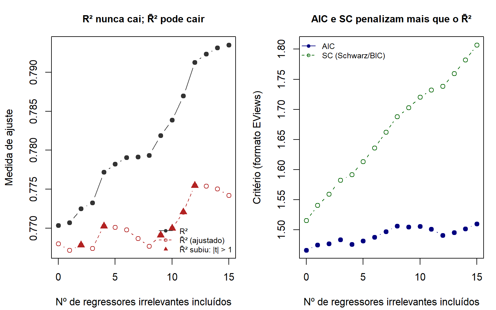
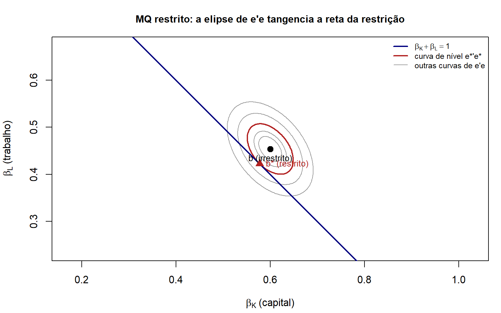

# Módulo 05 — Ajuste da regressão e mínimos quadrados restritos

Hub do módulo: [README](README.md) · Exercícios: [05_lista1.md](05_lista1.md) · Script: [05_ajuste_restricoes.R](05_ajuste_restricoes.R)

## 0. Mapa

> [!NOTE]
> **O que este módulo entrega**
> Três perguntas com a mesma ferramenta, a identidade $u'u=e'e+(d-b)'X'X(d-b)$ de D05.1. (i) Quanto a regressão explica: decomposição da variação, $R^2$, tabela ANOVA. (ii) Quanto uma variável a mais melhora o ajuste: Teorema 3.5 do Greene, correlação parcial, $\bar R^2$ e critérios de informação. (iii) Quanto se perde ao impor $R\beta=q$: MQ restrito e a estatística F nas três formas. O D0–D16 do aluno não é repetido; D13 (o $b$ por cálculo) e D14 (a variância) são citados.

| D | Resultado | Hipóteses | Usado em |
|---|---|---|---|
| D05.1 | $b$ minimiza $e'e$ (prova sem cálculo) | A2 | D05.9, D05.10 |
| D05.2 | SQT = SQE + SQR (exige constante) | A2 + constante | ANOVA, ex. 27, 56 |
| D05.3 | $R^2$: limites e $R^2=r^2_{y\hat y}$ | A2 + constante | ex. 55d, 56d |
| D05.4 | Incluir $z$ reduz $e'e$ em $c^2z^{*\prime}z^*$ (Teorema 3.5) | A2 | D05.5–D05.7 |
| D05.5 | $u'u=e'e(1-r^{*2})$ e $R^2_{Xz}=R^2_X+(1-R^2_X)r^{*2}$ | A2 + constante | saída "Partial-Rsq" |
| D05.6 | $r^{*2}=t^2/(t^2+n-K)$ e $F=t^2$ | A1–A4 | D05.7 |
| D05.7 | $\bar R^2$ sobe sse $\lvert t\rvert>1$ (sse $F>1$ para $J$ variáveis) | A1–A4 | ex. 56d, P1 Q1f |
| D05.8 | Log-verossimilhança normal e AIC/SC/HQ (EViews × Greene × R) | A1–A6 | ex. 56 |
| D05.9 | $b^*$ pelo Lagrangiano | A2, posto$(R)=J$ | ex. 55f, 62 |
| D05.10 | $e^{*\prime}e^*-e'e=m'[R(X'X)^{-1}R']^{-1}m\ge 0$ | A2 | D05.12 |
| D05.11 | Viés e variância de $b^*$ | A1–A4 | armadilhas |
| D05.12 | F nas três formas (Wald, SQR, $R^2$) e sua distribuição | A1–A6 | ex. 27, 55, 56, 62 |

## 1. Notação e hipóteses

- $y$ é $n\times 1$, $X$ é $n\times K$ **com** a coluna $\iota$ de 1s, $b=(X'X)^{-1}X'y$, $e=y-Xb$, $M^0=I_n-\tfrac1n\iota\iota'$, $M=I_n-X(X'X)^{-1}X'$, $s^2=e'e/(n-K)$. $K$ conta a constante (convenção do Greene).
- Restrições lineares: $R\beta=q$, com $R$ de dimensão $J\times K$ e posto $J$ (linhas LI), $q$ de dimensão $J\times 1$. Discrepância $m=Rb-q$ ($J\times 1$). Abreviação: $V_R\equiv R(X'X)^{-1}R'$ ($J\times J$).
- Regressão curta × longa (D05.4–D05.7): curta de $y$ em $X$ ($n\times(K-1)$, com $\iota$), resíduo $e$; longa de $y$ em $X_z=[X\;\;z]$ ($n\times K$), coeficientes $(d,c)$, resíduo $u$. $M_X=I-X(X'X)^{-1}X'$ e $z^*=M_Xz$.

**Somas de quadrados.** Este módulo usa os nomes em português abaixo. As siglas em inglês **trocam de sentido** conforme a fonte.

| Objeto | Aqui | Greene (SL05) e Lista 1, ex. 27 | Wooldridge | EViews | NLOGIT |
|---|---|---|---|---|---|
| $y'M^0y=\sum(y_i-\bar y)^2$ | SQT | total | SST | (n−1)·S.D. dependent var² | (n−1)·Standard deviation² |
| $b'X'M^0Xb=\sum(\hat y_i-\bar y)^2$ | SQE (explicada) | **SSR** (regression) | **SSE** (explained) | não imprime | não imprime |
| $e'e=\sum e_i^2$ | SQR (resíduos) | **SSE** (residual) | **SSR** (residual) | Sum squared resid | Residuals Sum of squares |

> [!WARNING]
> **"SSR" é o nome de duas coisas opostas**
> No ex. 27 da lista (e na tabela do Greene no SL05) SSR é a soma da **regressão**. No Wooldridge, SSR é a dos **resíduos**. No ex. 55 a lista usa "SQR" para os resíduos. Na prova, escreva a fórmula junto com a sigla, por exemplo "SQR $=e'e$", e a ambiguidade some.

**Hipóteses usadas.** As identidades D05.1–D05.5, D05.9 e D05.10 são **álgebra pura**: só usam [A2] (e a constante, quando se fala de $R^2$). Entram [A1], [A3] e [A4] quando aparece variância (D05.6, D05.7, D05.11) e [A6] quando aparece distribuição exata ou verossimilhança (D05.8, D05.12).

## 2. Demonstrações

### D05.1 · b minimiza e'e: prova sem cálculo

> [!NOTE]
> **O que se quer provar**
> Sob [A2], para todo $d\in\mathbb{R}^K$, a soma de quadrados de $u=y-Xd$ satisfaz $u'u=e'e+(d-b)'X'X(d-b)$. Logo $u'u>e'e$ sempre que $d\neq b$: $b$ é o minimizador **global e único** de $S(d)=(y-Xd)'(y-Xd)$.

**Por que importa.** D13 acha $b$ pela condição de 1ª ordem e confirma o mínimo pela Hessiana $2X'X$. Aqui o argumento é global e não usa derivada. A identidade do passo 3 volta em D05.9 e D05.10, com $d=b^*$: é ela que mede a perda de ajuste do MQ restrito.

**Passo a passo.**

1. Equações normais: $X'Xb=X'y$, ou seja, $X'e=X'(y-Xb)=0$ ($K\times 1$). *[D13; A2 garante $X'X$ inversível]*

2. Some e subtraia $Xb$ dentro de $u$:

$$
u=y-Xd=(y-Xb)-X(d-b)=e-X(d-b).
$$

3. Expanda o produto. O termo cruzado é um escalar, igual à própria transposta, e morre pelo passo 1:

$$
u'u=e'e-2(d-b)'X'e+(d-b)'X'X(d-b)=e'e+(d-b)'X'X(d-b).
$$

4. Com $v=X(d-b)$ ($n\times 1$), o último termo é $v'v=\sum_i v_i^2\ge 0$. Pela [A2] as colunas de $X$ são LI, então $v=0$ só quando $d-b=0$. Para $d\neq b$ vale $v'v>0$:

$$
\boxed{u'u=e'e+(d-b)'X'X(d-b)>e'e\quad\text{para todo } d\neq b.}
$$

> [!TIP]
> **Como o professor pode torcer**
> - "Prove que $b$ minimiza $e'e$ sem derivar": é esta prova. Com cálculo, é D13.
> - "Precisa de normalidade ou exogeneidade?" Não. Só [A2]. É álgebra.
> - Sem [A2], as equações normais têm infinitas soluções. Todas dão o mesmo $\hat y$ (a projeção de $y$ no espaço coluna de $X$) e o mesmo $e'e$, mas $b$ não é único.

### D05.2 · Decomposição da variação: SQT = SQE + SQR

> [!NOTE]
> **O que se quer provar**
> Se $\iota$ é uma coluna de $X$, então $y'M^0y=b'X'M^0Xb+e'e$, ou seja, $\sum(y_i-\bar y)^2=\sum(\hat y_i-\bar y)^2+\sum e_i^2$.

**Por que importa.** É a tabela ANOVA (ex. 56), a definição do $R^2$ e o passo-chave do ex. 27. Sem constante, ela quebra.

**Passo a passo.**

1. $M^0=I_n-\tfrac1n\iota\iota'$ ($n\times n$) é simétrica e idempotente: $(M^0)^2=I-\tfrac2n\iota\iota'+\tfrac1{n^2}\iota(\iota'\iota)\iota'=M^0$, porque $\iota'\iota=n$. Aplicada a um vetor, tira a média: $M^0a=a-\iota\bar a$.

2. Com constante, uma das $K$ linhas de $X'e=0$ (D05.1, passo 1) é $\iota'e=\sum_i e_i=0$. Logo $\bar e=0$ e $M^0e=e$.

3. Aplique $M^0$ a $y=Xb+e$ *[linearidade]* e use o passo 2:

$$
M^0y=M^0Xb+M^0e=M^0Xb+e.
$$

4. Como $M^0$ é simétrica e idempotente, $y'M^0y=(M^0y)'(M^0y)$. Expanda:

$$
y'M^0y=b'X'M^0Xb+2\,e'M^0Xb+e'e.
$$

5. Termo cruzado: $e'M^0Xb=(M^0e)'Xb=e'Xb=(X'e)'b=0$ (passos 2 e 1). Portanto

$$
\boxed{\underbrace{y'M^0y}_{\text{SQT}}=\underbrace{b'X'M^0Xb}_{\text{SQE}}+\underbrace{e'e}_{\text{SQR}}.}
$$

6. Formas de conta (as da tabela ANOVA do Greene, SL05, p. 11). De $\iota'e=0$ vem $\iota'y=\iota'\hat y$: a média dos ajustados é $\bar y$. Então $\text{SQE}=\hat y'M^0\hat y=\hat y'\hat y-n\bar y^2=b'X'Xb-n\bar y^2=b'X'y-n\bar y^2$, usando $X'Xb=X'y$. E $\text{SQT}=y'y-n\bar y^2$.

> [!WARNING]
> **Sem constante a decomposição falha**
> Se $\iota$ não está no espaço coluna de $X$, $\bar e\neq 0$ em geral. O termo cruzado vira $e'M^0\hat y=e'\hat y-n\bar e\,\bar{\hat y}=-n\bar e\,\bar{\hat y}$, porque $e'\hat y=e'Xb=0$ vale sempre. Com esse termo diferente de zero, $1-\text{SQR}/\text{SQT}$ pode ser negativo e $\text{SQE}/\text{SQT}$ pode passar de 1.

> [!TIP]
> **Como o professor pode torcer**
> Pedir a versão escalar: $\sum(y_i-\bar y)^2=\sum(\hat y_i-\bar y+e_i)^2$, e o termo cruzado $2\sum(\hat y_i-\bar y)e_i=2\sum\hat y_ie_i-2\bar y\sum e_i$ morre pelas duas equações normais (D8). É a mesma prova, com somatórios.

### D05.3 · R²: definição, limites e R² = corr(y, ŷ)²

> [!NOTE]
> **O que se quer provar**
> Com constante e MQO, $R^2\equiv \text{SQE}/\text{SQT}=1-e'e/y'M^0y$ está em $[0,1]$ e é igual ao quadrado da correlação amostral entre $y$ e $\hat y$.

**Por que importa.** A leitura "percentual da variação explicada" (ex. 55d, 56d, P1 Q1f) só vale nas condições deste resultado. O SL05, p. 10, destaca que o $R^2$ só fica entre 0 e 1 com constante **e** MQO.

**Passo a passo.**

1. Divida D05.2 por $\text{SQT}>0$ (supõe $y$ não constante): $1=\text{SQE}/\text{SQT}+\text{SQR}/\text{SQT}$. As duas definições coincidem.

2. Limites: $\text{SQE}=(M^0Xb)'(M^0Xb)\ge 0$ e $\text{SQR}=e'e\ge 0$, e somam SQT. Logo $0\le R^2\le 1$.

3. Covariância amostral (vezes $n$) entre $y$ e $\hat y$. Por D05.2, passo 3, $M^0y=M^0\hat y+e$. Então

$$
(M^0y)'(M^0\hat y)=(M^0\hat y+e)'M^0\hat y=\hat y'M^0\hat y+e'M^0\hat y=\hat y'M^0\hat y,
$$

porque $e'M^0\hat y=(M^0e)'\hat y=e'Xb=0$.

4. Correlação ao quadrado (supondo $\hat y'M^0\hat y>0$):

$$
r^2_{y\hat y}=\frac{[(M^0y)'(M^0\hat y)]^2}{(y'M^0y)(\hat y'M^0\hat y)}=\frac{(\hat y'M^0\hat y)^2}{(y'M^0y)(\hat y'M^0\hat y)}=\frac{\hat y'M^0\hat y}{y'M^0y}=R^2.
$$

5. Na regressão simples, $\hat y_i-\bar y=\hat\beta_2(X_i-\bar X)$, então $r^2_{y\hat y}=r^2_{yX}$: o $R^2$ é o quadrado da correlação entre $Y$ e $X$ (ex. 41 da lista, módulo 07).

$$
\boxed{R^2=\frac{\text{SQE}}{\text{SQT}}=1-\frac{e'e}{y'M^0y}=r^2_{y\hat y}\in[0,1].}
$$

> [!TIP]
> **Como o professor pode torcer**
> - Transformar $X$ em $Z=XP$ com $P$ inversível ($K\times K$) não muda $\hat y$, $e$ nem $R^2$. O espaço coluna é o mesmo; só os coeficientes mudam, para $P^{-1}b$ (SL05, pp. 18–19).
> - Comparar o $R^2$ de $y$ com o de $\ln y$: **não pode**. O SQT é outro (SL05, p. 16). O mesmo vale para a regressão por substituição do MQ restrito (D05.10).
> - "$R^2$ baixo viola alguma hipótese?" Não. [A1]–[A6] não falam de $R^2$.

### D05.4 · Incluir uma variável reduz e'e em c²z*'z* (Teorema 3.5)

> [!NOTE]
> **O que se quer provar**
> Seja $u$ o resíduo da regressão longa de $y$ em $[X\;\;z]$, com coeficiente $c$ em $z$, e $e$ o resíduo da curta (só $X$). Com $z^*=M_Xz$: $u'u=e'e-c^2\,z^{*\prime}z^*\le e'e$, com igualdade só se $c=0$.

**Por que importa.** Prova que o ajuste nunca piora ao incluir variável, logo o $R^2$ nunca cai (SL05, p. 5). Dá também a correlação parcial (D05.5), a ligação com o $t$ (D05.6) e o teorema do $\bar R^2$ (D05.7).

**Passo a passo.**

1. Equações normais da longa: $[X\;\;z]'u=0$, isto é, $X'u=0$ ($(K-1)\times 1$) e $z'u=0$ (escalar). *[D13 aplicado à longa; A2 para $[X\;\;z]$]*

2. Pelo passo 1, $M_Xu=u-X(X'X)^{-1}X'u=u$.

3. Pré-multiplique $u=y-Xd-zc$ por $M_X$. Use $M_XX=0$, $M_Xy=e$ (residual maker da curta, módulo 03) e $M_Xz=z^*$:

$$
u=M_Xu=M_Xy-M_XXd-M_Xz\,c=e-c\,z^*.
$$

4. Ache $c$. $M_X$ é simétrica, então $z^{*\prime}u=z'M_Xu=z'u=0$ (passos 2 e 1). Substituindo o passo 3: $0=z^{*\prime}e-c\,z^{*\prime}z^*$, logo

$$
c=\frac{z^{*\prime}e}{z^{*\prime}z^*}.
$$

Aqui $z^{*\prime}z^*>0$ porque $z$ não está no espaço coluna de $X$ (A2 da longa). Como $z^{*\prime}e=z'M_XM_Xy=z^{*\prime}y$, esse é o FWL (módulo 04).

5. Expanda $u'u$ com o passo 3 e use $z^{*\prime}e=c\,z^{*\prime}z^*$ (passo 4):

$$
u'u=e'e-2c\,z^{*\prime}e+c^2z^{*\prime}z^*=e'e-2c^2z^{*\prime}z^*+c^2z^{*\prime}z^*.
$$

$$
\boxed{u'u=e'e-c^2\,z^{*\prime}z^*\le e'e.}
$$

> [!TIP]
> **Como o professor pode torcer**
> - A recíproca: "excluir uma variável nunca melhora o ajuste". É o mesmo resultado lido de trás para a frente.
> - Com $J$ variáveis de uma vez, $Z^*=M_XZ$ e $u'u=e'e-C'Z^{*\prime}Z^*C$, com a forma quadrática $\ge 0$. É o caso $R=[0\;\;I_J]$, $q=0$ de D05.10.
> - A queda de $e'e$ é **estritamente** positiva sempre que $c\neq 0$, mesmo com $z$ irrelevante na população. Por isso o $R^2$ sozinho não serve para escolher modelo.

### D05.5 · R² com e sem z: a correlação parcial

> [!NOTE]
> **O que se quer provar**
> Com constante em $X$, seja $r^*_{yz}$ a correlação parcial entre $y$ e $z$ dado $X$, isto é, a correlação entre $e=M_Xy$ e $z^*=M_Xz$. Então $u'u=e'e\,(1-r^{*2}_{yz})$ e
> $R^2_{Xz}=R^2_X+(1-R^2_X)\,r^{*2}_{yz}$.

**Por que importa.** A soma de quadrados cai **pelo fator** $(1-r^{*2})$. O ganho de $R^2$ de uma variável depende do que já está na regressão, então "acumular $R^2$ variável a variável" não tem sentido (SL05, p. 12). É a coluna "Partial-Rsq" do NLOGIT (SL05, p. 13).

**Passo a passo.**

1. Com $\iota$ em $X$, $\iota'e=0$ e $\iota'z^*=0$ ($\iota'M_X=0$). Os dois vetores já têm média zero, e a correlação amostral é o cosseno:

$$
r^{*2}_{yz}=\frac{(z^{*\prime}e)^2}{(z^{*\prime}z^*)(e'e)}.
$$

2. Pelo passo 4 de D05.4, $c^2z^{*\prime}z^*=(z^{*\prime}e)^2/(z^{*\prime}z^*)=r^{*2}_{yz}\,e'e$. Em D05.4:

$$
u'u=e'e-r^{*2}_{yz}\,e'e=e'e\,(1-r^{*2}_{yz}).
$$

3. Divida pelo mesmo SQT (mesmo $y$, constante nas duas regressões; D05.3): $1-R^2_{Xz}=(1-R^2_X)(1-r^{*2}_{yz})$. Rearranjando:

$$
\boxed{R^2_{Xz}=R^2_X+(1-R^2_X)\,r^{*2}_{yz}\ \ge\ R^2_X,}
$$

com igualdade só se $r^*_{yz}=0$, isto é, $c=0$.

**Conferência numérica.** Na Cobb-Douglas simulada (script, Parte B), a curta tem só $\ln K$ e $z=\ln L$: $R^2_X=0{,}6302$, $r^{*2}=0{,}3791$, e a fórmula devolve o $R^2$ da longa, $0{,}7704$ (tabela ao fim da seção 2).

### D05.6 · Correlação parcial e o t: r*² = t²/(t² + n − K)

> [!NOTE]
> **O que se quer provar**
> Sob [A1]–[A4], seja $t$ a razão $t$ de $z$ na longa (com $K$ colunas, $s^2=u'u/(n-K)$). Então $t^2=(n-K)\,(e'e-u'u)/u'u$, $r^{*2}_{yz}=t^2/(t^2+n-K)$ e o $F$ da restrição $c=0$ é $t^2$.

**Por que importa.** Liga a álgebra do ajuste à inferência. Na prova, dá para recuperar $\lvert t\rvert$ a partir de duas SQR, ou a correlação parcial a partir de um $t$ (SL05, p. 14).

**Passo a passo.**

1. Modelo: $y=X\beta+z\gamma+\varepsilon$ *[A1]*. Como $z^{*\prime}X=z'M_XX=0$ e $z^{*\prime}z=z'M_Xz=z^{*\prime}z^*$, D05.4, passo 4, dá:

$$
c=\frac{z^{*\prime}y}{z^{*\prime}z^*}=\frac{z^{*\prime}(X\beta+z\gamma+\varepsilon)}{z^{*\prime}z^*}=\gamma+\frac{z^{*\prime}\varepsilon}{z^{*\prime}z^*}.
$$

2. Condicional em $X_z=[X\;\;z]$, $z^*$ é constante. Então $E[c\mid X_z]=\gamma$ *[A3]* e

$$
\operatorname{Var}(c\mid X_z)=\frac{z^{*\prime}E[\varepsilon\varepsilon'\mid X_z]z^*}{(z^{*\prime}z^*)^2}=\frac{\sigma^2}{z^{*\prime}z^*}.\quad\textit{[A4; Var de forma linear]}
$$

3. Razão $t$, com $\sigma^2$ estimado por $s^2=u'u/(n-K)$, e D05.4 ($c^2z^{*\prime}z^*=e'e-u'u$):

$$
t^2=\frac{c^2}{s^2/z^{*\prime}z^*}=\frac{c^2z^{*\prime}z^*}{u'u/(n-K)}=\frac{(n-K)(e'e-u'u)}{u'u}.
$$

4. Por D05.5, $r^{*2}=(e'e-u'u)/e'e$. Divida o numerador e o denominador de $t^2/(t^2+n-K)$ por $(n-K)/u'u$:

$$
\frac{t^2}{t^2+n-K}=\frac{e'e-u'u}{(e'e-u'u)+u'u}=\frac{e'e-u'u}{e'e}=r^{*2}_{yz}.
$$

5. O passo 3 é exatamente a forma SQR do $F$ para $J=1$ (D05.12): $F=[(e'e-u'u)/1]/[u'u/(n-K)]=t^2$.

$$
\boxed{r^{*2}_{yz}=\frac{t^2}{t^2+(n-K)},\qquad F_{(c=0)}=t^2.}
$$

**Conferência numérica.** SL05, p. 15: para PS, $(0{,}9907-0{,}9861)/(1-0{,}9861)=0{,}331$ e $3{,}92^2/(3{,}92^2+31)=0{,}331$. Na saída do NLOGIT (SL05, p. 13), o "Partial F" é o $t^2$: $15{,}340/(15{,}340+31)=0{,}331$.

### D05.7 · R̄² sobe se e somente se |t| > 1

> [!NOTE]
> **O que se quer provar**
> Com $\bar R^2=1-\dfrac{e'e/(n-K)}{y'M^0y/(n-1)}=1-\dfrac{n-1}{n-K}(1-R^2)$: ao incluir **uma** variável, $\bar R^2$ sobe se e somente se $\lvert t\rvert>1$. Ao incluir **$J$** variáveis, sobe se e somente se o $F$ da exclusão conjunta for maior que 1.

**Por que importa.** O SL05, p. 29, afirma o resultado e manda ao texto. A prova é curta e cai bem numa questão de 0,5 ponto. Explica também a saída do SL05, p. 32: PD entra, o $R^2$ sobe e o $\bar R^2$ cai, porque o $t$ de PD é bem menor que 1.

**Passo a passo.**

1. Curta com $K-J$ colunas (resíduo $e$, $n-K+J$ gl) e longa com $K$ colunas (resíduo $u$, $n-K$ gl), mesmo $y$, com constante. O fator $y'M^0y/(n-1)$ é comum e positivo, então $\bar R^2$ é decrescente em $e'e/\text{gl}$:

$$
\bar R^2_{\text{longa}}>\bar R^2_{\text{curta}}\iff\frac{u'u}{n-K}<\frac{e'e}{n-K+J}.
$$

2. Multiplique por $(n-K+J)/u'u>0$ e subtraia 1 dos dois lados:

$$
\iff\frac{n-K+J}{n-K}<\frac{e'e}{u'u}\iff\frac{J}{n-K}<\frac{e'e-u'u}{u'u}.
$$

3. Divida por $J/(n-K)>0$. O lado direito vira a forma SQR do $F$ (D05.12), com a curta no papel de modelo restrito:

$$
\iff 1<\frac{(e'e-u'u)/J}{u'u/(n-K)}=F.
$$

4. Com $J=1$, $F=t^2$ (D05.6). Então:

$$
\boxed{\bar R^2\ \text{sobe}\iff t^2>1\iff\lvert t\rvert>1\qquad(\text{e}\iff F>1\ \text{para}\ J\ \text{variáveis}).}
$$

5. Dois corolários. (a) $\bar R^2\le R^2$, porque $(n-1)/(n-K)\ge 1$. (b) $\bar R^2<0\iff(n-1)(1-R^2)>n-K\iff R^2<(K-1)/(n-1)$: com muitos regressores e ajuste fraco, o $\bar R^2$ fica negativo.

**Conferência numérica.** Em 2000 variáveis irrelevantes sorteadas (script, Parte B), a regra "$\bar R^2$ sobe sse $\lvert t\rvert>1$" acertou em 100% dos casos (`m05_sim_prop_teorema_t1` $=1$). No SL05, pp. 31–32 (gasolina), as duas SQR impressas devolvem $\lvert t_{PD}\rvert=\sqrt{26\,(596{,}68995-594{,}54206)/594{,}54206}=0{,}3065$, que confere com o $0{,}306$ impresso. Como $0{,}3065<1$, o $\bar R^2$ cai de 0,99137 para 0,99107.



*Figura 1 (script m05).* À esquerda, o $R^2$ só sobe; o $\bar R^2$ sobe exatamente nos passos marcados com triângulo, onde $\lvert t\rvert>1$. À direita, os critérios de informação no formato do EViews (D05.8): o SC cresce mais depressa que o AIC, porque $\ln n>2$.

> [!TIP]
> **Como o professor pode torcer**
> - "O $\bar R^2$ caiu; então a variável é irrelevante?" Não. $\lvert t\rvert>1$ é um critério muito mais frouxo que $\lvert t\rvert>1{,}96$. Maximizar $\bar R^2$ **não** é testar significância.
> - No output da P1 2025/2, Q1, todo $\lvert b/\text{E.p.}\rvert$ é pelo menos 4,267. Logo retirar **qualquer** regressor derrubaria o $\bar R^2$.
> - Interpretar o $\bar R^2$ como "% explicado" é abuso: ele pode ser negativo. É o $R^2$ corrigido pelos graus de liberdade, útil para comparar modelos com o mesmo $y$.

### D05.8 · Log-verossimilhança do modelo normal e critérios de informação

> [!NOTE]
> **O que se quer provar**
> Sob [A1]–[A6], o máximo da log-verossimilhança é $\ln\hat L=-\tfrac n2\big[1+\ln 2\pi+\ln(e'e/n)\big]$, com $\hat\beta_{MV}=b$ e $\hat\sigma^2_{MV}=e'e/n$. Os critérios impressos pelo EViews são $\text{AIC}=-2\ln\hat L/n+2K/n$, $\text{SC}=-2\ln\hat L/n+K\ln n/n$ e $\text{HQ}=-2\ln\hat L/n+2K\ln(\ln n)/n$. Eles diferem das versões do Greene só pela constante $1+\ln 2\pi$.

**Por que importa.** O output do ex. 56 imprime "Log likelihood", "Akaike info criterion" e "Schwarz criterion". O SL05, p. 30, usa a forma do Greene, $\ln(e'e/n)+\text{penalidade}$. Os números não batem entre as duas formas, mas a **ordenação** dos modelos é a mesma.

**Passo a passo.**

1. Por [A6], $y\mid X\sim N(X\beta,\sigma^2I_n)$, com densidade conjunta $(2\pi\sigma^2)^{-n/2}\exp\{-(y-X\beta)'(y-X\beta)/(2\sigma^2)\}$. Tomando log:

$$
\ln L(\beta,\sigma^2)=-\frac n2\ln 2\pi-\frac n2\ln\sigma^2-\frac{(y-X\beta)'(y-X\beta)}{2\sigma^2}.
$$

2. Para cada $\sigma^2>0$, maximizar em $\beta$ é minimizar $(y-X\beta)'(y-X\beta)$. Por D05.1 o maximizador é $b$, qualquer que seja $\sigma^2$.

3. Concentre em $\sigma^2$: $\partial\ln L/\partial\sigma^2=-n/(2\sigma^2)+e'e/(2\sigma^4)=0$ dá $\hat\sigma^2=e'e/n$ (viesado; $s^2$ divide por $n-K$). A segunda derivada em $\hat\sigma^2$ é $n/(2\hat\sigma^4)-e'e/\hat\sigma^6=-n/(2\hat\sigma^4)<0$: é máximo.

4. Substitua $b$ e $\hat\sigma^2$ no passo 1:

$$
\boxed{\ln\hat L=-\frac n2\Big[1+\ln 2\pi+\ln\frac{e'e}{n}\Big].}
$$

5. Daí $-2\ln\hat L/n=1+\ln 2\pi+\ln(e'e/n)$. Os critérios do EViews são as versões do Greene mais a constante $1+\ln 2\pi=2{,}8379$:

| Critério | EViews (impresso) | Greene (SL05) e NLOGIT | R: `AIC(lm)`, `BIC(lm)` |
|---|---|---|---|
| AIC | $-2\ln\hat L/n+2K/n$ | $\ln(e'e/n)+2K/n$ | $-2\ln\hat L+2(K+1)$ |
| SC / BIC | $-2\ln\hat L/n+K\ln n/n$ | $\ln(e'e/n)+K\ln n/n$ | $-2\ln\hat L+(K+1)\ln n$ |
| HQ | $-2\ln\hat L/n+2K\ln(\ln n)/n$ | — | — |

Menor é melhor em todos. O R conta $\sigma^2$ como parâmetro ($K+1$) e não divide por $n$. Na Cobb-Douglas simulada, $(\text{AIC}_R-2)/n$ reproduz o AIC do EViews (script, Parte C). A coluna do NLOGIT foi conferida com o SL05, p. 31: $\ln(596{,}68995/36)+18/36=3{,}3079$, igual ao "Akaike Info. Criter." impresso (3,30788).

6. Comparação das penalidades por parâmetro (vezes $n$): AIC $2$, HQ $2\ln\ln n$, SC $\ln n$. O SC penaliza mais que o AIC quando $\ln n>2$, isto é, $n\ge 8$. O HQ fica entre os dois quando $n\ge 16$ ($\ln\ln n>1$). Como $2\ln x<x$ para todo $x>0$, o HQ nunca passa do SC. Já o $\bar R^2$ equivale a minimizar $\ln s^2=\ln(e'e/n)-\ln(1-K/n)\approx\ln(e'e/n)+K/n$: para $K/n$ pequeno, a penalidade é mais leve que a do AIC.

**Conferência numérica (ex. 56).** Com $e'e=152{,}3325$ e $n=10$, o passo 4 dá $\ln\hat L=-27{,}80679$, igual ao impresso. Com $K=3$: $\text{AIC}=5{,}561358+0{,}6=6{,}161358$ e $\text{SC}=6{,}25213$, os dois iguais ao impresso. O HQ, que não aparece no output, seria 6,0618. Detalhes em [05_lista1.md](05_lista1.md).

> [!TIP]
> **Como o professor pode torcer**
> - "O modelo A tem AIC 6,16 e o B tem AIC 3,32; qual é melhor?" Primeiro confira se os dois vêm da **mesma fórmula** (EViews × Greene), do mesmo $y$ e da mesma amostra. Senão, a comparação é inválida.
> - Critérios de informação servem para modelos **não aninhados** com o mesmo $y$. Para aninhados, use o teste F.
> - $\hat\sigma^2_{MV}=e'e/n$ é viesado para baixo; $s^2=e'e/(n-K)$ é não viesado (módulo 06).

### D05.9 · MQ restrito pelo Lagrangiano

> [!NOTE]
> **O que se quer provar**
> Sob [A2] e posto$(R)=J$, o problema $\min_\beta(y-X\beta)'(y-X\beta)$ sujeito a $R\beta=q$ tem solução única
> $b^*=b-(X'X)^{-1}R'[R(X'X)^{-1}R']^{-1}(Rb-q)$, com multiplicador $\lambda^*=[R(X'X)^{-1}R']^{-1}(Rb-q)$.

**Por que importa.** É o estimador por trás de todo "F com SQR restrita" (ex. 55f, 62). Em restrições simples, dá o mesmo que a regressão por substituição da Cobb-Douglas.

**Passo a passo.**

1. Lagrangiano, com $\lambda$ de dimensão $J\times 1$ e o fator 2 por conveniência (SL05, p. 36):

$$
L^*(\beta,\lambda)=(y-X\beta)'(y-X\beta)+2\lambda'(R\beta-q).
$$

2. Condições de 1ª ordem, usando $\partial(\beta'X'X\beta)/\partial\beta=2X'X\beta$, $\partial(\beta'X'y)/\partial\beta=X'y$ e $\partial(\lambda'R\beta)/\partial\beta=R'\lambda$ (kit de D13):

$$
-2X'y+2X'Xb^*+2R'\lambda^*=0\quad(K\times 1),\qquad 2(Rb^*-q)=0\quad(J\times 1).
$$

3. Da primeira, pré-multiplicando por $(X'X)^{-1}$ *[A2]* e usando $b=(X'X)^{-1}X'y$:

$$
b^*=b-(X'X)^{-1}R'\lambda^*.
$$

4. Pré-multiplique por $R$ ($J\times K$) e imponha $Rb^*=q$: $q=Rb-R(X'X)^{-1}R'\lambda^*$. A matriz $V_R=R(X'X)^{-1}R'$ ($J\times J$) é positiva definida: para $a\neq 0$, $R'a\neq 0$ (linhas de $R$ LI) e $a'V_Ra=(R'a)'(X'X)^{-1}(R'a)>0$, pois $(X'X)^{-1}$ é p.d. *[A2]*. Logo é inversível e

$$
\lambda^*=[R(X'X)^{-1}R']^{-1}(Rb-q).
$$

5. Substitua no passo 3:

$$
\boxed{b^*=b-(X'X)^{-1}R'\,[R(X'X)^{-1}R']^{-1}\,(Rb-q).}
$$

Conferência: $Rb^*=Rb-V_RV_R^{-1}(Rb-q)=q$.

6. Mínimo global e único, sem Hessiana. Para qualquer $\beta$ com $R\beta=q$, D05.1 dá $S(\beta)=e'e+(\beta-b)'X'X(\beta-b)$. Escreva $\beta-b=(\beta-b^*)+(b^*-b)$. O termo cruzado é $2(\beta-b^*)'X'X(b^*-b)=-2(\beta-b^*)'R'\lambda^*=-2(R\beta-Rb^*)'\lambda^*=-2(q-q)'\lambda^*=0$, porque $X'X(b^*-b)=-R'\lambda^*$ pelo passo 3. Então

$$
S(\beta)=S(b^*)+(\beta-b^*)'X'X(\beta-b^*)\ \ge\ S(b^*),
$$

com igualdade só em $\beta=b^*$ *[A2]*.

**Leitura geométrica.** Pelo passo 6, $b^*$ é o ponto da reta (ou do hiperplano) $R\beta=q$ mais próximo de $b$ na métrica $X'X$. As curvas de nível de $e'e$ são elipses centradas em $b$, e $b^*$ é onde uma delas tangencia a restrição (SL05, p. 40; Figura 2).



*Figura 2 (script m05).* Cobb-Douglas simulada no plano $(\beta_K,\beta_L)$, com o intercepto concentrado. As elipses são curvas de nível de $e'e$ centradas em $b$; a reta é $\beta_K+\beta_L=1$; a elipse vermelha, de nível $e^{*\prime}e^*$, toca a reta em $b^*$.

> [!TIP]
> **Como o professor pode torcer**
> - Exclusão ($\beta_3=0$): $R=[0\;0\;1]$, $q=0$, e $b^*$ é a regressão sem $x_3$. Igualdade ($\beta_2=\beta_3$): $R=[0\;1\;-1]$, e $b^*$ vem de regredir $y$ em $x_1$ e $(x_2+x_3)$. Soma ($\beta_2+\beta_3=1$): regredir $y-x_3$ em $x_1$ e $(x_2-x_3)$ (SL05, pp. 34–35).
> - Se $Rb=q$ já vale, então $\lambda^*=0$ e $b^*=b$: a restrição não "custa" nada. $\lambda^*$ é o preço-sombra da restrição.
> - Se as restrições são redundantes (posto$(R)\lt J$), $V_R$ é singular e a fórmula não existe. Elimine as restrições repetidas.
> - O sistema aumentado $\begin{bmatrix}X'X & R'\\ R & 0\end{bmatrix}\begin{bmatrix}\beta\\ \lambda\end{bmatrix}=\begin{bmatrix}X'y\\ q\end{bmatrix}$ só precisa que essa matriz de ordem $K+J$ seja inversível, não que $X$ tenha posto cheio (SL05, p. 37).

### D05.10 · Perda de ajuste: e*'e* − e'e é uma forma quadrática em Rb − q

> [!NOTE]
> **O que se quer provar**
> Com $e^*=y-Xb^*$ e $m=Rb-q$: $e^{*\prime}e^*-e'e=m'[R(X'X)^{-1}R']^{-1}m\ge 0$, com igualdade só se $m=0$. Em consequência, $R^{*2}\le R^2$ (mesmo $y$).

**Por que importa.** É a ponte entre o $F$ de Wald (que só usa a regressão irrestrita) e o $F$ das SQR (que usa as duas). Mostra por que impor restrição nunca melhora o ajuste (SL05, p. 42).

**Passo a passo.**

1. D05.1 com $d=b^*$:

$$
e^{*\prime}e^*=e'e+(b^*-b)'X'X(b^*-b).
$$

2. Por D05.9, $b^*-b=-(X'X)^{-1}R'V_R^{-1}m$ ($K\times 1$). Substitua, lembrando que $V_R^{-1}$ é simétrica:

$$
(b^*-b)'X'X(b^*-b)=m'V_R^{-1}R(X'X)^{-1}\,X'X\,(X'X)^{-1}R'V_R^{-1}m=m'V_R^{-1}\,V_R\,V_R^{-1}m=m'V_R^{-1}m.
$$

Dimensões: $(1\times J)(J\times J)(J\times 1)$, um escalar.

3. $V_R^{-1}$ é p.d. porque $V_R$ é (D05.9, passo 4). Logo $m'V_R^{-1}m\ge 0$, com igualdade só se $m=0$:

$$
\boxed{e^{*\prime}e^*-e'e=(Rb-q)'\,[R(X'X)^{-1}R']^{-1}\,(Rb-q)=\lambda^{*\prime}R(X'X)^{-1}R'\lambda^*\ \ge 0.}
$$

4. Com o mesmo $y$ e o mesmo SQT, $R^{*2}=1-e^{*\prime}e^*/\text{SQT}\le 1-e'e/\text{SQT}=R^2$.

> [!WARNING]
> **A regressão por substituição tem outro y**
> Impondo retornos constantes por $\ln(Y/L)=\beta_0+\beta_K\ln(K/L)$, o **resíduo** é o mesmo de $y-Xb^*$ na equação original: $\ln Y-b_0^*-b_K^*\ln K-(1-b_K^*)\ln L$. Então a SQR restrita pode ser usada no $F$. O **$R^2$ impresso** dessa regressão, porém, é o de $\ln(Y/L)$, com outro SQT, e **não** entra na forma $R^2$ do $F$. Com restrição que muda o regressando, use a forma SQR.

**Conferência numérica (script, Parte A).** Cobb-Douglas simulada, $n=200$, $H_0:\beta_K+\beta_L=1$: $b^*$ satisfaz $Rb^*=1$ e coincide com a regressão por substituição. $e^{*\prime}e^*-e'e=0{,}417861$, igual à forma quadrática. Ver a tabela no fim da seção.

### D05.11 · Viés e variância do estimador restrito

> [!NOTE]
> **O que se quer provar**
> Sob [A1]–[A4]: $E[b^*\mid X]=\beta-(X'X)^{-1}R'V_R^{-1}(R\beta-q)$, não viesado sse $R\beta=q$. E, verdadeira ou falsa a restrição, $\operatorname{Var}(b^*\mid X)=\sigma^2(X'X)^{-1}-\sigma^2(X'X)^{-1}R'V_R^{-1}R(X'X)^{-1}\preceq\operatorname{Var}(b\mid X)$.

**Por que importa.** A restrição traz informação: reduz a variância **sempre** (SL05, p. 41), mas vicia se for falsa. É o dilema viés × variância do EQM, e o mesmo de omitir variável (módulo 04).

**Passo a passo.**

1. Seja $C=(X'X)^{-1}R'V_R^{-1}$ ($K\times J$). Por D05.9, $b^*=b-C(Rb-q)=(I_K-CR)\,b+Cq$.

2. Esperança, usando $E[b\mid X]=\beta$ (D9/D14; [A1], [A3]) e a linearidade de $E$:

$$
E[b^*\mid X]=(I_K-CR)\beta+Cq=\beta-C(R\beta-q).
$$

O viés some sse $R\beta=q$, porque $C$ tem posto $J$.

3. Variância de forma linear, com $\operatorname{Var}(b\mid X)=\sigma^2(X'X)^{-1}$ (D14; [A4]); $Cq$ é constante:

$$
\operatorname{Var}(b^*\mid X)=\sigma^2(I-CR)(X'X)^{-1}(I-CR)'.
$$

4. Expanda. Seja $G\equiv(X'X)^{-1}R'V_R^{-1}R(X'X)^{-1}$ ($K\times K$, simétrica). Os três termos com $C$ valem $G$: $CR(X'X)^{-1}=G$; $(X'X)^{-1}R'C'=G$; $CR(X'X)^{-1}R'C'=(X'X)^{-1}R'V_R^{-1}V_RV_R^{-1}R(X'X)^{-1}=G$. Então

$$
\boxed{\operatorname{Var}(b^*\mid X)=\sigma^2\big[(X'X)^{-1}-G\big].}
$$

5. $G$ é p.s.d.: com $w=R(X'X)^{-1}a$, $a'Ga=w'V_R^{-1}w\ge 0$. Logo $\operatorname{Var}(b\mid X)-\operatorname{Var}(b^*\mid X)=\sigma^2G\succeq 0$. O resultado não usa $R\beta=q$.

6. Estimar $\sigma^2$ no modelo restrito. Sob $H_0$, $m=R(b-\beta)$. Pelo truque do traço, $E[m'V_R^{-1}m\mid X]=\operatorname{tr}(V_R^{-1}\,\sigma^2V_R)=\sigma^2J$. Com $E[e'e\mid X]=\sigma^2(n-K)$ (módulo 06) e D05.10, $E[e^{*\prime}e^*\mid X]=\sigma^2(n-K+J)$. Logo $s^{*2}=e^{*\prime}e^*/(n-K+J)$ é não viesado **sob $H_0$**.

**Conferência numérica.** No script (Parte A), $s^{*2}[(X'X)^{-1}-G]$ reproduz exatamente a `vcov` da regressão por substituição, nos parâmetros livres $(\beta_0,\beta_K)$.

> [!TIP]
> **Como o professor pode torcer**
> - "Impor retornos constantes melhora a precisão; então sempre vale impor?" Não. Se a restrição for falsa, $b^*$ é viesado e inconsistente. Menos variância não compensa um viés que não some com $n$.
> - É a mesma lógica da exclusão de variável relevante (ex. 53, módulo 06): excluir é impor $\beta_j=0$.

### D05.12 · Estatística F nas três formas equivalentes

> [!NOTE]
> **O que se quer provar**
> Para $H_0:R\beta=q$ ($J$ restrições), as três expressões abaixo são o mesmo número. Sob [A1]–[A6] e $H_0$, esse número tem distribuição $F(J,n-K)$.
>
> (i) Wald: $F=\dfrac{m'[s^2R(X'X)^{-1}R']^{-1}m}{J}$. (ii) SQR: $F=\dfrac{(e^{*\prime}e^*-e'e)/J}{e'e/(n-K)}$. (iii) $R^2$: $F=\dfrac{(R^2-R^{*2})/J}{(1-R^2)/(n-K)}$.

**Por que importa.** O ex. 27 é o caso (iii) com todas as inclinações nulas. Os ex. 55f e 62 são o caso (ii) com $J=1$. A forma (i) é a que o software calcula a partir de $b$ e da `vcov` (`car::linearHypothesis`).

**Passo a passo.**

1. (i) = (ii). Com $s^2=e'e/(n-K)$, (i) é $m'V_R^{-1}m/(J\,s^2)$. Por D05.10, $m'V_R^{-1}m=e^{*\prime}e^*-e'e$. Então

$$
F=\frac{(e^{*\prime}e^*-e'e)/J}{e'e/(n-K)}.
$$

2. (ii) = (iii). Divida o numerador e o denominador por SQT (mesmo $y$; constante nos dois modelos, para que $R^2=1-e'e/\text{SQT}$ e $R^{*2}=1-e^{*\prime}e^*/\text{SQT}$, D05.3). Então $(e^{*\prime}e^*-e'e)/\text{SQT}=(1-R^{*2})-(1-R^2)=R^2-R^{*2}$ e $e'e/\text{SQT}=1-R^2$.

3. Caso particular da significância global, $H_0$: todas as $K-1$ inclinações nulas. O modelo restrito é $y=\beta_1\iota+\varepsilon$, com $b_1^*=\bar y$, $e^*=M^0y$ e $e^{*\prime}e^*=\text{SQT}$. Logo $R^{*2}=0$, $J=K-1$ e

$$
\boxed{F=\frac{R^2/(K-1)}{(1-R^2)/(n-K)}=\frac{\text{SQE}/(K-1)}{\text{SQR}/(n-K)}.}
$$

4. Caso $J=1$: $F=t^2$, com $t=(r'b-q)/\sqrt{s^2r'(X'X)^{-1}r}$ (D05.6 e forma (i) com $R=r'$). A decisão com $F$ e a com $t$ **bilateral** coincidem.

5. Distribuição sob $H_0$ e [A1]–[A6], em esboço. A prova completa fica no [módulo 07](../07_testes_hipoteses/07_teoria.md).
   - $m=R(b-\beta)=R(X'X)^{-1}X'\varepsilon\sim N(0,\sigma^2V_R)$, por ser função linear de vetor normal (Greene, Ap. B.11.3).
   - $m'(\sigma^2V_R)^{-1}m\sim\chi^2(J)$, forma quadrática de posto cheio (Ap. B.11.6).
   - $e'e/\sigma^2=\varepsilon'M\varepsilon/\sigma^2\sim\chi^2(n-K)$, porque $M$ é idempotente com $\operatorname{tr}M=n-K$ (Ap. B.11.4).
   - As duas são independentes: $m$ é função de $L\varepsilon$ com $L=R(X'X)^{-1}X'$, $e=M\varepsilon$ e $LM=0$ porque $X'M=0$ (Ap. B.11.7).
   - A razão de $\chi^2$ independentes divididas pelos gl é $F(J,n-K)$ (Ap. B.11.5), e $\sigma^2$ se cancela.

> [!TIP]
> **Como o professor pode torcer**
> - "Use o $R^2$ do modelo restrito": só vale se o restrito tiver o **mesmo $y$** (D05.10, WARNING). Na dúvida, use as SQR.
> - "Quantos gl?" O numerador tem $J$ = número de **restrições** (linhas de $R$), não o número de parâmetros. O denominador tem $n-K$ do modelo **irrestrito**, com $K$ contando a constante.
> - Assintoticamente, sem [A6], $J\cdot F\to\chi^2(J)$ (Wald; módulos 07 e 08). Com $n$ muito grande (ex. 55), $F(1,n-K)$ a 5% vale $\approx 3{,}84=1{,}96^2$.

**Conferência numérica das identidades (script m05, partes A–C).**

| chave_R | nota |
|---|---|
| m05_sim_b_k | 0,6001 |
| m05_sim_b_l | 0,4539 |
| m05_sim_soma_b | 1,054 |
| m05_sim_bstar_k | 0,5776 |
| m05_sim_bstar_l | 0,4224 |
| m05_sim_rbstar | 1 |
| m05_sim_lambda | 7,745 |
| m05_sim_ssr_u | 49,2488 |
| m05_sim_ssr_r | 49,6667 |
| m05_sim_dif_ssr | 0,417861 |
| m05_sim_forma_quad | 0,417861 |
| m05_sim_F_wald | 1,671487 |
| m05_sim_F_ssr | 1,671487 |
| m05_sim_F_r2 | 1,671487 |
| m05_sim_F_car | 1,671487 |
| m05_sim_t_crs | 1,29286 |
| m05_sim_t2 | 1,671487 |
| m05_sim_p_F | 0,1976 |
| m05_sim_r2_u | 0,7704 |
| m05_sim_r2_r | 0,7684 |
| m05_sim_corr_lk_ll | 0,447 |
| m05_sim_ee_curta | 79,3123 |
| m05_sim_uu_longa | 49,2488 |
| m05_sim_r2_curta | 0,6302 |
| m05_sim_r2parc | 0,3791 |
| m05_sim_t_ll | 10,966 |
| m05_sim_prop_teorema_t1 | 1 |
| m05_fig1_r2a_inicial | 0,7680 |
| m05_fig1_r2_final | 0,7935 |
| m05_fig1_r2a_final | 0,7742 |
| m05_sim_loglik | -143,6445 |
| m05_sim_aic_eviews | 1,4664 |
| m05_sim_sc_eviews | 1,5159 |
| m05_sim_aic_greene | -1,3714 |
| m05_sim_aic_R | 295,2889 |
| m05_const_1_ln2pi | 2,8379 |
| m05_sl05_t_pd | 0,3065 |
| m05_sl05_rparc_ps_r2 | 0,331 |
| m05_sl05_rparc_ps_t | 0,331 |
| m05_sl05_rparc_ps_F | 0,331 |
| m05_sl05_aic_nlogit | 3,3079 |
| m05_sl05_amemiya | 3,3187 |

> [!WARNING]
> **Não rejeitar não é provar**
> Na simulação, o verdadeiro $\beta_K+\beta_L$ é 0,95, e o teste **não** rejeita retornos constantes ($F=1{,}671$, $p=0{,}1976$). A soma estimada, 1,054, ficou do outro lado de 1. É um erro tipo II, e a amostra de 200 firmas não tem poder para distinguir 0,95 de 1. A frase certa é "os dados são compatíveis com retornos constantes", não "a firma tem retornos constantes".

## 3. Como cai na prova

| Formato | O que o professor pede | Onde está |
|---|---|---|
| Derivação curta | $F=\dfrac{\text{SQE}/(K-1)}{\text{SQR}/(n-K)}=\dfrac{R^2(n-K)}{(1-R^2)(K-1)}$ | ex. 27; D05.2 + D05.12 |
| Derivação | $b$ minimiza $e'e$; $R^2$ só vale com constante; $b^*$ pelo Lagrangiano | D05.1, D05.3, D05.9 |
| Output (EViews) | montar a tabela ANOVA, interpretar $R^2$ e $\bar R^2$, F global e $t$ | ex. 56 |
| Output + SQR restrita | testar retornos constantes com as duas SQR | ex. 55f, 62 |
| Conceitual | "o $\bar R^2$ caiu ao incluir $x$: por quê?"; "por que não comparar $R^2$ de $y$ e $\ln y$?" | D05.7, D05.3 |

**Receita: tabela ANOVA a partir de um output.**

1. SQR = "Sum squared resid" (EViews) ou "Residuals Sum of squares" (NLOGIT) $=e'e$.
2. SQT $=(n-1)\,s_y^2$, com $s_y$ = "S.D. dependent var" ou "Standard deviation" do LHS. Conferência: SQT $=\text{SQR}/(1-R^2)$.
3. SQE = SQT − SQR, que só vale com constante (D05.2).
4. gl: regressão $K-1$, resíduos $n-K$, total $n-1$. QM = SQ/gl. $F=\text{QM}_{\text{reg}}/\text{QM}_{\text{res}}$, que deve bater com o F impresso.
5. Conferências extras: $\sqrt{\text{QM}_{\text{res}}}$ = "S.E. of regression" = $s$; $\text{QM}_{\text{total}}=s_y^2$.

**Aplicação ao output da P1 2025/2, Questão 1** (NLOGIT, $n=4165$, $K=10$). Números impressos: SQR 581,2717; desvio padrão do LHS 0,4615122; $R^2$ 0,3446066; F 242,74.

| Fonte | gl | SQ | QM | F |
|---|---|---|---|---|
| Regressão | 9 | 305,633 | 33,9593 | 242,745 |
| Resíduos | 4155 | 581,2717 | 0,13990 | |
| Total | 4164 | 886,905 | | |

A reconstrução devolve $R^2=0{,}344607$, $\bar R^2=0{,}343187$ e $s=0{,}374028$, todos iguais aos impressos, e o F confere com o 242,74 impresso.

| chave_R | nota |
|---|---|
| m05_p1q1_sst | 886,905 |
| m05_p1q1_sqe | 305,633 |
| m05_p1q1_qm_reg | 33,9593 |
| m05_p1q1_qm_res | 0,13990 |
| m05_p1q1_F_anova | 242,745 |
| m05_p1q1_r2_recalc | 0,344607 |
| m05_p1q1_r2adj_recalc | 0,343187 |
| m05_p1q1_s_recalc | 0,374028 |

**Resposta-modelo do F de restrição (4 linhas, CONVENCOES §11).**

```text
Hipóteses:   H0: bK + bL = 1 (retornos constantes)   vs   H1: bK + bL ≠ 1        [J = 1]
Estatística: F = [(SQR_r − SQR_ir)/J] / [SQR_ir/(n − K)]  ~ F(J, n − K) sob H0
Decisão:     compara F com o F tabelado do enunciado (ou p com α)
Conclusão:   rejeitar → os dados não são compatíveis com retornos constantes; não rejeitar → são compatíveis
```

> [!CAUTION]
> **Os valores críticos impressos na Lista 1 nem sempre têm os gl certos**
> No ex. 56, o "$F_{2;7;0,10}=2{,}30$" é, numericamente, o crítico de $F(2,\infty)$; o de $F(2,7)$ a 10% é 3,257. O "$t_{8;0,05}=1{,}86$" usa 8 gl, mas $n-K=7$ dá 1,895. No ex. 62, o "2,45" não pode ser crítico de $F(1,\cdot)$ a 5%, que nunca é menor que 3,84. Na prova, **decida com o número impresso** e, se sobrar tempo, anote numa linha que o crítico exato tem outros gl. Nesses exercícios a decisão não muda.

## 4. Interpretação de output

| Objeto | EViews | NLOGIT (SL05 e P1 2025/2) | Uso |
|---|---|---|---|
| $e'e$ | Sum squared resid | Residuals Sum of squares / "Soma dos quadrados" | ANOVA, F com SQR |
| $s=\sqrt{e'e/(n-K)}$ | S.E. of regression | Standard error of e / "Erro padrão dos resíduos" | $s^2$, QM dos resíduos |
| $\bar y$ | Mean dependent var | Mean / "Média" | elasticidade na média |
| $s_y$ | S.D. dependent var | Standard deviation / "Desvio padrão" | SQT $=(n-1)s_y^2$ |
| $R^2$, $\bar R^2$ | R-squared, Adjusted R-squared | R-squared, Adjusted R-squared | ajuste |
| F global | F-statistic, Prob(F-statistic) | Model test F[K−1, n−K] (prob) | $H_0$: inclinações nulas |
| $\ln\hat L$ | Log likelihood | (quando impresso) | LR, critérios |
| AIC, SC, HQ | forma $-2\ln\hat L/n+\text{pen.}$ | Akaike Info. Criter. na forma $\ln(e'e/n)+2K/n$ | seleção de modelos |
| $r^{*2}$, $t^2$ de uma variável adicionada | — | Partial-Rsq, Partial F (SL05, p. 13) | D05.5, D05.6 |

Recuperações que valem ponto:
- $\lvert t\rvert$ de uma variável adicionada, a partir das duas SQR: $\lvert t\rvert=\sqrt{(n-K)(e'e-u'u)/u'u}$ (D05.6).
- $\operatorname{Cov}(b_j,b_k)$ implícita, a partir da SQR restrita de uma restrição $b_j+b_k=1$: $\text{EP}(b_j+b_k)=\lvert b_j+b_k-1\rvert/\sqrt F$ e $\operatorname{Cov}=[\text{EP}^2-\text{EP}_j^2-\text{EP}_k^2]/2$. Feito no ex. 55, onde dá $\operatorname{corr}(b_K,b_L)=-0{,}522$.
- $\ln\hat L$ a partir de $e'e$ (D05.8), para conferir se o output é coerente.

## 5. Armadilhas

> [!WARNING]
> **Dez erros que custam ponto**
> 1. Trocar SQR (resíduos) com SSR (regressão). Escreva a fórmula junto com a sigla (seção 1).
> 2. Ler $R^2$ como "% explicado" num modelo sem constante. Sem $\iota$, a decomposição D05.2 falha.
> 3. Comparar $R^2$ entre modelos com $y$ diferentes ($Y$ × $\ln Y$; $\ln Y$ × $\ln(Y/L)$).
> 4. Usar o $R^2$ impresso da regressão por substituição na forma $R^2$ do F. Use as SQR.
> 5. Achar que $\bar R^2$ subir quer dizer "variável significativa". O limiar é $\lvert t\rvert=1$, não 1,96.
> 6. Comparar AIC do EViews com AIC do Greene ou do R. As escalas diferem ($1+\ln 2\pi$; fator $n$; $K$ × $K+1$).
> 7. Errar os gl do F: numerador $J$ (restrições), denominador $n-K$ do irrestrito, com $K$ contando a constante.
> 8. Usar $F=t^2$ com $J\ge 2$, ou com $t$ unilateral. Só vale com $J=1$ e $t$ bilateral.
> 9. "Não rejeito $H_0$, logo $H_0$ é verdadeira." Não: os dados só são compatíveis com $H_0$.
> 10. Achar que multicolinearidade imperfeita viola [A2]. [A2] só exclui a **perfeita** (ex. 55a).

## 6. Checklist

- [ ] Provo D05.1 sem derivar, com o termo cruzado morrendo por $X'e=0$.
- [ ] Provo SQT = SQE + SQR e aponto **onde** entra a constante ($\iota'e=0$, $M^0e=e$).
- [ ] Mostro $R^2=r^2_{y\hat y}$ e explico por que o $R^2$ só fica em $[0,1]$ com constante e MQO.
- [ ] Derivo $u'u=e'e-c^2z^{*\prime}z^*$ e $R^2_{Xz}=R^2_X+(1-R^2_X)r^{*2}$.
- [ ] Provo "$\bar R^2$ sobe sse $\lvert t\rvert>1$" em quatro linhas.
- [ ] Escrevo $\ln\hat L$ do modelo normal e confiro o AIC/SC de um output do EViews.
- [ ] Derivo $b^*$ e $\lambda^*$ pelo Lagrangiano, com as dimensões, e confiro $Rb^*=q$.
- [ ] Provo $e^{*\prime}e^*-e'e=m'V_R^{-1}m$ e passo do Wald ao F com SQR e ao F com $R^2$.
- [ ] Faço o ex. 27 inteiro de cabeça (em [05_lista1.md](05_lista1.md)).
- [ ] Monto uma ANOVA a partir de qualquer output (ex. 56 e P1 2025/2).

## 7. Referências

- Greene, W. H. *Econometric Analysis*, 8ª ed.: cap. 3, §3.5 (ajuste, ANOVA, Teorema 3.5 citado no SL05, p. 5); cap. 5, §5.5 (MQ restrito e perda de ajuste); §5.10.1 (AIC e BIC, citada no SL05, p. 30). Apêndices: A.2.9 ($M^0$), A.5.3 (inversa particionada), A.7.2 (formas quadráticas idempotentes), B.11.3–B.11.7 (normal multivariada, $\chi^2$, $F$, independência).
- SL05 (slides do professor): pp. 3 (min $e'e$), 5 (Teorema 3.5), 9–12 (decomposição, $R^2$, ANOVA), 13–15 (correlação parcial), 26–32 ($\bar R^2$ e critérios), 33–42 (MQ restrito).
- Greene, W. H.; Seaks, T. G. (1991). The restricted least squares estimator: a pedagogical note. *Review of Economics and Statistics*, 73(3), 563–567 (variância de $b^*$, citada no SL05, p. 41).
- Wooldridge, J. M. *Introductory Econometrics*, 5ª ed.: §3.2 (qualidade do ajuste), §4.5 (F e forma $R^2$), §6.3 ($\bar R^2$ e seleção de regressores).
- Hayashi, F. (2000). *Econometrics*, §1.4 (testes sob normalidade; F via SQR restrita).
- D0–D16: [demonstracoes/econometria-i-demonstracoes-mes-1-1.md](../demonstracoes/econometria-i-demonstracoes-mes-1-1.md), com D8, D9, D13 e D14 citadas aqui.
