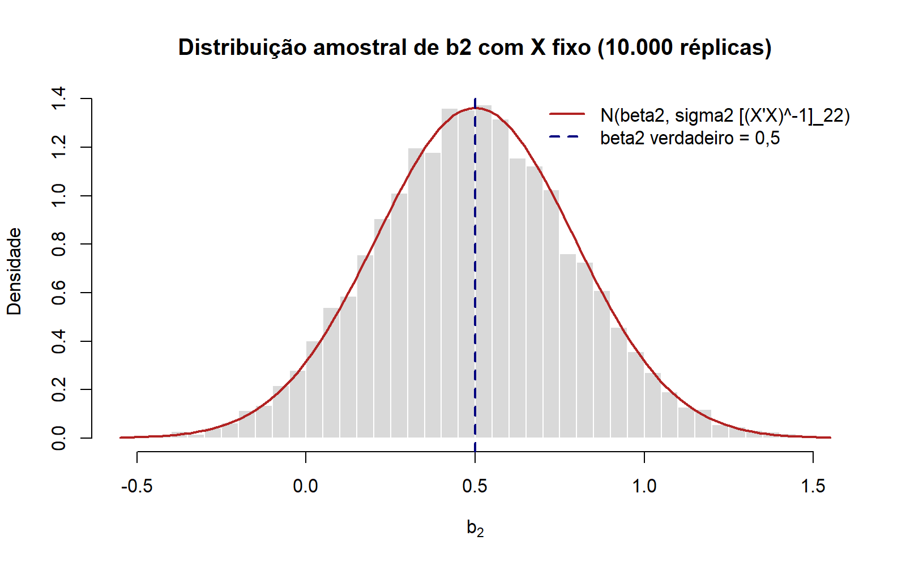
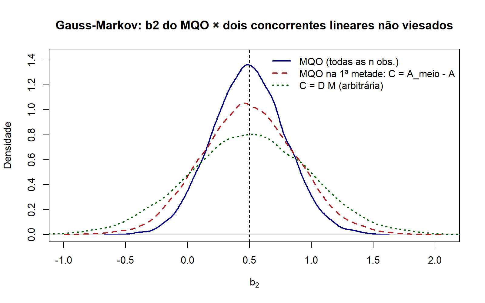
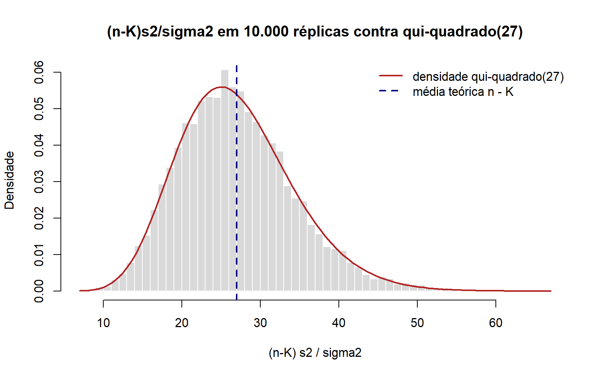
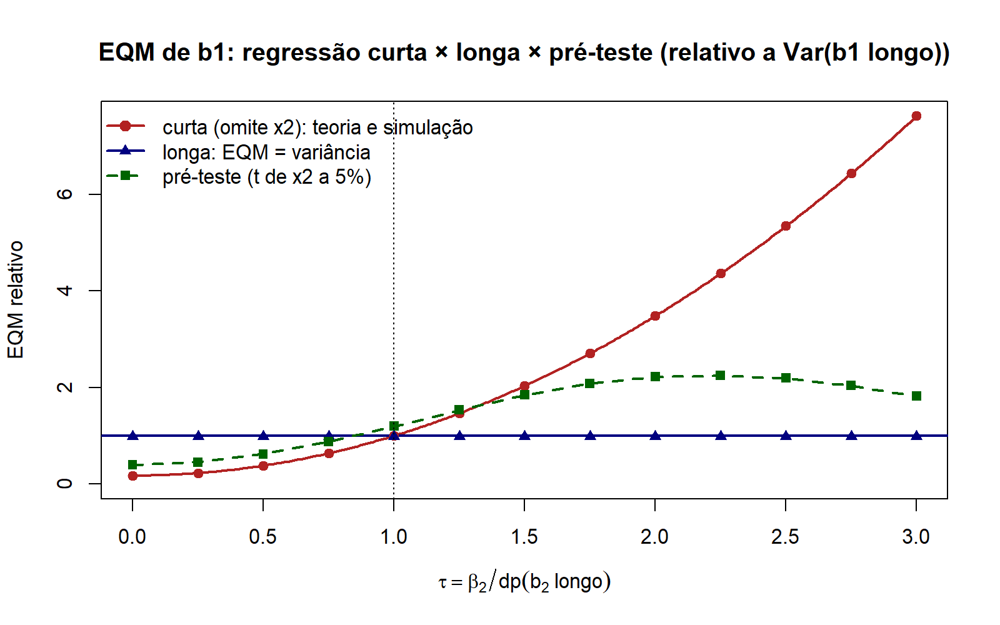

# Módulo 06 — Propriedades de amostra finita do MQO e multicolinearidade

Hub do módulo: [README](README.md) · Exercícios: [06_lista1.md](06_lista1.md) · Script: [06_amostra_finita_multicol.R](06_amostra_finita_multicol.R) · Figuras: [figuras/](figuras/)

## 0. Mapa

> [!NOTE]
> **O que este módulo entrega**
> O MQO visto como **variável aleatória**: $b=\beta+(X'X)^{-1}X'\varepsilon$ herda tudo de $\varepsilon$. Daí saem as quatro propriedades de amostra finita do SL06 (não-viés, variância, eficiência de Gauss-Markov, distribuição normal sob [A6]), o estimador não viesado $s^2$ pelo truque do traço e, por fim, o que a correlação entre regressores faz com a variância: multicolinearidade, FIV, regressão auxiliar, número de condição e componentes principais. O núcleo D9, D14, D15 e D16 de [demonstracoes/](../demonstracoes/econometria-i-demonstracoes-mes-1-1.md) **não é repetido**: aqui ele é citado e completado onde faltava rigor (dimensões, esperança incondicional, necessidade de $CX=0$, a fórmula do FIV por inversa particionada).

| D | Resultado | Hipóteses | Usado em |
|---|---|---|---|
| D06.1 | $b=\beta+(X'X)^{-1}X'\varepsilon=\beta+\sum_i v_i\varepsilon_i$ | A1, A2 | tudo |
| D06.2 | $E[b\mid X]=\beta$ e $E[b]=\beta$ (lei das expectativas iteradas) | A1–A3 | ex. 24, 33 |
| D06.3 | $\operatorname{Var}(b\mid X)=\sigma^2(X'X)^{-1}$ e $\operatorname{Var}(b)=\sigma^2E[(X'X)^{-1}]$ | A1–A4 | ex. 26; P1 2025/2 Q5 |
| D06.4 | Erros esféricos elemento a elemento; o que cai com heterocedasticidade e autocorrelação | A3, A4 | ex. 32, 36, 37 |
| D06.5 | Gauss-Markov matricial: $CX=0$ é necessário; $\operatorname{Var}(b^*\mid X)-\operatorname{Var}(b\mid X)=\sigma^2CC'\succeq 0$ | A1–A4 | ex. 33 |
| D06.6 | $M$ é simétrica, idempotente, $MX=0$, autovalores 0 ou 1, $\operatorname{tr}M=n-K$ | A2 | D06.7, D06.8 |
| D06.7 | $E[e'e\mid X]=\sigma^2(n-K)$, logo $E[s^2]=\sigma^2$ (truque do traço) | A1–A4 | ex. 23c; toda inferência |
| D06.8 | Sob A6: $b\mid X$ normal, $(n-K)s^2/\sigma^2\sim\chi^2(n-K)$, $b$ e $s^2$ independentes | A1–A6 | teste t e F (módulo 07) |
| D06.9 | $\operatorname{Var}(b_k\mid X)=\sigma^2/[(1-R_k^2)S_{kk}]$ e FIV; $\operatorname{Corr}(b_2,b_3\mid X)=-r_{23}$ | A1–A4 + constante | ex. 54, 63, 64 |
| D06.10 | Omitir variável: viés $P_{12}\beta_2$, variância menor e comparação por EQM | A1–A4 | ex. 53 |
| D06.11 | Colinearidade perfeita: $X'X$ singular e $\beta$ não identificado | A2 | ex. 35 |
| D06.12 | Teste F da regressão auxiliar e FIV por pares como cota inferior | A2 (+ normalidade para o F) | ex. 54, 63, 64 |
| D06.13 | Componentes principais: autovetor do maior autovalor | — | remédio (SL06, p. 56–60) |

## 1. Notação e hipóteses

- Notação do Greene (ver [CONVENCOES.md](../CONVENCOES.md)): $y$ é $n\times1$, $X$ é $n\times K$ **com** a coluna $\iota$ de 1s, $\beta$ é $K\times1$, $\varepsilon$ é $n\times1$. $b=(X'X)^{-1}X'y$ ($K\times1$), $e=y-Xb$ ($n\times1$).
- $A\equiv(X'X)^{-1}X'$ é $K\times n$ (então $b=Ay$). $P=XA$ e $M=I_n-P$ são $n\times n$. $M^0=I_n-\tfrac1n\iota\iota'$. $s^2=e'e/(n-K)$, com $K$ contando a constante.
- $v_i=(X'X)^{-1}x_i$ ($K\times1$), em que $x_i'$ é a linha $i$ de $X$ ($1\times K$). Então $X'\varepsilon=\sum_i x_i\varepsilon_i$.
- Para um regressor $x_k$ ($n\times1$): $X_{(k)}$ é $X$ sem a coluna $k$ ($n\times(K-1)$, **com** $\iota$), $M_{(k)}=I_n-X_{(k)}(X_{(k)}'X_{(k)})^{-1}X_{(k)}'$, $S_{kk}=\sum_i(x_{ik}-\bar x_k)^2=x_k'M^0x_k$ e $R_k^2$ é o $R^2$ da regressão auxiliar de $x_k$ em $X_{(k)}$. $\mathrm{FIV}_k=1/(1-R_k^2)$.
- Na Lista 1 o erro aparece como $u$, $\mu$ ou $\varepsilon$, e $b^*$ (ex. 33) é o que D16 chama de $b_0$. Na prova, use a letra do enunciado.

**Hipóteses usadas** (numeração do Greene, [CONVENCOES.md](../CONVENCOES.md) §2): [A1] linearidade; [A2] posto completo; [A3] $E[\varepsilon\mid X]=0$; [A4] $E[\varepsilon\varepsilon'\mid X]=\sigma^2I_n$; [A5] $X$ gerado independentemente de $\varepsilon$; [A6] $\varepsilon\mid X\sim N(0,\sigma^2I_n)$. Não-viés usa A1–A3; variância e Gauss-Markov acrescentam A4; distribuição exata acrescenta A6. **Nenhuma** propriedade deste módulo exige $n\to\infty$: são de amostra finita. As assintóticas estão no módulo 08.

**Contexto amostral (SL06, p. 3–13).** "Estimativa" é o número calculado em uma amostra; "estimador" é a regra $b=Ay$, uma variável aleatória. As propriedades de amostra finita descrevem a **distribuição amostral** de $b$: o que aconteceria com $b$ se o experimento fosse repetido muitas vezes. Há dois experimentos possíveis. Com **$X$ fixo em amostras repetidas**, só $\varepsilon$ é sorteado de novo; os resultados valem condicionais a $X$ ($E[\cdot\mid X]$). Com **$X$ aleatório**, sorteia-se tudo; os resultados incondicionais saem dos condicionais pela lei das expectativas iteradas. O script faz os dois (seções A e B).

## 2. Demonstrações

### D06.1 · b como variável aleatória

> [!NOTE]
> **O que se quer provar**
> Sob [A1] e [A2], $b=\beta+(X'X)^{-1}X'\varepsilon=\beta+\sum_{i=1}^n v_i\varepsilon_i$, com $v_i=(X'X)^{-1}x_i$. Logo $b$ é **linear** em $y$ (e em $\varepsilon$): $b=Ay$ com $A$ função só de $X$.

**Por que importa.** Todas as propriedades seguintes são contas com esta identidade. É o análogo matricial de $\hat\beta_2=\beta_2+\sum k_iu_i$ (D9).

**Passo a passo.**

1. Sob [A2], $X'X$ ($K\times K$) tem posto $K$, logo é invertível, e $b=(X'X)^{-1}X'y$ existe. Substitui-se [A1], $y=X\beta+\varepsilon$:

$$
b=\underbrace{(X'X)^{-1}}_{K\times K}\underbrace{X'}_{K\times n}\big(\underbrace{X\beta}_{n\times1}+\underbrace{\varepsilon}_{n\times1}\big)=(X'X)^{-1}X'X\beta+(X'X)^{-1}X'\varepsilon .
$$

2. Como $(X'X)^{-1}(X'X)=I_K$, o primeiro termo é $\beta$:

$$
b=\beta+(X'X)^{-1}X'\varepsilon=\beta+A\varepsilon .
$$

3. Escrevendo $X'\varepsilon=\sum_i x_i\varepsilon_i$ (produto de $X'$ pela coluna $\varepsilon$, soma de colunas de $X'$ ponderadas por $\varepsilon_i$):

$$
\boxed{b=\beta+\sum_{i=1}^n\underbrace{(X'X)^{-1}x_i}_{v_i\ (K\times1)}\,\varepsilon_i}
$$

> [!TIP]
> **Como o professor pode torcer**
> "Mostre que $b$ é linear." A resposta é $b=Ay$ com $A=(X'X)^{-1}X'$ não dependendo de $y$. Não precisa de nenhuma hipótese sobre $\varepsilon$: linearidade é álgebra, só usa [A2].

### D06.2 · Não-viés condicional e incondicional

> [!NOTE]
> **O que se quer provar**
> Sob [A1]–[A3], $E[b\mid X]=\beta$ para todo $\beta$ e, se $E[b]$ existe, $E[b]=\beta$.

**Por que importa.** D14 (etapa 1) e o ex. 24 do módulo 03 fazem a parte condicional. O que falta é a passagem para a esperança **incondicional**, que é o que "não viesado" significa quando $X$ é aleatório (SL06, p. 11 e 35).

**Passo a passo.**

1. Esperança condicional de D06.1. Dado $X$, $A$ é constante e sai da esperança (linearidade de $E[\cdot\mid X]$). *[D06.1; A3]*

$$
E[b\mid X]=\beta+(X'X)^{-1}X'\,E[\varepsilon\mid X]=\beta+(X'X)^{-1}X'\cdot 0=\beta .
$$

2. Lei das expectativas iteradas, $E[b]=E_X\big[E[b\mid X]\big]$: *[LEI]*

$$
E[b]=E_X[\beta]=\beta .
$$

$$\boxed{E[b\mid X]=\beta\quad\Longrightarrow\quad E[b]=\beta}$$

> [!WARNING]
> **O que [A3] exige e o que não basta**
> É preciso $E[\varepsilon\mid X]=0$ (exogeneidade **estrita**: $\varepsilon_i$ não correlacionado com os regressores de **todas** as observações). Só $E[x_i\varepsilon_i]=0$ (ortogonalidade contemporânea) não basta para não-viés em amostra finita; basta para consistência (módulo 08). Exemplo clássico: regressão com $y_{t-1}$ como regressor é viesada em amostra finita.

> [!TIP]
> **Como o professor pode torcer**
> - "O estimador é não viesado se houver heterocedasticidade?" Sim: o passo 1 não usa [A4].
> - Se $E[\varepsilon\mid X]=\eta\neq0$ (ex. 65), então $E[b\mid X]=\beta+(X'X)^{-1}X'\eta$: viés. É a porta para variáveis instrumentais (módulo 10).
> - Erro de medição no regressor (P1 2025/2, Q4) quebra [A3]; na dependente, não (ver a [prova resolvida](../provas/p1_2025_2/econometria-i-prova-2025-2-resolvida.md)).

### D06.3 · Variância condicional e incondicional de b (ex. 26)

> [!NOTE]
> **O que se quer provar**
> Sob [A1]–[A4], $\operatorname{Var}(b\mid X)=\sigma^2(X'X)^{-1}$ ($K\times K$). Se $X$ é aleatório e $E[(X'X)^{-1}]$ existe, $\operatorname{Var}(b)=\sigma^2E[(X'X)^{-1}]$.

**Por que importa.** A parte condicional é D14; aqui ela vem com as dimensões em cada produto, que é o que a correção cobra, e com a versão incondicional (SL06, p. 22–23). Caiu na P1 2025/2 (Q5) junto com consistência.

**Passo a passo.**

1. Definição de matriz de covariância de um vetor $K\times1$ com média condicional $\beta$ (D06.2): *[def.; D06.2]*

$$
\operatorname{Var}(b\mid X)=E\big[(b-\beta)(b-\beta)'\mid X\big]\qquad (K\times1)(1\times K)=K\times K .
$$

2. Por D06.1, $b-\beta=A\varepsilon$ e $(b-\beta)'=\varepsilon'A'$, com $A=(X'X)^{-1}X'$ ($K\times n$) e $A'=X(X'X)^{-1}$ ($n\times K$; a inversa de uma matriz simétrica é simétrica): *[D06.1; $(AB)'=B'A'$]*

$$
\operatorname{Var}(b\mid X)=E\big[\underbrace{A}_{K\times n}\underbrace{\varepsilon\varepsilon'}_{n\times n}\underbrace{A'}_{n\times K}\mid X\big].
$$

3. Dado $X$, $A$ é constante; a esperança de uma forma $A Z A'$ com $A$ constante é $A\,E[Z]\,A'$ (linearidade elemento a elemento): *[linearidade de $E[\cdot\mid X]$]*

$$
\operatorname{Var}(b\mid X)=A\,E[\varepsilon\varepsilon'\mid X]\,A' .
$$

4. Erros esféricos: *[A4]*

$$
\operatorname{Var}(b\mid X)=A(\sigma^2I_n)A'=\sigma^2AA'=\sigma^2(X'X)^{-1}X'X(X'X)^{-1}.
$$

5. $X'X(X'X)^{-1}=I_K$:

$$
\boxed{\operatorname{Var}(b\mid X)=\sigma^2(X'X)^{-1}}\qquad(K\times K,\ \text{simétrica, positiva definida})
$$

6. **Incondicional.** Decomposição da variância (lei da variância total), $\operatorname{Var}(b)=E_X[\operatorname{Var}(b\mid X)]+\operatorname{Var}_X(E[b\mid X])$: *[lei da variância total; D06.2]*

$$
\operatorname{Var}(b)=E_X\big[\sigma^2(X'X)^{-1}\big]+\operatorname{Var}_X(\beta)=\sigma^2E\big[(X'X)^{-1}\big]+0 .
$$

$$\boxed{\operatorname{Var}(b)=\sigma^2E\big[(X'X)^{-1}\big]}$$

**Leitura.** O elemento $(k,k)$ é $\operatorname{Var}(b_k\mid X)$ e o $(j,k)$ é $\operatorname{Cov}(b_j,b_k\mid X)$. $\sigma^2$ é desconhecido: estima-se $\operatorname{Var}(b\mid X)$ por $s^2(X'X)^{-1}$ (D06.7), e o erro-padrão impresso no output é $\sqrt{s^2[(X'X)^{-1}]_{kk}}$. A estimativa de $E[(X'X)^{-1}]$ usa a única informação disponível, o próprio $X$ (SL06, p. 23): na prática, $s^2(X'X)^{-1}$ serve para as duas.

> [!WARNING]
> **$E[(X'X)^{-1}]\neq[E(X'X)]^{-1}$**
> A inversão é uma função convexa no sentido matricial, e a desigualdade de Jensen dá $E[(X'X)^{-1}]\succeq[E(X'X)]^{-1}$. Trocar uma pela outra **subestima** a variância. No script (seção B), com $X$ sorteado a cada réplica, $\operatorname{Var}(b_2)$ simulada é 0,1093, $\sigma^2E[(X'X)^{-1}]_{22}$ é 0,1066 e $\sigma^2[E(X'X)]^{-1}_{22}$ é só 0,0925.

> [!TIP]
> **Como o professor pode torcer**
> - Pedir a versão escalar ($\operatorname{Var}(\hat\beta_2\mid X)=\sigma^2/S_{XX}$, D10): é o elemento $(2,2)$ desta matriz quando $X=[\iota\ \ x]$.
> - Tirar [A4] e pedir a variância: o passo 4 vira $A\Sigma A'=(X'X)^{-1}X'\Sigma X(X'X)^{-1}$ (sanduíche; ver D06.4).
> - Pedir $\operatorname{Var}(b)$ "sem condicionar": responder com o passo 6 e dizer que o termo $\operatorname{Var}_X(E[b\mid X])$ some **porque** $b$ é condicionalmente não viesado.

**Conferência numérica** (seção A do script: $n=30$, $K=3$, $\sigma=2$, 10.000 réplicas com $X$ fixo; seção B: 5.000 réplicas com $X$ aleatório)

| chave_R | nota |
|---|---|
| m06_mc_media_b2 | 0,4943 |
| m06_mc_var_b2_teo | 0,085645 |
| m06_mc_var_b2_sim | 0,08742 |
| m06_mc_cov_b2b3_teo | -0,07402 |
| m06_mc_cov_b2b3_sim | -0,07610 |
| m06_mc_erro_rel_max_diag | 0,027 |
| m06_inc_media_b2 | 0,5002 |
| m06_inc_var_b2_sim | 0,1093 |
| m06_inc_var_b2_teo | 0,1066 |
| m06_inc_var_b2_jensen | 0,0925 |

A distribuição simulada de $b_2$ está em [figuras/m06_dist_b2.png](figuras/m06_dist_b2.png).



### D06.4 · Erros esféricos elemento a elemento (ex. 32, 36, 37)

> [!NOTE]
> **O que se quer provar**
> (i) Sob [A3], o elemento $(i,j)$ de $E[\varepsilon\varepsilon'\mid X]$ é $\operatorname{Cov}(\varepsilon_i,\varepsilon_j\mid X)$, e $E[\varepsilon\varepsilon'\mid X]=\sigma^2I_n$ equivale a homocedasticidade (diagonal constante) **e** ausência de autocorrelação (fora da diagonal nula). (ii) Com amostragem aleatória, $E[\varepsilon_i\mid x_i]=0$ e $E[\varepsilon_i^2\mid x_i]=\sigma^2$, a matriz $\sigma^2I_n$ é **consequência**. (iii) Se $E[\varepsilon\varepsilon'\mid X]=\Sigma\neq\sigma^2I_n$, $b$ continua não viesado, mas $\operatorname{Var}(b\mid X)=A\Sigma A'$, $s^2(X'X)^{-1}$ é viesado e Gauss-Markov deixa de valer.

**Por que importa.** Os ex. 32, 36 e 37 são exatamente isto, e a leitura "qual hipótese caiu" volta na P2 (MQG, SL11).

**Passo a passo.**

1. $\varepsilon\varepsilon'$ é $n\times n$ com elemento $(i,j)$ igual a $\varepsilon_i\varepsilon_j$. Tomando $E[\cdot\mid X]$ elemento a elemento: *[def. de esperança de matriz]*

$$
E[\varepsilon\varepsilon'\mid X]=\begin{bmatrix}E[\varepsilon_1^2\mid X]&E[\varepsilon_1\varepsilon_2\mid X]&\cdots&E[\varepsilon_1\varepsilon_n\mid X]\\ E[\varepsilon_2\varepsilon_1\mid X]&E[\varepsilon_2^2\mid X]&\cdots&E[\varepsilon_2\varepsilon_n\mid X]\\ \vdots&\vdots&\ddots&\vdots\\ E[\varepsilon_n\varepsilon_1\mid X]&E[\varepsilon_n\varepsilon_2\mid X]&\cdots&E[\varepsilon_n^2\mid X]\end{bmatrix}.
$$

2. Como $E[\varepsilon_i\mid X]=0$ para todo $i$, $\operatorname{Cov}(\varepsilon_i,\varepsilon_j\mid X)=E[\varepsilon_i\varepsilon_j\mid X]-E[\varepsilon_i\mid X]E[\varepsilon_j\mid X]=E[\varepsilon_i\varepsilon_j\mid X]$. Em particular, a diagonal é $\operatorname{Var}(\varepsilon_i\mid X)$. *[A3; def. de covariância]*

3. Logo $E[\varepsilon\varepsilon'\mid X]=\sigma^2I_n$ se e somente se: *[comparação elemento a elemento]*

$$
\underbrace{\operatorname{Var}(\varepsilon_i\mid X)=\sigma^2\ \ \forall i}_{\text{homocedasticidade: diagonal constante}}\qquad\text{e}\qquad\underbrace{\operatorname{Cov}(\varepsilon_i,\varepsilon_j\mid X)=0\ \ \forall i\neq j}_{\text{sem autocorrelação: fora da diagonal nula}} .
$$

4. **Quando dá para "provar" (ex. 32).** $\sigma^2I_n$ é hipótese, mas é consequência de três hipóteses mais primitivas (Hayashi, §1.1): $\{(y_i,x_i)\}$ i.i.d., $E[\varepsilon_i\mid x_i]=0$ e $E[\varepsilon_i^2\mid x_i]=\sigma^2$. Pela independência entre observações, condicionar em $X$ equivale a condicionar em $x_i$ (ou em $x_i,x_j$). Então, para $i\neq j$: *[i.i.d.; independência]*

$$
E[\varepsilon_i\varepsilon_j\mid X]=E[\varepsilon_i\varepsilon_j\mid x_i,x_j]=E[\varepsilon_i\mid x_i]\,E[\varepsilon_j\mid x_j]=0\cdot0=0,
$$

e, na diagonal, $E[\varepsilon_i^2\mid X]=E[\varepsilon_i^2\mid x_i]=\sigma^2$. Juntando, $E[\varepsilon\varepsilon'\mid X]=\sigma^2I_n$.

5. **Se falhar.** Seja $E[\varepsilon\varepsilon'\mid X]=\Sigma$ ($n\times n$, simétrica, positiva definida). D06.2 não usa [A4], logo $E[b\mid X]=\beta$ continua. O passo 3 de D06.3 dá: *[D06.3, passo 3]*

$$
\operatorname{Var}(b\mid X)=\underbrace{(X'X)^{-1}}_{K\times K}\underbrace{X'}_{K\times n}\underbrace{\Sigma}_{n\times n}\underbrace{X}_{n\times K}\underbrace{(X'X)^{-1}}_{K\times K}\ \neq\ \sigma^2(X'X)^{-1}.
$$

Além disso, $E[e'e\mid X]=\operatorname{tr}(M\Sigma)$ (mesma conta de D06.7 sem usar [A4]), de modo que $s^2(X'X)^{-1}$ não estima a variância certa: os erros-padrão impressos e os testes t e F ficam errados. Gauss-Markov também cai (D06.5 usa [A4] no passo 5); o eficiente passa a ser o MQG (SL11).

| Estrutura de $E[\varepsilon\varepsilon'\mid X]$ | Diagonal | Fora da diagonal | Hipótese violada | Exercício |
|---|---|---|---|---|
| $\sigma^2I_n$ | constante | zero | nenhuma | ex. 32 |
| $\operatorname{diag}(\sigma_1^2,\dots,\sigma_n^2)$ | varia com $i$ | zero | homocedasticidade (parte de A4) | ex. 36 |
| $\sigma^2\Omega$, $\Omega$ com 1 na diagonal | constante | não nula | ausência de autocorrelação (parte de A4) | ex. 37 |

> [!TIP]
> **Como o professor pode torcer**
> - Dar a matriz em forma de correlação, $\sigma^2\Omega$ com uns na diagonal (ex. 37): a diagonal constante indica homocedasticidade; os 0,56, 0,42 e 0,65 fora da diagonal são **correlações** entre erros, e a covariância é $\sigma^2$ vezes elas.
> - Perguntar se $b$ fica viesado: não, só perde eficiência e o erro-padrão usual fica errado (passo 5).
> - Escrever $E(u_i,u_j)$ (notação do ex. 36): leia como $E[u_iu_j\mid X]$; para $i=j$ é $E[u_i^2\mid X]=\operatorname{Var}(u_i\mid X)$.

**Conferência numérica** (seção D do script: razão entre o desvio-padrão "ingênuo" $\sqrt{E[s^2\mid X][(X'X)^{-1}]_{22}}$ e o verdadeiro $\sqrt{[A\Sigma A']_{22}}$)

| chave_R | nota |
|---|---|
| m06_nesf_het_razao_dp_b2 | 0,843 |
| m06_nesf_ar1_rho | 0,6 |
| m06_nesf_ar1_razao_dp_b2 | 0,502 |

Com variância crescente no desvio de $x_2$, o erro-padrão usual subestima o verdadeiro em cerca de 16%; com erros AR(1) de $\rho=0{,}6$ e regressor com tendência, o usual é só metade do verdadeiro, e o teste t rejeita demais.

### D06.5 · Gauss-Markov matricial com b* = [(X'X)^{-1}X' + C]y (ex. 33)

> [!NOTE]
> **O que se quer provar**
> Sob [A1]–[A4], seja $b^*=[(X'X)^{-1}X'+C]y$, com $C$ ($K\times n$) função só de $X$. (i) $b^*$ é não viesado para todo $\beta$ **se e somente se** $CX=0$. (ii) Nesse caso, $\operatorname{Var}(b^*\mid X)=\sigma^2(X'X)^{-1}+\sigma^2CC'$. (iii) $\sigma^2CC'\succeq0$, e $CC'=0$ só se $C=0$. Logo $\operatorname{Var}(a'b^*\mid X)\ge\operatorname{Var}(a'b\mid X)$ para todo $a\in\mathbb{R}^K$: MQO é BLUE.

**Por que importa.** D16 já faz a conta. Aqui entram os três pontos em que a correção costuma tirar nota: a **necessidade** de $CX=0$ (não só suficiência), a **positividade semidefinida** com dimensões e o que "menor variância" significa para matrizes. Todo estimador linear em $y$ se escreve assim: dado $b^*=Dy$, basta tomar $C=D-A$ (SL06, p. 30–33).

**Passo a passo.**

1. Dimensões: $(X'X)^{-1}X'$ é $K\times n$, $C$ é $K\times n$, $y$ é $n\times1$; $b^*$ é $K\times1$. Substitui-se [A1] e usa-se $(X'X)^{-1}X'X=I_K$: *[A1; D06.1]*

$$
b^*=\beta+(X'X)^{-1}X'\varepsilon+\underbrace{C}_{K\times n}\underbrace{X}_{n\times K}\beta+C\varepsilon .
$$

2. Esperança condicional, com $C$ e $X$ constantes dado $X$: *[A3; linearidade de $E[\cdot\mid X]$]*

$$
E[b^*\mid X]=\beta+CX\beta .
$$

3. **Necessidade.** "Não viesado" significa $E[b^*\mid X]=\beta$ **para todo** $\beta\in\mathbb{R}^K$, isto é, $CX\beta=0$ para todo $\beta$. Tomando $\beta=\mathbf{e}_k$ (vetor canônico), $CX\mathbf{e}_k$ é a coluna $k$ de $CX$; logo cada coluna de $CX$ ($K\times K$) é nula: *[escolha de $\beta$]*

$$
\boxed{CX=0_{K\times K}}\qquad\Longleftrightarrow\qquad E[b^*\mid X]=\beta\ \ \forall\beta .
$$

A volta é imediata pelo passo 2. Sob $CX=0$: $b^*-\beta=[(X'X)^{-1}X'+C]\varepsilon\equiv(A+C)\varepsilon$.

4. Variância, pelo mesmo argumento de D06.3 (passos 1–4), agora com $A+C$ ($K\times n$) no lugar de $A$: *[D06.3; A4]*

$$
\operatorname{Var}(b^*\mid X)=(A+C)\,E[\varepsilon\varepsilon'\mid X]\,(A+C)'=\sigma^2\big(AA'+AC'+CA'+CC'\big).
$$

5. Termos cruzados. $CA'=CX(X'X)^{-1}=0\cdot(X'X)^{-1}=0$ ($K\times K$), e $AC'=(CA')'=0$. E $AA'=(X'X)^{-1}$ (D06.3, passo 5): *[passo 3; transposição]*

$$
\boxed{\operatorname{Var}(b^*\mid X)=\underbrace{\sigma^2(X'X)^{-1}}_{\operatorname{Var}(b\mid X)}+\sigma^2\underbrace{C}_{K\times n}\underbrace{C'}_{n\times K}}
$$

6. **$CC'$ é positiva semidefinida.** Para todo $a\in\mathbb{R}^K$, $w\equiv C'a$ é $n\times1$ e: *[forma quadrática]*

$$
a'CC'a=(C'a)'(C'a)=w'w=\sum_{i=1}^n w_i^2\ \ge\ 0 .
$$

7. **Estrita quando $C\neq0$.** $\operatorname{tr}(CC')=\sum_{k,i}c_{ki}^2>0$ se $C\neq0$; como o traço é a soma dos elementos da diagonal, pelo menos um $[CC']_{kk}>0$. Então existe pelo menos um coeficiente com $\operatorname{Var}(b_k^*\mid X)>\operatorname{Var}(b_k\mid X)$, e nenhum com variância menor. *[traço]*

8. **Tradução para a prova.** Para qualquer combinação linear $a'\beta$ (um coeficiente, uma soma, uma previsão): *[Var de forma linear; passos 5–6]*

$$
\operatorname{Var}(a'b^*\mid X)-\operatorname{Var}(a'b\mid X)=a'\big[\operatorname{Var}(b^*\mid X)-\operatorname{Var}(b\mid X)\big]a=\sigma^2a'CC'a\ \ge0 .
$$

$$\boxed{\operatorname{Var}(b^*\mid X)-\operatorname{Var}(b\mid X)=\sigma^2CC'\succeq0\ \Longrightarrow\ b\ \text{é eficiente (BLUE)}}$$

O resultado é condicional a $X$; como vale para cada $X$, vale também incondicionalmente (tomar $E_X$ preserva a semidefinição: $E_X[\sigma^2CC']\succeq0$).

> [!IMPORTANT]
> **O que Gauss-Markov diz e o que não diz**
> - Usa [A1]–[A4]. **Não** usa normalidade [A6].
> - Compara $b$ só com estimadores **lineares e não viesados**. Um estimador viesado (a regressão curta de D06.10, ridge, pré-teste) pode ter **EQM menor**.
> - "Menor" é no sentido matricial: a diferença é positiva semidefinida. Isso implica cada variância da diagonal menor ou igual, mas é mais forte que isso.
> - Com heterocedasticidade ou autocorrelação, o passo 4 vira $(A+C)\Sigma(A+C)'$ e os termos cruzados não somem: MQO deixa de ser BLUE.

> [!TIP]
> **Como o professor pode torcer**
> - Dar $b^*$ com $C$ e dizer "linear e não viciado" (ex. 33): mesmo assim **deduza** $CX=0$ no passo 3; é o ponto que vale nota.
> - Escalar (D11): pesos $w_i=k_i+d_i$ e as condições $\sum d_i=0$ e $\sum d_ix_i=0$ são exatamente $CX=0$ com $X=[\iota\ \ x]$.
> - Pedir um exemplo de concorrente: o MQO calculado só com parte da amostra é linear e não viesado (seção C do script); a razão de variâncias de $b_2$ é 1,72.

**Conferência numérica** (seção C: $C_1$ = MQO na primeira metade menos MQO completo; $C_2=DM$ com $D$ arbitrária, logo $C_2X=DMX=0$)

| chave_R | nota |
|---|---|
| m06_gm_media_b2_meio | 0,4948 |
| m06_gm_media_b2_dm | 0,4947 |
| m06_gm_var_b2_meio_teo | 0,1472 |
| m06_gm_var_b2_meio_sim | 0,1471 |
| m06_gm_var_b2_dm_teo | 0,2431 |
| m06_gm_var_b2_dm_sim | 0,2445 |
| m06_gm_razao_var_b2_meio | 1,72 |
| m06_gm_razao_var_b2_dm | 2,84 |
| m06_gm_vies_b2_cx | -1,203 |
| m06_gm_vies_b2_cx_sim | -1,211 |

Os menores autovalores de $\sigma^2C_1C_1'$ e de $\sigma^2C_2C_2'$ são positivos (chaves `m06_gm_autoval_min_cc1` e `m06_gm_autoval_min_cc2` no CSV). Quando se usa $C=D$ sem o $M$, $CX\neq0$ e o estimador é viesado: o viés teórico $[CX\beta]_2$ bate com o simulado. Figura: [figuras/m06_gauss_markov.png](figuras/m06_gauss_markov.png).



### D06.6 · Propriedades da matriz M

> [!NOTE]
> **O que se quer provar**
> Sob [A2], $M=I_n-X(X'X)^{-1}X'$ ($n\times n$) satisfaz $M'=M$, $MM=M$, $MX=0$, $e=My=M\varepsilon$, seus autovalores são 0 ou 1 e $\operatorname{tr}(M)=\operatorname{posto}(M)=n-K$.

**Por que importa.** É a ferramenta de D06.7 e D06.8. $e=My$ é o ex. 28 (módulo 03); aqui o que interessa é $e=M\varepsilon$ e o traço (SL06, p. 38–42).

**Passo a passo.**

1. Simetria: $M'=I_n-[X(X'X)^{-1}X']'=I_n-X(X'X)^{-1}X'=M$. *[$(ABC)'=C'B'A'$; $(X'X)^{-1}$ simétrica]*
2. $MX=X-X(X'X)^{-1}X'X=X-X=0$ ($n\times K$). *[$(X'X)^{-1}X'X=I_K$]*
3. Idempotência: $MM=M-X(X'X)^{-1}X'M=M-X(X'X)^{-1}(MX)'=M$. *[passos 1–2]*
4. $e=y-Xb=[I_n-X(X'X)^{-1}X']y=My=M(X\beta+\varepsilon)=M\varepsilon$. *[passo 2; A1]*
5. Autovalores: se $Mz=\lambda z$ com $z\neq0$, então $\lambda z=Mz=MMz=\lambda^2z$, logo $\lambda^2=\lambda$ e $\lambda\in\{0,1\}$. *[passo 3]*
6. Traço, pela propriedade cíclica $\operatorname{tr}(AB)=\operatorname{tr}(BA)$ com $A=X$ ($n\times K$) e $B=(X'X)^{-1}X'$ ($K\times n$): *[linearidade do traço; ciclicidade]*

$$
\operatorname{tr}(M)=\operatorname{tr}(I_n)-\operatorname{tr}\big[X(X'X)^{-1}X'\big]=n-\operatorname{tr}\big[(X'X)^{-1}X'X\big]=n-\operatorname{tr}(I_K)=n-K .
$$

Como $M$ é simétrica, $M=C\Lambda C'$ com $C'C=I_n$, e $\operatorname{tr}(M)=\operatorname{tr}(\Lambda)$ = número de autovalores iguais a 1 = $\operatorname{posto}(M)$.

$$\boxed{\operatorname{tr}(M)=\operatorname{posto}(M)=n-K}$$

**Conferência numérica** ($n=30$, $K=3$ na seção A)

| chave_R | nota |
|---|---|
| m06_trM | 27 |
| m06_autoval_M_uns | 27 |
| m06_autoval_M_zeros | 3 |

### D06.7 · E[s²] = σ² pelo truque do traço

> [!NOTE]
> **O que se quer provar**
> Sob [A1]–[A4], $E[e'e\mid X]=\sigma^2(n-K)$. Logo $s^2=e'e/(n-K)$ satisfaz $E[s^2\mid X]=\sigma^2$ e $E[s^2]=\sigma^2$, enquanto $E[e'e/n\mid X]=\sigma^2(n-K)/n\lt\sigma^2$.

**Por que importa.** É o que justifica dividir por $n-K$ em todo output (o "Degrees of freedom" do NLOGIT) e é a peça que falta para $s^2(X'X)^{-1}$ estimar $\operatorname{Var}(b\mid X)$ sem viés. Não está no D0–D16. O ponto sutil: $e'e$ é um **escalar**, e o traço é o que permite mover $\varepsilon$ para dentro da esperança (SL06, p. 37–41).

**Passo a passo.**

1. Por D06.6, $e=M\varepsilon$. Então $e'e=\varepsilon'M'M\varepsilon=\varepsilon'M\varepsilon$ ($1\times n\cdot n\times n\cdot n\times1=1\times1$). *[D06.6: $M'=M$, $MM=M$]*

$$
e'e=\varepsilon'M\varepsilon=\sum_{i=1}^n\sum_{j=1}^n m_{ij}\varepsilon_i\varepsilon_j .
$$

2. Um escalar é igual ao seu traço, e $\operatorname{tr}(\varepsilon'M\varepsilon)=\operatorname{tr}(M\varepsilon\varepsilon')$ pela ciclicidade, com $\varepsilon'$ ($1\times n$) e $M\varepsilon$ ($n\times1$): *[escalar = traço; ciclicidade]*

$$
e'e=\operatorname{tr}(\varepsilon'M\varepsilon)=\operatorname{tr}(\underbrace{M\varepsilon\varepsilon'}_{n\times n}).
$$

3. Traço e esperança comutam (o traço é soma de elementos da diagonal, e $E$ é linear); dado $X$, $M$ é constante: *[linearidade de $E$ e do traço]*

$$
E[e'e\mid X]=\operatorname{tr}\big(E[M\varepsilon\varepsilon'\mid X]\big)=\operatorname{tr}\big(M\,E[\varepsilon\varepsilon'\mid X]\big).
$$

4. Erros esféricos e D06.6: *[A4; D06.6]*

$$
E[e'e\mid X]=\operatorname{tr}(M\sigma^2I_n)=\sigma^2\operatorname{tr}(M)=\sigma^2(n-K).
$$

5. Dividindo por $n-K$ (constante) e usando a lei das expectativas iteradas: *[linearidade; LEI]*

$$
\boxed{E[s^2\mid X]=\frac{E[e'e\mid X]}{n-K}=\sigma^2\qquad\Longrightarrow\qquad E[s^2]=E_X\big[E[s^2\mid X]\big]=\sigma^2}
$$

6. **Conta alternativa, sem traço** (útil se o professor pedir escalar): pelo passo 1, $E[e'e\mid X]=\sum_i\sum_jm_{ij}E[\varepsilon_i\varepsilon_j\mid X]=\sum_i m_{ii}\sigma^2=\sigma^2\operatorname{tr}(M)$, porque $E[\varepsilon_i\varepsilon_j\mid X]=0$ para $i\neq j$ e $\sigma^2$ para $i=j$ *[A4, elemento a elemento como em D06.4]*.

7. **Consequência.** $\widehat{\operatorname{Var}}(b\mid X)=s^2(X'X)^{-1}$ é não viesado para $\sigma^2(X'X)^{-1}$: $E[s^2(X'X)^{-1}\mid X]=(X'X)^{-1}E[s^2\mid X]=\sigma^2(X'X)^{-1}$. *[passo 5; $X$ constante dado $X$]*

**Por que $e'e/n$ subestima.** $e_i=\varepsilon_i-x_i'(b-\beta)$: o resíduo é o erro "contaminado" pelo erro de estimação, e o MQO escolhe $b$ justamente para deixar $e'e$ pequeno ($e'e\le\varepsilon'\varepsilon$ sempre, porque $e'e=\min_d(y-Xd)'(y-Xd)$ e $\varepsilon=y-X\beta$). Perde-se um grau de liberdade por parâmetro estimado: as $K$ restrições $X'e=0$.

> [!WARNING]
> **$s$ não é não viesado para $\sigma$**
> $E[s^2]=\sigma^2$ não implica $E[s]=\sigma$. Como a raiz é côncava, Jensen dá $E[s]=E[\sqrt{s^2}]\le\sqrt{E[s^2]}=\sigma$. Na seção A ($\sigma=2$), a média de $s$ nas réplicas é 1,984. O viés some com $n$ grande; em amostra finita, não.

> [!TIP]
> **Como o professor pode torcer**
> - Regressão simples: $E[\sum\hat u_i^2]=\sigma^2(n-2)$, o mesmo resultado com $K=2$.
> - Sem [A4]: o passo 4 vira $\operatorname{tr}(M\Sigma)$, que em geral não é $\sigma^2(n-K)$.
> - Pedir "quantos graus de liberdade": $n-K$ no Greene ($K$ conta a constante), $n-k-1$ no Wooldridge ($k$ inclinações). Mesmo número.

**Conferência numérica** (seção A; $\sigma^2=4$, $n-K=27$)

| chave_R | nota |
|---|---|
| m06_mc_media_s2 | 3,995 |
| m06_mc_media_een | 3,596 |
| m06_mc_een_teo | 3,6 |
| m06_mc_media_s | 1,984 |

### D06.8 · Distribuição de b e de s² sob normalidade

> [!NOTE]
> **O que se quer provar**
> Sob [A1]–[A6]: (i) $b\mid X\sim N\big(\beta,\sigma^2(X'X)^{-1}\big)$; (ii) $(n-K)s^2/\sigma^2\mid X\sim\chi^2(n-K)$; (iii) $b$ e $s^2$ são independentes dado $X$. Consequência: $t_k=(b_k-\beta_k)/\sqrt{s^2[(X'X)^{-1}]_{kk}}\sim t(n-K)$, também incondicionalmente.

**Por que importa.** É a quarta propriedade do SL06 (p. 34–35) e a base exata dos testes t e F do módulo 07. Sem [A6], a distribuição de $b$ em amostra finita é desconhecida e a inferência passa a ser assintótica (módulo 08); é por isso que, com $n=4165$, o JB é dispensável (P1 2025/2, Q1a).

**Passo a passo.**

1. $b-\beta=A\varepsilon$ é função linear de um vetor normal. Função linear de normal é normal, com média $A\cdot0$ e covariância $A(\sigma^2I_n)A'$: *[A6; Greene, Ap. B.11.3; D06.3]*

$$
b\mid X\sim N\big(\beta,\ \sigma^2AA'\big)=N\big(\beta,\ \sigma^2(X'X)^{-1}\big).
$$

2. Seja $z=\varepsilon/\sigma$, com $z\mid X\sim N(0,I_n)$. Por D06.6, $(n-K)s^2/\sigma^2=e'e/\sigma^2=z'Mz$. Decompondo $M=C\Lambda C'$ ($C'C=I_n$) e definindo $w=C'z$: *[D06.6; A6]*

$$
w\mid X\sim N(0,C'I_nC)=N(0,I_n),\qquad z'Mz=w'\Lambda w=\sum_{i:\ \lambda_i=1}w_i^2 .
$$

3. Há exatamente $n-K$ autovalores iguais a 1 (D06.6), e os $w_i$ são normais padrão independentes (normais não correlacionadas). Soma de $n-K$ quadrados de $N(0,1)$ independentes: *[def. de $\chi^2$; Greene, Teor. B.8]*

$$
\boxed{\frac{(n-K)s^2}{\sigma^2}\ \Big|\ X\sim\chi^2(n-K)}
$$

Daí, de novo, $E[s^2\mid X]=\sigma^2$ (média da $\chi^2$ é $n-K$) e $\operatorname{Var}(s^2\mid X)=2\sigma^4/(n-K)$.

4. **Independência.** $b-\beta=A\varepsilon$ e $e=M\varepsilon$ são funções lineares do mesmo vetor normal, logo **conjuntamente** normais. A covariância cruzada ($K\times n$) é: *[Var de forma linear; A4; D06.6]*

$$
\operatorname{Cov}(A\varepsilon,M\varepsilon\mid X)=A\,E[\varepsilon\varepsilon'\mid X]\,M'=\sigma^2(X'X)^{-1}X'M=\sigma^2(X'X)^{-1}(MX)'=0 .
$$

Para vetores conjuntamente normais, covariância nula implica independência. Então $b$ é independente de $e$ e, portanto, de qualquer função de $e$, como $s^2=e'e/(n-K)$. *[normal multivariada; Greene, Ap. B.11.4]*

5. **Estatística t.** Dividindo numerador e denominador por $\sqrt{\sigma^2[(X'X)^{-1}]_{kk}}$: *[passos 1, 3 e 4]*

$$
t_k=\frac{(b_k-\beta_k)\big/\sqrt{\sigma^2[(X'X)^{-1}]_{kk}}}{\sqrt{\dfrac{(n-K)s^2/\sigma^2}{n-K}}}=\frac{N(0,1)}{\sqrt{\chi^2(n-K)/(n-K)}}\ \ \text{(independentes)}\ \sim t(n-K).
$$

A distribuição não depende de $X$, logo vale também sem condicionar.

> [!WARNING]
> **Covariância zero só dá independência com normalidade conjunta**
> O passo 4 usa [A6]. Sem normalidade, $b$ e $s^2$ continuam não correlacionados em muitos casos, mas não necessariamente independentes, e o $t$ não tem distribuição $t$ exata.

> [!TIP]
> **Como o professor pode torcer**
> - "Por que $n-K$ graus de liberdade?" Porque $\operatorname{posto}(M)=n-K$ (D06.6).
> - "O teste t exige normalidade?" Em amostra finita, sim ([A6]); em amostra grande, não (TLC, módulo 08).

**Conferência numérica** (seção A, 10.000 réplicas; teoria: média 27, variância 54, tamanho 5%)

| chave_R | nota |
|---|---|
| m06_mc_media_q | 26,97 |
| m06_mc_var_q | 54,21 |
| m06_mc_cor_b2_s2 | 0,011 |
| m06_mc_tamanho_t | 0,0533 |
| m06_mc_tcrit | 2,052 |



### D06.9 · Variância de um coeficiente e FIV (partição e FWL)

> [!NOTE]
> **O que se quer provar**
> Sob [A1]–[A4], com constante em $X$:
>
> $$\operatorname{Var}(b_k\mid X)=\sigma^2\big[(X'X)^{-1}\big]_{kk}=\frac{\sigma^2}{x_k'M_{(k)}x_k}=\frac{\sigma^2}{(1-R_k^2)\,S_{kk}}=\frac{\sigma^2}{S_{kk}}\cdot\mathrm{FIV}_k .$$
>
> Com $K=3$ ($X=[\iota\ \ x_2\ \ x_3]$): $\operatorname{Var}(b_2\mid X)=\sigma^2/[(1-r_{23}^2)S_{22}]$ e $\operatorname{Corr}(b_2,b_3\mid X)=-r_{23}$.

**Por que importa.** D15 enuncia a fórmula e diz que "sai por FWL"; aqui está a conta. É a fórmula do SL06 (p. 49–51, Teorema 3.4 do Greene) e a origem do FIV usado nos ex. 54, 63 e 64.

**Passo a passo.**

1. Reordene as colunas: $X=[X_{(k)}\ \ x_k]$, com $X_{(k)}$ ($n\times(K-1)$, contendo $\iota$). A variância de $b_k$ não depende da ordem das colunas. Por Frisch-Waugh-Lovell ([módulo 04](../04_fwl_particionada/04_teoria.md)), o coeficiente de $x_k$ é *[FWL]*

$$
b_k=\big(x_k'M_{(k)}x_k\big)^{-1}x_k'M_{(k)}y\qquad(1\times n\cdot n\times n\cdot n\times1=\text{escalar}).
$$

2. Substitui-se $y=X_{(k)}\beta_{(k)}+x_k\beta_k+\varepsilon$; como $M_{(k)}X_{(k)}=0$ (D06.6 aplicada a $X_{(k)}$): *[A1; D06.6]*

$$
b_k=\beta_k+\big(x_k'M_{(k)}x_k\big)^{-1}x_k'M_{(k)}\varepsilon .
$$

3. Variância, com $a'=(x_k'M_{(k)}x_k)^{-1}x_k'M_{(k)}$ ($1\times n$) constante dado $X$: *[Var de forma linear; A4; $M_{(k)}$ simétrica e idempotente]*

$$
\operatorname{Var}(b_k\mid X)=\sigma^2a'a=\sigma^2\frac{x_k'M_{(k)}M_{(k)}x_k}{(x_k'M_{(k)}x_k)^2}=\frac{\sigma^2}{x_k'M_{(k)}x_k}.
$$

(O mesmo sai da inversa particionada, Greene, Ap. A.5.3: o bloco inferior direito de $(X'X)^{-1}$ é $[x_k'x_k-x_k'X_{(k)}(X_{(k)}'X_{(k)})^{-1}X_{(k)}'x_k]^{-1}=[x_k'M_{(k)}x_k]^{-1}$.)

4. $x_k'M_{(k)}x_k=e_k'e_k$ é a soma dos quadrados dos resíduos da regressão auxiliar de $x_k$ em $X_{(k)}$. Como $X_{(k)}$ contém $\iota$, o $R^2$ centrado dessa regressão é $R_k^2=1-e_k'e_k/S_{kk}$, com $S_{kk}=x_k'M^0x_k$: *[def. de $R^2$ com constante]*

$$
x_k'M_{(k)}x_k=(1-R_k^2)\,S_{kk}.
$$

5. Substituindo no passo 3:

$$\boxed{\operatorname{Var}(b_k\mid X)=\frac{\sigma^2}{(1-R_k^2)\,S_{kk}}=\underbrace{\frac{\sigma^2}{S_{kk}}}_{\text{se }x_k\perp\text{ demais}}\times\underbrace{\frac{1}{1-R_k^2}}_{\mathrm{FIV}_k}}$$

6. **Caso $K=3$.** Pela inversa particionada com $X=[\iota\ \ \tilde X]$, o bloco das inclinações de $(X'X)^{-1}$ é $(\tilde X'M^0\tilde X)^{-1}$, com *[Ap. A.5.3; inversa $2\times2$]*

$$
\tilde X'M^0\tilde X=\begin{bmatrix}S_{22}&S_{23}\\ S_{23}&S_{33}\end{bmatrix},\qquad(\tilde X'M^0\tilde X)^{-1}=\frac{1}{\Delta}\begin{bmatrix}S_{33}&-S_{23}\\ -S_{23}&S_{22}\end{bmatrix},\quad\Delta=S_{22}S_{33}(1-r_{23}^2).
$$

Logo $\operatorname{Var}(b_2\mid X)=\sigma^2S_{33}/\Delta=\sigma^2/[(1-r_{23}^2)S_{22}]$ (aqui $R_2^2=r_{23}^2$) e

$$
\operatorname{Corr}(b_2,b_3\mid X)=\frac{-\sigma^2S_{23}/\Delta}{\sqrt{\sigma^2S_{33}/\Delta}\sqrt{\sigma^2S_{22}/\Delta}}=-\frac{S_{23}}{\sqrt{S_{22}S_{33}}}=-r_{23}.
$$

**Leitura.** Três fontes de imprecisão: $\sigma^2$ grande, pouca variação de $x_k$ ($S_{kk}$ pequeno) e $x_k$ bem explicado pelos outros regressores ($R_k^2$ perto de 1). Só a terceira é multicolinearidade. Com $r_{23}$ alto e positivo, $b_2$ e $b_3$ andam em sentidos opostos: os dados identificam bem $\beta_2+\beta_3$ e mal $\beta_2-\beta_3$ (ver a seção 4).

> [!TIP]
> **Como o professor pode torcer**
> - Dar $R_k^2$ da auxiliar e pedir o FIV: $1/(1-R_k^2)$. Dar o FIV e pedir $R_k^2$: $1-1/\mathrm{FIV}$ (FIV = 10 equivale a $R_k^2=0{,}9$).
> - Com dois regressores, $R_k^2=r^2$ e o FIV "por pares" é o FIV exato (ex. 64).
> - Perguntar por que a variância **não** depende de $\beta$: porque $b_k-\beta_k$ só envolve $\varepsilon$ (passo 2).

**Conferência numérica** (seção A: $x_3$ correlacionado com $x_2$; a fórmula do passo 5 reproduz $\sigma^2[(X'X)^{-1}]_{33}$ exatamente, conferido por `stopifnot`)

| chave_R | nota |
|---|---|
| m06_mc_cor_x2x3 | 0,831 |
| m06_mc_r2_aux_x3 | 0,6905 |
| m06_mc_fiv_x3 | 3,231 |
| m06_mc_var_b3_fwl | 0,09265 |
| m06_mc_var_b3_teo | 0,09265 |
| m06_mc_var_b3_sim | 0,09518 |
| m06_mc_var_b3_sem_colin | 0,02867 |

### D06.10 · Omitir variável: viés, variância e EQM (ex. 53)

> [!NOTE]
> **O que se quer provar**
> Modelo verdadeiro $y=X_1\beta_1+X_2\beta_2+\varepsilon$ com [A1]–[A4]. Regressão curta $b_1=(X_1'X_1)^{-1}X_1'y$; longa $b_{1\cdot2}=(X_1'M_2X_1)^{-1}X_1'M_2y$. (i) $E[b_1\mid X]=\beta_1+P_{12}\beta_2$, $P_{12}=(X_1'X_1)^{-1}X_1'X_2$. (ii) $\operatorname{Var}(b_{1\cdot2}\mid X)-\operatorname{Var}(b_1\mid X)\succeq0$. (iii) Com uma variável incluída e uma omitida, $\mathrm{EQM}(b_1)\lt\mathrm{EQM}(b_{1\cdot2})$ se e somente se $\beta_2^2\lt\operatorname{Var}(b_{2\cdot1}\mid X)$.

**Por que importa.** O ex. 53 pergunta qual problema a exclusão de variável cria. A resposta "viés de omissão" (o viés é o ex. 25, [módulo 04](../04_fwl_particionada/04_teoria.md)) é metade: o SL06 (p. 24–25 e 61) insiste que omitir **reduz a variância**, e a comparação honesta é por EQM.

**Passo a passo.**

1. **Viés.** Substitui-se o modelo verdadeiro na regressão curta; $P_{12}$ é $K_1\times K_2$: *[A1; A3]*

$$
b_1=\beta_1+P_{12}\beta_2+(X_1'X_1)^{-1}X_1'\varepsilon\ \Longrightarrow\ E[b_1\mid X]=\beta_1+P_{12}\beta_2 .
$$

O viés some só se $\beta_2=0$ ou $X_1'X_2=0$. Quem exclui uma variável **porque** ela é colinear com as outras está, por construção, no caso $X_1'X_2\neq0$: se $\beta_2\neq0$, o viés é certo. E não some com $n$: $\operatorname{plim}P_{12}\neq0$, logo $b_1$ também é inconsistente.

2. **Variâncias.** Pelo mesmo argumento de D06.3, $\operatorname{Var}(b_1\mid X)=\sigma^2(X_1'X_1)^{-1}$ e, por FWL como em D06.9, $\operatorname{Var}(b_{1\cdot2}\mid X)=\sigma^2(X_1'M_2X_1)^{-1}$. Compare as **inversas**: *[D06.3; D06.9; $P_2=I-M_2$ simétrica e idempotente]*

$$
X_1'X_1-X_1'M_2X_1=X_1'P_2X_1=(P_2X_1)'(P_2X_1)\succeq0 .
$$

Para matrizes positivas definidas, $A\succeq B\succ0$ implica $B^{-1}\succeq A^{-1}$. Com $A=X_1'X_1$ e $B=X_1'M_2X_1$: *[inversão inverte a ordem de Loewner]*

$$
\boxed{\operatorname{Var}(b_{1\cdot2}\mid X)\succeq\operatorname{Var}(b_1\mid X)}
$$

Omitir $X_2$ equivale a impor a informação $\beta_2=0$. Informação, certa ou errada, reduz variância (SL06, p. 25 e 29).

3. **Caso escalar.** $y=\beta_0+\beta_1x_1+\beta_2x_2+\varepsilon$; a curta omite $x_2$. Seja $\delta=S_{12}/S_{11}$ a inclinação de $x_2$ em $(\iota,x_1)$ e $r$ a correlação amostral entre $x_1$ e $x_2$. Por D06.9 e D10: *[D06.9; D10]*

$$
\operatorname{Var}(b_{1\cdot2})=\frac{\sigma^2}{S_{11}(1-r^2)},\qquad\operatorname{Var}(b_1)=\frac{\sigma^2}{S_{11}},\qquad\operatorname{Var}(b_{2\cdot1})=\frac{\sigma^2}{S_{22}(1-r^2)} .
$$

Como $\delta^2=S_{12}^2/S_{11}^2=r^2S_{22}/S_{11}$, *[álgebra]*

$$
\operatorname{Var}(b_{1\cdot2})-\operatorname{Var}(b_1)=\frac{\sigma^2}{S_{11}}\cdot\frac{r^2}{1-r^2}=\delta^2\operatorname{Var}(b_{2\cdot1}).
$$

4. **EQM** ($=$ variância $+$ viés$^2$, ex. 9). O viés da curta é $\delta\beta_2$ (passo 1); a longa é não viesada: *[EQM; passos 1 e 3]*

$$
\mathrm{EQM}(b_1)-\mathrm{EQM}(b_{1\cdot2})=\big[\operatorname{Var}(b_1)+\delta^2\beta_2^2\big]-\big[\operatorname{Var}(b_1)+\delta^2\operatorname{Var}(b_{2\cdot1})\big]=\delta^2\big[\beta_2^2-\operatorname{Var}(b_{2\cdot1})\big].
$$

$$\boxed{\mathrm{EQM}(b_1)\lt\mathrm{EQM}(b_{1\cdot2})\iff\lvert\tau\rvert\lt1,\qquad\tau\equiv\frac{\beta_2}{\sqrt{\operatorname{Var}(b_{2\cdot1}\mid X)}}}$$

$\tau$ é a razão t **populacional** de $\beta_2$ na regressão longa. Como $\tau$ é desconhecido, a regra prática "exclua $x_2$ se o t estimado for pequeno" é um **estimador de pré-teste**: nem a curta nem a longa, viesado e com EQM que, numa faixa de $\tau$, supera o da longa (Greene, discussão do pré-teste).

> [!IMPORTANT]
> **Resposta completa do ex. 53**
> Excluir uma variável relevante e correlacionada com as incluídas gera **viés (e inconsistência) de variável omitida**, $E[b_1\mid X]-\beta_1=P_{12}\beta_2$. A causa: a variável omitida vai para o erro, que passa a ser correlacionado com os regressores incluídos, violando [A3]. Em troca, a variância cai. Multicolinearidade não viola hipótese nenhuma (se não for perfeita); o viés viola. Por isso a exclusão pode ser o problema "mais grave".

> [!TIP]
> **Como o professor pode torcer**
> - "Incluir variável irrelevante causa viés?" Não (SL06, p. 26): com $\beta_2=0$, a longa é não viesada, só perde precisão.
> - "Quando a exclusão não causa viés?" Quando $\beta_2=0$ ou a omitida é ortogonal às incluídas; mas então ela não era a causa da multicolinearidade.

**Conferência numérica** (seção H: $n=50$, correlação amostral entre $x_1$ e $x_2$ de 0,910; EQM de $b_1$ relativo a $\operatorname{Var}(b_{1\cdot2})$; 5.000 réplicas por valor de $\tau$)

| chave_R | nota |
|---|---|
| m06_ex53_cor_amostral | 0,910 |
| m06_ex53_delta | 0,850 |
| m06_ex53_razao_var_curta_longa | 0,172 |
| m06_ex53_eqm_curta_tau0_teo | 0,172 |
| m06_ex53_eqm_curta_tau0_sim | 0,168 |
| m06_ex53_eqm_curta_tau1_teo | 1 |
| m06_ex53_eqm_curta_tau2_teo | 3,484 |
| m06_ex53_eqm_curta_tau2_sim | 3,488 |
| m06_ex53_eqm_longa_tau2_sim | 0,980 |
| m06_ex53_eqm_pre_max_sim | 2,246 |
| m06_ex53_eqm_pre_tau_max | 2,25 |

Com $\tau=0$ a curta tem EQM de só 17% do da longa; em $\tau=1$ empatam; em $\tau=2$ a curta é 3,5 vezes pior. O pré-teste chega a 2,25 vezes o EQM da longa perto de $\tau=2{,}25$.



### D06.11 · Colinearidade perfeita e quase colinearidade

> [!NOTE]
> **O que se quer provar**
> (i) Se existe $c\neq0$ ($K\times1$) com $Xc=0$, então $X'X$ é singular e $\beta$ não é identificado. (ii) Com $X'X$ invertível e autovalores $\lambda_1\ge\dots\ge\lambda_K>0$, a combinação linear de $\beta$ mais mal estimada é a do autovetor do menor autovalor: $\max_{\lVert c\rVert=1}\operatorname{Var}(c'b\mid X)=\sigma^2/\lambda_K$.

**Por que importa.** Separa as duas coisas que o SL06 (p. 48–49) separa: a colinearidade **perfeita** é defeito do modelo (viola [A2]); a **quase** colinearidade é característica dos dados (não viola nada, só infla variâncias). O item (ii) justifica o número de condição.

**Passo a passo.**

1. Se $Xc=0$ com $c\neq0$, então $X'Xc=X'0=0$: $X'X$ ($K\times K$) tem núcleo não trivial, logo $\det(X'X)=0$ e não há inversa. As equações normais $X'Xb=X'y$ têm infinitas soluções: se $b_0$ resolve, $b_0+\lambda c$ também, para todo $\lambda$. *[posto; D13]*
2. **Não identificação.** $X\beta=X(\beta+\lambda c)$ para todo $\lambda$: os parâmetros $\beta$ e $\beta+\lambda c$ geram a mesma distribuição de $y$. Nenhuma quantidade de dados separa um do outro. *[A1]*
3. Exemplos: o de Monet no SL06 (p. 48), em que o log da altura é combinação exata do log da área e do log da razão de aspecto; a armadilha da dummy (ex. 61); o ex. 35, com $X_2=2X_1$.
4. **Quase colinearidade.** $X'X=C\Lambda C'$ (decomposição espectral, $C'C=I_K$), logo $(X'X)^{-1}=C\Lambda^{-1}C'$. Para $\lVert c\rVert=1$, escrevendo $c=C\alpha$ com $\lVert\alpha\rVert=1$: *[D06.3; decomposição espectral]*

$$
\operatorname{Var}(c'b\mid X)=\sigma^2c'(X'X)^{-1}c=\sigma^2\sum_{j=1}^K\frac{\alpha_j^2}{\lambda_j}\ \le\ \frac{\sigma^2}{\lambda_K},
$$

com igualdade quando $c$ é o autovetor de $\lambda_K$. Se uma combinação das colunas é quase nula ($Xc\approx0$), então $\lambda_K\approx c'X'Xc\approx0$ e essa combinação é estimada com variância enorme.

5. **Número de condição.** $\kappa=\sqrt{\lambda_{\max}/\lambda_{\min}}$ de $X'X$, com as colunas de $X$ escaladas para comprimento 1 (Belsley), para que a medida não dependa das unidades. $\kappa>30$ é considerado alto (SL06, p. 53).

> [!IMPORTANT]
> **Multicolinearidade (não perfeita) não viola hipótese nenhuma**
> [A1]–[A4] continuam valendo: $b$ é não viesado e **BLUE**. As consequências são de precisão: erros-padrão grandes, t pequenos, intervalos largos, coeficientes sensíveis a pequenas mudanças nos dados e com sinais "errados", e o quadro clássico de F global significativo com t individuais não significativos. O problema é de **informação** nos dados, não do estimador.

**Conferência numérica** (seção E: dados de Longley, base do R, emprego contra ano, deflator do PIB, PIB e forças armadas, 1947–1962; os FIV reproduzem a Tabela 4.9 do Greene citada no SL06, p. 52)

| chave_R | nota |
|---|---|
| m06_lo_fiv_year | 143,46 |
| m06_lo_fiv_deflator | 75,67 |
| m06_lo_fiv_gnp | 132,46 |
| m06_lo_fiv_armed | 1,553 |
| m06_lo_ncond_escalado | 15824 |
| m06_lo_varpct_deflator | 89,1 |
| m06_lo_varpct_gnp | -29,3 |
| m06_lo_varpct_armed | 86,5 |
| m06_lo_varpct_year | 20,1 |

Acrescentar **uma** observação (1962) muda o coeficiente do deflator em 89% e o das forças armadas em 86%: é a sensibilidade que o SL06 aponta como assinatura da colinearidade. O FIV calculado pelas regressões auxiliares coincide com `car::vif` (diferença máxima na chave `m06_lo_dif_max_aux_car`, da ordem de $10^{-12}$).

### D06.12 · Teste F da regressão auxiliar e FIV por pares (ex. 54, 63, 64)

> [!NOTE]
> **O que se quer provar**
> (i) No modelo com $K$ parâmetros (constante incluída), a regressão auxiliar de $x_k$ nos outros $K-2$ regressores e na constante dá $F_k=\dfrac{R_k^2/(K-2)}{(1-R_k^2)/(n-K+1)}$, que sob $H_0$ (nenhuma relação linear entre $x_k$ e os demais) e normalidade segue $F(K-2,\,n-K+1)$. (ii) $R_k^2\ge r_{kj}^2$ para todo $j$, logo $\mathrm{FIV}_k\ge\max_j 1/(1-r_{kj}^2)$: o FIV por pares é **cota inferior** do FIV.

**Por que importa.** (i) é o que o ex. 54 pede, passo a passo; (ii) responde "isto elimina todas as possíveis multicolinearidades?" do ex. 64.

**Passo a passo.**

1. **A regressão auxiliar é uma regressão comum.** Tem $K-1$ parâmetros (constante e $K-2$ inclinações) e $n$ observações, logo $n-(K-1)=n-K+1$ graus de liberdade nos resíduos. $H_0$ zera as $J=K-2$ inclinações. Pela forma $R^2$ do teste F (D05.12, ex. 27), com $J=K-2$: *[D05.12]*

$$
F_k=\frac{R_k^2/(K-2)}{(1-R_k^2)/(n-K+1)}\ \overset{H_0}{\sim}\ F(K-2,\ n-K+1).
$$

É exatamente o "F-statistic" impresso no output da auxiliar. No ex. 54, $K=4$: $F\sim F(2,n-3)$.

2. **Decisão e conclusão.** Rejeita-se $H_0$ se $F_k>F_{\text{crít}}$ (ou $p\lt\alpha$): $x_k$ é colinear com os demais. Complementa-se com a magnitude: $\mathrm{FIV}_k=1/(1-R_k^2)$ (alto se $>10$) e a regra de Klein (preocupante se $R_k^2$ supera o $R^2$ da regressão principal).

3. **Cota inferior.** O $R^2$ da regressão de $x_k$ em $(\iota,x_j)$ é $r_{kj}^2$. Acrescentar regressores nunca reduz o $R^2$ (a SQR da regressão maior é mínima sobre um conjunto maior; D05.4). Logo $R_k^2\ge r_{kj}^2$ para cada $j$ e, como $1/(1-R^2)$ é crescente: *[D05.4; monotonicidade]*

$$
\boxed{\mathrm{FIV}_k=\frac{1}{1-R_k^2}\ \ge\ \max_{j\neq k}\frac{1}{1-r_{kj}^2}}
$$

4. **Correlações por pares moderadas não descartam colinearidade forte.** Contraexemplo populacional: $x_1,x_2$ independentes com variância 1 e $x_3=x_1+x_2+u$, $\operatorname{Var}(u)=0{,}02$. Então $r_{12}=0$ e $r_{13}=r_{23}=1/\sqrt{2{,}02}$, mas $x_3$ é quase combinação exata de $x_1$ e $x_2$: $R_3^2=2/2{,}02$ e $\mathrm{FIV}_3=101$. *[Var de soma de independentes]*

> [!WARNING]
> **O F da auxiliar mede significância, não gravidade**
> Com $n$ grande, qualquer correlação pequena gera $F$ significativo. O que importa para a variância é a magnitude de $R_k^2$ (D06.9). Na prova, conclua pelo teste **e** comente o FIV. E o $F$ só tem distribuição $F$ exata tratando os outros regressores como fixos e o erro da auxiliar como normal: é um diagnóstico, não um teste de hipótese do modelo.

**Conferência numérica** (seção F: auxiliar de $X_1$ nos dados de cabos do ex. 38/39, $n=16$, $K=6$; seção G: contraexemplo)

| chave_R | nota |
|---|---|
| m06_ex54_r2aux | 0,8315 |
| m06_ex54_gl1 | 4 |
| m06_ex54_gl2 | 11 |
| m06_ex54_faux | 13,57 |
| m06_ex54_paux | 0,00031 |
| m06_ex54_fcrit10 | 2,536 |
| m06_ex54_fiv_x1 | 5,935 |
| m06_ex54_r2_modelo | 0,8253 |
| m06_ex64_contra_r13 | 0,704 |
| m06_ex64_contra_fivpar_max | 1,980 |
| m06_ex64_contra_fiv_x3 | 101 |

### D06.13 · Componentes principais

> [!NOTE]
> **O que se quer provar**
> Com $X$ em desvios da média (ou padronizado), $n\times K$, a combinação $z=Xp$ com $p'p=1$ que maximiza a variação $z'z$ tem $p$ igual ao autovetor do maior autovalor $\lambda_1$ de $X'X$, e $z'z=\lambda_1$. As componentes $Z=XC$ ($C$ = autovetores) têm colunas ortogonais.

**Por que importa.** É o remédio do SL06 (p. 56–60) para regressores colineares de "identidade ambígua": trocar vários regressores por poucas combinações que carregam quase toda a variação.

**Passo a passo.**

1. Lagrangiano $\mathcal{L}=p'X'Xp-\lambda(p'p-1)$. Condição de 1ª ordem, com $X'X$ simétrica: *[derivada de forma quadrática, D13]*

$$
\frac{\partial\mathcal{L}}{\partial p}=2X'Xp-2\lambda p=0\ \Longrightarrow\ X'Xp=\lambda p .
$$

2. Logo $p$ é autovetor e $z'z=p'X'Xp=\lambda p'p=\lambda$: o máximo é o maior autovalor $\lambda_1$. *[passo 1; $p'p=1$]*
3. Com $C$ ortogonal de autovetores, $Z'Z=C'X'XC=\Lambda$, diagonal: as componentes são ortogonais. *[decomposição espectral]*
4. Regredir $y$ nas $m\lt K$ primeiras componentes equivale a impor que as combinações das componentes descartadas têm coeficiente zero: ganha-se precisão, perde-se ajuste, e há **viés** se a restrição for falsa. Os coeficientes deixam de ter interpretação direta por variável.

**Conferência numérica** (seção I: dois regressores padronizados com correlação 0,9864)

| chave_R | nota |
|---|---|
| m06_out_pc_autoval1 | 1,9864 |
| m06_out_pc_autoval2 | 0,0136 |
| m06_out_pc_share1 | 0,9932 |
| m06_out_pc_t | 5,224 |
| m06_out_pc_r2 | 0,418 |

## 3. Como cai na prova

A P1 é metade derivação e metade interpretação de output. Este módulo alimenta as duas.

| Formato | O que pedem | Onde está | Tempo-alvo |
|---|---|---|---|
| Derivação | $\operatorname{Var}(b\mid X)=\sigma^2(X'X)^{-1}$ (P1 2025/2, Q5; ex. 26) | D06.3 | 8 min |
| Derivação | Gauss-Markov com $b^*=[(X'X)^{-1}X'+C]y$ (ex. 33) | D06.5 | 12 min |
| Derivação | $E[s^2]=\sigma^2$ pelo traço | D06.6, D06.7 | 10 min |
| Derivação | Não-viés, condicional e incondicional (ex. 24) | D06.2 | 4 min |
| Conceitual | Qual hipótese cai com uma matriz $E[\varepsilon\varepsilon'\mid X]$ dada (ex. 32, 36, 37) | D06.4 | 4 min |
| Conceitual | Excluir variável colinear (ex. 53); passos da auxiliar (ex. 54) | D06.10, D06.12 | 6 min cada |
| Output | Matriz de correlação, FIV por pares (ex. 63, 64) | D06.9, D06.12 | 5 min |
| Output | Tabela MQO com F significativo e t's não significativos; auxiliar com F (ex. 39k) | seção 4 | 6 min |

> [!TIP]
> **Como escrever na prova**
> - Derivação: (1) escreva as hipóteses que vai usar, com o nome; (2) comece de $b=\beta+(X'X)^{-1}X'\varepsilon$; (3) em cada linha, diga a regra (linearidade de $E$, $\operatorname{Var}(A\varepsilon)=A\operatorname{Var}(\varepsilon)A'$, traço, [A3], [A4]); (4) indique a dimensão das matrizes pelo menos uma vez; (5) feche com o resultado em caixa e uma frase de interpretação.
> - Multicolinearidade: sempre diga que **não** viola hipótese (se não for perfeita), que $b$ continua BLUE e que o custo é variância.
> - Teste: as quatro linhas de [CONVENCOES.md](../CONVENCOES.md) §11, decidindo pelo número impresso no enunciado.

## 4. Interpretação de output

Output **ilustrativo** gerado pela seção I do script (dados simulados: $\beta_2=\beta_3=0{,}6$, correlação populacional 0,98 entre $X_2$ e $X_3$). O formato imita o LIMDEP/NLOGIT; a coluna `b/St.Er.` é o "b/E.p." da prova.

```text
Ordinary     least squares regression ............
LHS=Y        Mean                 =      6.45252
             Number of observs.   =           40
Model size   Parameters           =            3
             Degrees of freedom   =           37
Residuals    Sum of squares       =     62.03689
             Standard error of e  =      1.29486
Fit          R-squared            =      0.43233
             Adjusted R-squared   =      0.40164
Model test   F[ 2,  37] (prob)    =  14.089 (0.0000)
--------+--------------------------------------------------------------------
Variable| Coefficient   Standard Error  b/St.Er.  P[|T|>t]    Mean of X
--------+--------------------------------------------------------------------
Constant|     0.63658          1.11673     0.570    0.5721
X2      |    -0.72652          1.36199    -0.533    0.5969       4.80961
X3      |     1.95699          1.40467     1.393    0.1719       4.75743
--------+--------------------------------------------------------------------
```

**(a) Significância individual de $X_2$** ($\alpha=5\%$, $t_{0{,}025;37}=2{,}026$)

```text
Hipóteses:   H0: β2 = 0   vs   H1: β2 ≠ 0
Estatística: t = b/E.p. = -0,533  (t com 37 gl)
Decisão:     |-0,533| < 2,026  ⇒  não se rejeita H0   [p = 0,5969 > 0,05]
Conclusão:   X2 não é individualmente significativo.
```

**(b) Significância individual de $X_3$**

```text
Hipóteses:   H0: β3 = 0   vs   H1: β3 ≠ 0
Estatística: t = 1,393
Decisão:     1,393 < 2,026  ⇒  não se rejeita H0   [p = 0,1719 > 0,05]
Conclusão:   X3 não é individualmente significativo.
```

**(c) Significância conjunta** ($F_{0{,}05;2;37}=3{,}252$)

```text
Hipóteses:   H0: β2 = β3 = 0   vs   H1: pelo menos um ≠ 0
Estatística: F = 14,089  (F com 2 e 37 gl)
Decisão:     14,089 > 3,252  ⇒  rejeita-se H0   [p = 0,0000 < 0,05]
Conclusão:   X2 e X3 são conjuntamente significativos.
```

**(d) Diagnóstico.** F rejeita, nenhum t rejeita, e $b_2$ tem sinal negativo onde a teoria esperaria positivo: é o quadro típico de multicolinearidade. A correlação amostral entre $X_2$ e $X_3$ é 0,9864; com dois regressores o FIV é $1/(1-r^2)=37{,}11>10$. Pela D06.9, $\operatorname{Corr}(b_2,b_3\mid X)=-r_{23}=-0{,}9864$: quando $b_2$ sai baixo, $b_3$ sai alto, e é isso que produz o sinal "errado".

**(e) O que os dados identificam.** A soma $b_2+b_3=1{,}2305$ tem erro-padrão $\sqrt{\widehat{\operatorname{Var}}(b_2)+\widehat{\operatorname{Var}}(b_3)+2\widehat{\operatorname{Cov}}(b_2,b_3)}=0{,}2318$, e $t=5{,}308$: o efeito conjunto é preciso; a divisão entre $X_2$ e $X_3$ é que não é. Os remédios: (i) informação externa (restrição como $\beta_2=\beta_3$, MQ restrito, módulo 05); (ii) componentes principais: a regressão de $Y$ na 1ª componente tem $t=5{,}224$ e $R^2=0{,}418$, quase o mesmo ajuste com um só regressor; (iii) excluir $X_3$: a regressão curta dá $b_2=1{,}1453$ com erro-padrão 0,2263, preciso mas viesado, pois estima $\beta_2$ mais o efeito de $X_3$ que passa por $X_2$ (D06.10).

| chave_R | nota |
|---|---|
| m06_out_b1 | 0,6366 |
| m06_out_se1 | 1,1167 |
| m06_out_b2 | -0,7265 |
| m06_out_se2 | 1,3620 |
| m06_out_t2 | -0,533 |
| m06_out_p2 | 0,5969 |
| m06_out_b3 | 1,9570 |
| m06_out_se3 | 1,4047 |
| m06_out_t3 | 1,393 |
| m06_out_p3 | 0,1719 |
| m06_out_r2 | 0,4323 |
| m06_out_r2adj | 0,4016 |
| m06_out_ssr | 62,037 |
| m06_out_se_e | 1,2949 |
| m06_out_f | 14,089 |
| m06_out_pf | 0,00003 |
| m06_out_tcrit5 | 2,026 |
| m06_out_fcrit5 | 3,252 |
| m06_out_r23 | 0,9864 |
| m06_out_fiv | 37,11 |
| m06_out_corr_b2b3 | -0,9864 |
| m06_out_soma_b | 1,2305 |
| m06_out_se_soma | 0,2318 |
| m06_out_t_soma | 5,308 |
| m06_out_curta_b2 | 1,1453 |
| m06_out_curta_se2 | 0,2263 |

## 5. Armadilhas

> [!WARNING]
> **$E[\cdot\mid X]$ não é $E[\cdot]$**
> $E[b\mid X]=\beta$ e $\operatorname{Var}(b\mid X)=\sigma^2(X'X)^{-1}$ são condicionais. O incondicional sai por expectativas iteradas e pela lei da variância total (D06.2, D06.3). $\operatorname{Var}(b)=\sigma^2E[(X'X)^{-1}]$, **não** $\sigma^2[E(X'X)]^{-1}$.

> [!WARNING]
> **Graus de liberdade**
> $s^2=e'e/(n-K)$ com $K$ contando a constante. Dividir por $n$ dá estimador viesado para baixo. Dividir por $n-K$ torna $s^2$ não viesado, mas $s$ continua viesado para $\sigma$ (D06.7).

> [!WARNING]
> **Gauss-Markov**
> (i) Não usa normalidade. (ii) Só compara com lineares **não viesados**. (iii) O não-viés tem de valer **para todo** $\beta$; é isso que obriga $CX=0$. (iv) "Menor variância" entre matrizes significa diferença positiva semidefinida, não "cada elemento menor".

> [!WARNING]
> **Heterocedasticidade e autocorrelação não viesam $b$**
> Elas tornam $s^2(X'X)^{-1}$ um estimador errado da variância e tiram a eficiência (D06.4). O estimador continua não viesado se [A3] vale.

> [!WARNING]
> **Multicolinearidade**
> - Não viola nenhuma hipótese quando não é perfeita, e $b$ continua BLUE (D06.11).
> - Correlação por pares baixa não descarta colinearidade entre três ou mais variáveis; o FIV por pares é só cota inferior (D06.12).
> - FIV $>10$ e $\lvert r\rvert>0{,}8$ são regras de bolso, não testes.
> - Uma matriz de correlação precisa ser positiva semidefinida. A do ex. 64 **não é** (determinante negativo): ver [06_lista1.md](06_lista1.md).

> [!CAUTION]
> **Números que mudam entre versões e erros de impressão**
> - Ex. 63: a matriz impressa não é simétrica (0,88725 acima da diagonal e 0,88720 abaixo). A diferença não muda nada.
> - Ex. 39k (módulo 07): a chave calcula o F da auxiliar com gl (3, 12); o correto é (4, 11), que reproduz o "F-statistic" 13,57 do próprio output. A conclusão (rejeitar) não muda.

## 6. Checklist

- [ ] Escrevo $b=\beta+(X'X)^{-1}X'\varepsilon$ e digo que é linear sem usar [A3]–[A6].
- [ ] Provo $E[b\mid X]=\beta$ e passo para $E[b]=\beta$ pela lei das expectativas iteradas.
- [ ] Deduzo $\operatorname{Var}(b\mid X)=\sigma^2(X'X)^{-1}$ com as dimensões e $\operatorname{Var}(b)=\sigma^2E[(X'X)^{-1}]$.
- [ ] Explico cada elemento de $E[\varepsilon\varepsilon'\mid X]$ e digo qual hipótese cai em cada padrão.
- [ ] Faço Gauss-Markov com $C$: necessidade de $CX=0$, termos cruzados nulos, $CC'\succeq0$.
- [ ] Mostro $\operatorname{tr}(M)=n-K$ e $E[e'e\mid X]=\sigma^2(n-K)$ pelo traço.
- [ ] Sei por que $(n-K)s^2/\sigma^2\sim\chi^2(n-K)$ e por que $b$ e $s^2$ são independentes sob [A6].
- [ ] Deduzo $\operatorname{Var}(b_k\mid X)=\sigma^2/[(1-R_k^2)S_{kk}]$ por FWL e defino o FIV.
- [ ] Comparo regressão curta e longa por viés, variância e EQM ($\lvert\tau\rvert\lt1$).
- [ ] Monto os passos da regressão auxiliar: equação, $H_0$, $F(K-2,n-K+1)$, decisão, FIV.
- [ ] Leio uma tabela com F significativo e t's não significativos e digo o que fazer.

## 7. Referências

- GREENE, W. H. *Econometric Analysis*. 8ª ed., 2017: cap. 4 (propriedades de amostra finita do MQO, Gauss-Markov, estimação de $\sigma^2$, normalidade, multicolinearidade, Tabela 4.9 com os dados de Longley, componentes principais, pré-teste); Teorema 3.4 (elemento diagonal da inversa). Apêndices: A.5.3 (inversa particionada), A.7.2 (formas quadráticas idempotentes), B.11 (normal multivariada; Teoremas B.8 e B.9).
- HAYASHI, F. *Econometrics*, 2000: §1.1 (hipóteses; erros esféricos a partir de amostragem aleatória), §1.3 (propriedades de amostra finita, Gauss-Markov, $E[s^2]$).
- WOOLDRIDGE, J. M. *Introductory Econometrics*, 5ª ed.: cap. 3 (componentes da variância dos estimadores, FIV, variável omitida e irrelevante).
- Slides SL06 (Prof. Edson Zambon Monte, a partir do curso do Greene na NYU): p. 3–13 (contexto amostral), 21–26 (variância e erros de especificação), 30–35 (Gauss-Markov, distribuição), 36–42 ($s^2$ e traço), 48–60 (multicolinearidade, Longley, número de condição, componentes principais).
- Lista 1, ex. 26, 32, 33, 36, 37, 53, 54, 63 e 64: resolução em [06_lista1.md](06_lista1.md).
- Núcleo do aluno: D9, D14, D15 e D16 em [demonstracoes/econometria-i-demonstracoes-mes-1-1.md](../demonstracoes/econometria-i-demonstracoes-mes-1-1.md).
