# Intuição visual

Dezesseis figuras, cada uma com o que olhar, a metáfora que ajuda a lembrar e — importante — **onde a metáfora quebra**. Metáfora sem limite vira erro conceitual; por isso toda analogia aqui vem com a fronteira marcada.

Todas as figuras são geradas por [didatica.R](didatica.R) e existem em PNG e SVG. Os números citados vêm do mesmo script e são conferidos pelo `check_numbers`.

> [!TIP]
> **Como usar esta página**
> Antes de estudar um módulo, olhe a figura correspondente por dois minutos e tente explicar em voz alta o que ela mostra. Depois da leitura, volte e veja se a explicação mudou. É o teste mais rápido de "entendi" contra "reconheci".

---

## 1. A reta e os resíduos

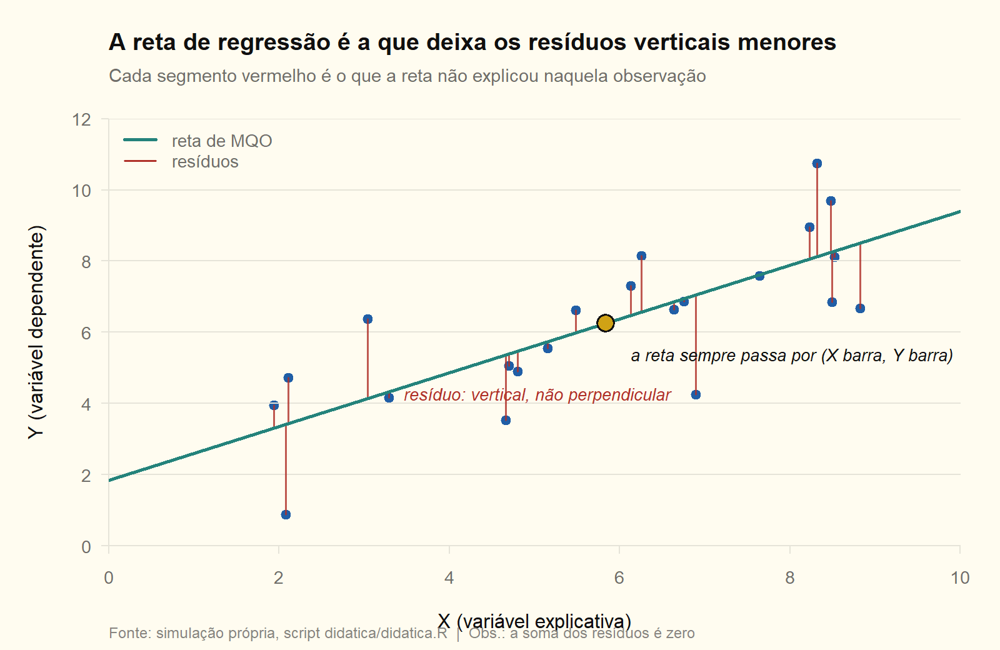

**O que olhar.** Os segmentos vermelhos são **verticais**, não perpendiculares à reta. E o ponto amarelo: a reta passa exatamente pela média conjunta $(\bar X,\bar Y)$ — consequência direta de $\hat\beta_1=\bar Y-\hat\beta_2\bar X$.

**A metáfora.** A reta é uma **vara de equilíbrio**: ela se apoia no centro de massa da nuvem e gira até que os puxões de cima e de baixo se anulem. Os resíduos somam zero porque é exatamente essa a condição de equilíbrio.

**Onde quebra.** A vara equilibra pesos iguais; o MQO pondera pelo **quadrado** do desvio, então um ponto distante puxa muito mais que dois pontos próximos. É por isso que existe a figura 16.

→ [Módulo 02](../02_mqo_simples/02_teoria.md), D02.1 e D02.2.

| chave_R | nota |
|---|---|
| dtc_f1_b2 | 0,7543 |
| dtc_f1_xbar | 5,8384 |
| dtc_f1_ybar | 6,2526 |

## 2. Por que o quadrado da distância vertical

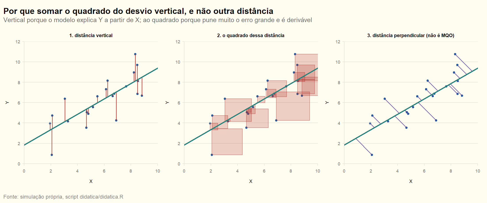

**O que olhar.** Três medidas possíveis para "erro": vertical, vertical ao quadrado, perpendicular. O MQO escolhe a do meio.

**A metáfora.** É a diferença entre **multa fixa e multa progressiva**. Somar $\lvert e_i\rvert$ é multa proporcional: dez erros pequenos custam como um erro grande. Somar $e_i^2$ é multa progressiva: um erro grande custa desproporcionalmente mais, e o estimador faz de tudo para evitá-lo.

**Onde quebra.** A analogia sugere que o quadrado é só uma escolha de severidade — mas há duas razões técnicas: a função vira **derivável** em toda parte (o valor absoluto não é) e, sob as hipóteses clássicas, é o quadrado que entrega o estimador de menor variância. A distância perpendicular resolve **outro** problema (erro nas duas variáveis), não o da regressão.

→ [Módulo 02](../02_mqo_simples/02_teoria.md), D02.1.

## 3. A decomposição da variação

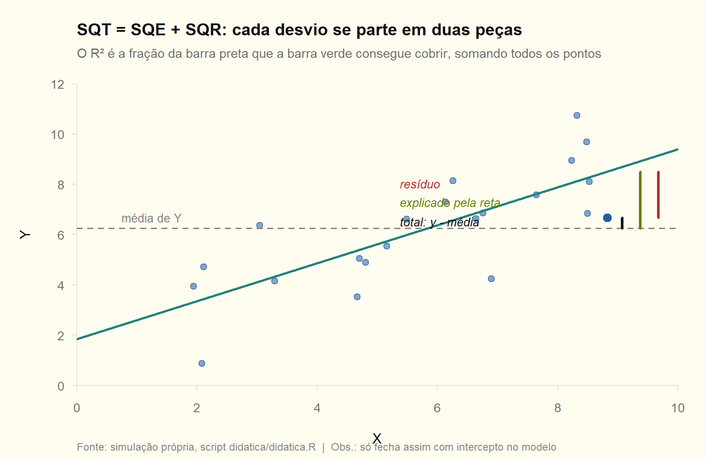

**O que olhar.** Para um ponto, a barra preta (distância até a média) se parte exatamente em verde (o que a reta explica) mais vermelho (o que sobra). Somando todos os pontos ao quadrado: $SQT=SQE+SQR$.

**A metáfora.** Um **orçamento**: a variação total de $Y$ é a receita; a regressão mostra quanto dela foi explicada e quanto ficou sem justificativa. O $R^2$ é a fração explicada do orçamento.

**Onde quebra.** Orçamento não tem parte negativa; aqui, sem intercepto no modelo, a decomposição simplesmente **não fecha** — e o $R^2$ pode até ficar negativo em algumas definições. Além disso, explicar mais não significa explicar **melhor**: acrescentar qualquer variável aumenta o $R^2$.

→ [Módulo 05](../05_ajuste_restricoes/05_teoria.md).

## 4. O alvo: viés e variância

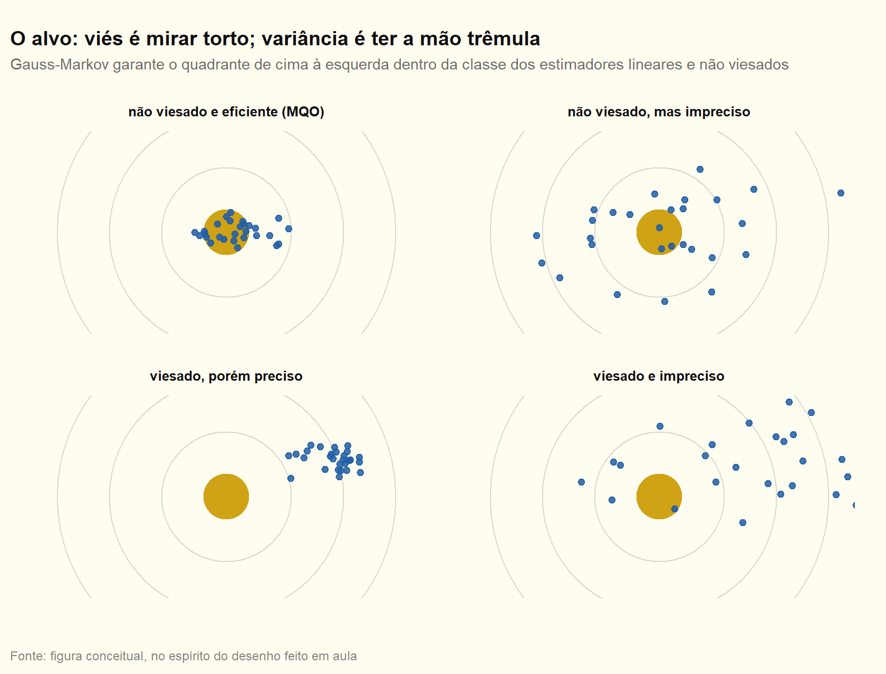

**O que olhar.** Quatro atiradores. Em cima à esquerda, os tiros cercam o centro e são agrupados — é o MQO sob as hipóteses clássicas.

**A metáfora.** **Viés é mira torta; variância é mão trêmula.** Um atirador com mira torta erra sempre para o mesmo lado, por mais firme que seja o pulso; um com a mão trêmula acerta na média, mas raramente no alvo.

**Onde quebra.** No tiro você vê onde acertou; em econometria você tem **uma única amostra** e nunca observa a nuvem — ela é hipotética, construída sobre amostras repetidas. É essa nuvem invisível que a distribuição amostral descreve (figura 5).

→ [Módulo 00](../00_fundamentos/00_teoria.md) D00.1; [módulo 06](../06_amostra_finita_multicol/06_teoria.md).

## 5. A distribuição amostral

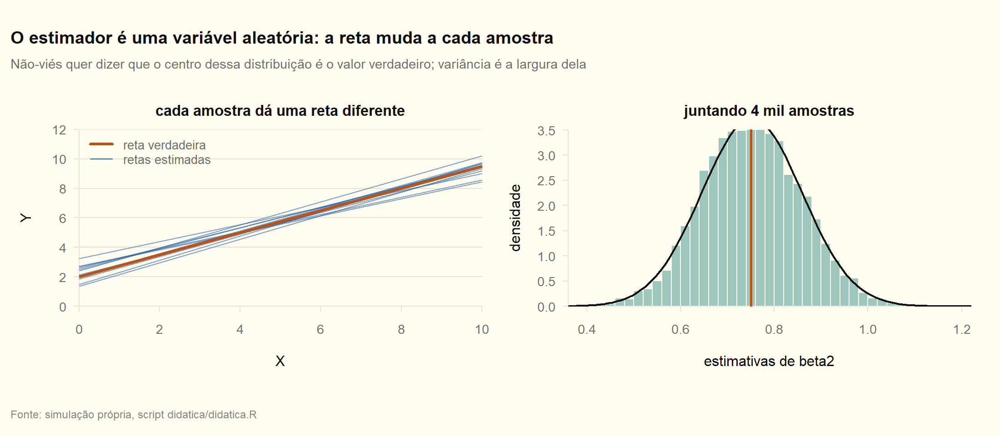

**O que olhar.** À esquerda, doze amostras do **mesmo** processo geram doze retas diferentes. À direita, quatro mil delas viram um histograma centrado no valor verdadeiro.

**A metáfora.** Cada amostra é uma **fotografia com granulação**. O objeto fotografado (o parâmetro) não muda; o grão muda a cada clique. Não-viés é a foto estar centrada no objeto; variância é o tamanho do grão.

**Onde quebra.** A foto você pode repetir; a amostra, não. Toda a inferência é sobre o que **teria acontecido** em amostras que você nunca vai coletar — por isso o intervalo de confiança se interpreta em termos de repetição, e não de probabilidade sobre o parâmetro.

→ [Módulo 02](../02_mqo_simples/02_teoria.md) D02.5; [módulo 06](../06_amostra_finita_multicol/06_teoria.md).

| chave_R | nota |
|---|---|
| dtc_f5_media_b2 | 0,7518 |
| dtc_f5_dp_b2 | 0,10722 |

## 6. Gauss-Markov em uma imagem

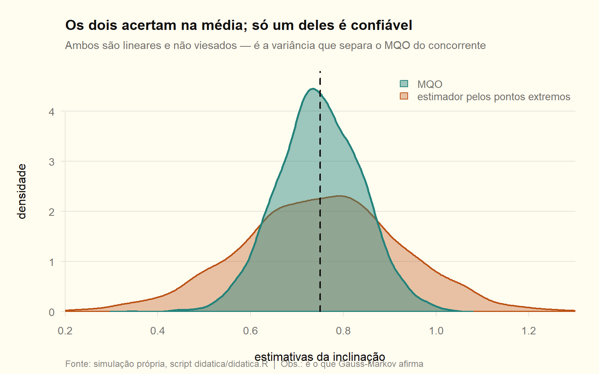

**O que olhar.** As duas distribuições têm o **mesmo centro** (os dois estimadores são não viesados), mas a laranja é muito mais larga. O concorrente usa só os dois pontos extremos; o MQO usa toda a amostra.

**A metáfora.** Duas testemunhas honestas: uma viu o filme inteiro, a outra só o primeiro e o último minuto. Nenhuma mente — mas uma é muito mais confiável.

**Onde quebra.** Honestidade aqui é **não-viés**, que depende de hipótese, não de caráter: basta $E[\varepsilon\mid X]\neq0$ e a testemunha "mente" sem saber. E Gauss-Markov só compara dentro da classe **linear e não viesada**; fora dela pode existir estimador com erro quadrático médio menor.

→ [Módulo 06](../06_amostra_finita_multicol/06_lista1.md), ex. 33.

| chave_R | nota |
|---|---|
| dtc_f6_var_mqo | 0,008186 |
| dtc_f6_var_extremos | 0,029967 |
| dtc_f6_razao | 3,661 |

## 7. A geometria da projeção

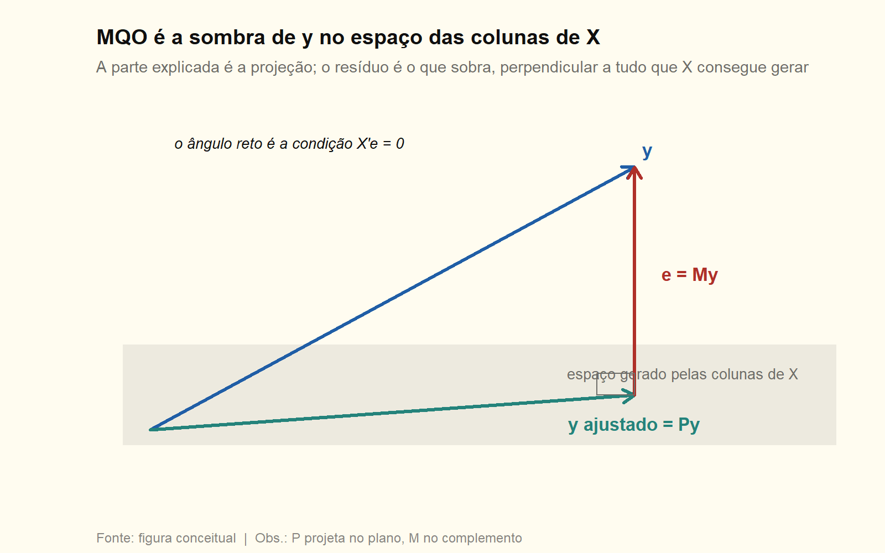

**O que olhar.** O vetor $y$ sai do plano; o ajustado é a **sombra** dele no plano gerado pelas colunas de $X$; o resíduo é o pedaço que sobra, formando ângulo reto com o plano.

**A metáfora.** **Sombra ao meio-dia.** O plano é o chão — tudo o que $X$ consegue construir. A sombra é a melhor representação de $y$ usando apenas o que existe no chão. O resíduo é a altura: a parte de $y$ que nenhum arranjo de $X$ alcança.

**Onde quebra.** Sombra depende do ângulo do sol; a projeção do MQO é única e **ortogonal** por construção — é isso que $X'e=0$ diz. E o "chão" não é o espaço das variáveis, é o espaço das **observações**: cada eixo é uma unidade amostral, não uma variável.

→ [Módulo 03](../03_mqo_matricial/03_teoria.md).

## 8. Frisch-Waugh-Lovell: o que é "controlar por"

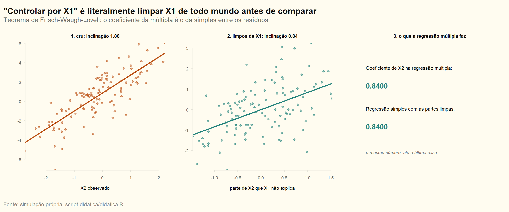

**O que olhar.** A inclinação crua é 1,86; depois de limpar $X_1$ de $y$ e de $X_2$, ela cai para 0,84 — **exatamente** o coeficiente da regressão múltipla, até a quarta casa.

**A metáfora.** Comparar o desempenho de dois alunos **descontando o tempo de estudo**: você não compara as notas brutas, compara o quanto cada um ficou acima ou abaixo do que o tempo de estudo já previa. "Controlar por" é exatamente isso, e nada mais.

**Onde quebra.** O desconto é **linear** e feito pela própria amostra. Se a relação com $X_1$ for não linear, a limpeza é imperfeita e sobra viés de forma funcional. E controlar por uma variável afetada pelo tratamento (um "colisor") **cria** viés em vez de remover.

→ [Módulo 04](../04_fwl_particionada/04_teoria.md), D04.2.

| chave_R | nota |
|---|---|
| dtc_f8_b_bruta | 1,8631 |
| dtc_f8_b_longa | 0,84002 |
| dtc_f8_b_fwl | 0,84002 |

## 9. Viés de variável omitida

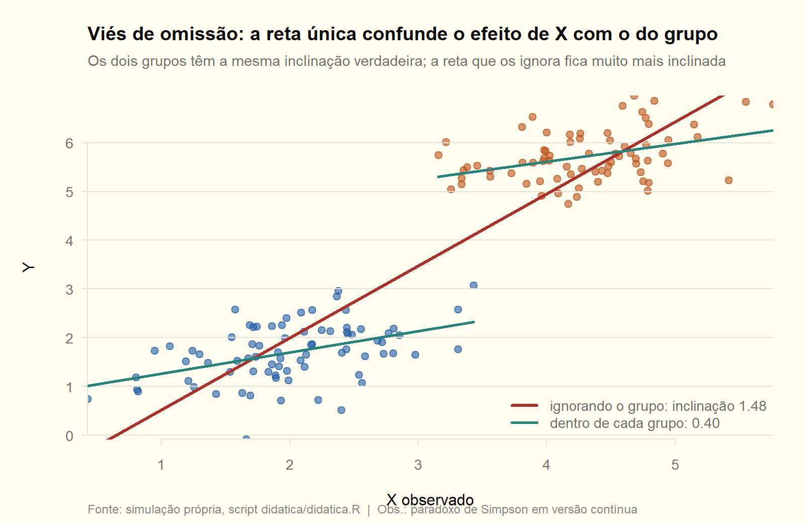

**O que olhar.** Dentro de cada grupo a inclinação é 0,40 — o valor verdadeiro. A reta que ignora o grupo dá **1,48**: quase quatro vezes maior, porque atribui a $X$ o salto que na verdade é do grupo.

**A metáfora.** Duas escadas em andares diferentes. Se você fotografa as duas de longe e traça uma linha ligando os degraus, a inclinação que aparece é a do **prédio**, não a das escadas.

**Onde quebra.** Nas escadas você enxerga os andares; a variável omitida é, por definição, **invisível**. Só a teoria econômica diz que ela existe — nenhum teste estatístico aponta o que ficou de fora.

→ [Módulo 02](../02_mqo_simples/02_lista1.md) ex. 15; [módulo 04](../04_fwl_particionada/04_lista1.md) ex. 25.

| chave_R | nota |
|---|---|
| dtc_f9_b_curta | 1,4781 |
| dtc_f9_b_longa | 0,40348 |

## 10. Multicolinearidade

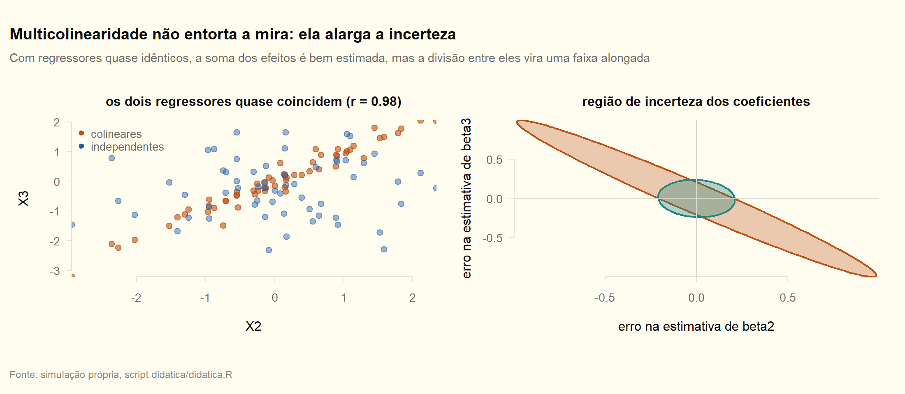

**O que olhar.** À esquerda, dois regressores quase idênticos ($r=0{,}98$). À direita, a região de incerteza dos coeficientes vira uma **elipse alongada** na diagonal: a soma dos dois efeitos é bem determinada, mas a divisão entre eles não.

**A metáfora.** Dois amigos que sempre chegam juntos à festa. Você sabe que a bagunça aumenta quando eles aparecem, mas não tem como saber **quem** fez a bagunça.

**Onde quebra.** Os amigos podem um dia chegar separados; com colinearidade **perfeita** não existe essa possibilidade nem em teoria — o parâmetro não é identificado. E, ao contrário da intuição, o modelo com colinearidade **prevê bem**: o problema é só atribuir crédito.

→ [Módulo 06](../06_amostra_finita_multicol/06_lista1.md), ex. 53, 54, 63 e 64.

| chave_R | nota |
|---|---|
| dtc_f10_cor_colinear | 0,97813 |
| dtc_f10_fiv_colinear | 23,115 |
| dtc_f10_fiv_independente | 1,0074 |

## 11. Erro de medição: a atenuação

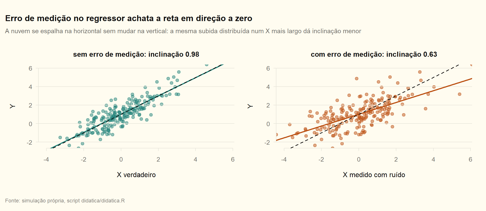

**O que olhar.** A nuvem da direita é a mesma da esquerda, **esticada na horizontal** pelo ruído da medida. A altura não muda, a largura sim — e a inclinação cai de 0,98 para 0,63, perto do fator teórico $\lambda=2/3$.

**A metáfora.** Uma régua **elástica**. A altura das pessoas não mudou; sua régua é que estica e encolhe ao medir. Como a subida total continua a mesma e a régua ficou mais longa, a "subida por centímetro" parece menor.

**Onde quebra.** A régua elástica sugere erro no instrumento; aqui o que importa é que o erro esteja no **regressor** e não seja correlacionado com ele. Erro na variável **dependente** não atenua nada — só infla a variância. E a atenuação vale para o caso clássico; com erro correlacionado, o viés pode ir para qualquer direção.

→ [Módulo 10](../10_endogeneidade_iv/10_teoria.md), D10.2 e D10.3.

| chave_R | nota |
|---|---|
| dtc_f11_b_sem_erro | 0,98345 |
| dtc_f11_b_com_erro | 0,63493 |
| dtc_f11_lambda_teorico | 0,66667 |

## 12. O que o instrumento faz

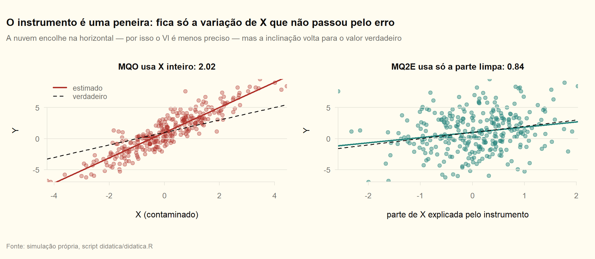

**O que olhar.** À esquerda, o MQO usa $X$ inteiro e devolve 2,02 quando o verdadeiro é 1,00 — o erro comum a $X$ e a $Y$ contamina tudo. À direita, usando só a parte de $X$ explicada pelo instrumento, a inclinação volta para perto de 1. E a nuvem **encolhe na horizontal**: é o preço em precisão.

**A metáfora.** Uma **peneira**. $X$ vem misturado: parte é variação legítima, parte é contaminação. O instrumento peneira e deixa passar só a fração limpa. Você fica com menos material — daí o erro-padrão maior — mas com material confiável.

**Onde quebra.** A peneira só funciona se o instrumento for **mesmo** limpo, e isso é hipótese, não resultado: a exogeneidade não é testável (a menos que sobrem instrumentos, via Sargan). Peneira furada, com instrumento fraco, entrega algo pior que o MQO original.

→ [Módulo 10](../10_endogeneidade_iv/10_teoria.md), D10.5 e D10.7.

| chave_R | nota |
|---|---|
| dtc_f12_b_mqo | 2,0224 |
| dtc_f12_b_iv | 0,83560 |

## 13. Heterocedasticidade

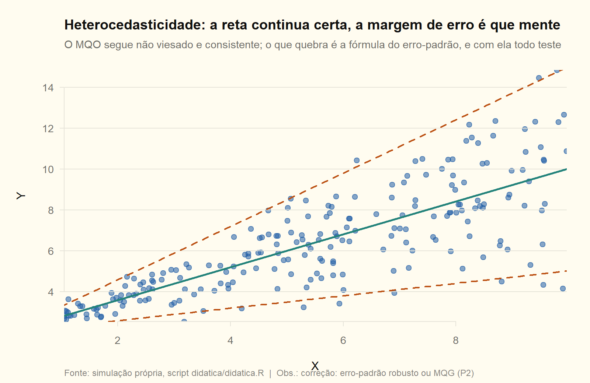

**O que olhar.** A reta continua no lugar certo; o que muda é a **abertura do cone**: a dispersão cresce com $X$. O MQO segue não viesado, mas a fórmula do erro-padrão pressupõe largura constante.

**A metáfora.** Um **termômetro descalibrado na margem de erro**: a temperatura marcada está certa, mas o fabricante promete "mais ou menos 1 grau" quando na prática é mais ou menos cinco. A leitura é boa; a confiança anunciada é falsa.

**Onde quebra.** O termômetro erra sempre igual; aqui a margem erra de forma **dependente de X** — pode subestimar numa faixa e superestimar em outra, e não existe um fator único de correção. Daí a fórmula sanduíche de White, que estima a margem ponto a ponto.

→ [Módulo 06](../06_amostra_finita_multicol/06_lista1.md) ex. 36; [módulo 08](../08_assintotica/08_teoria.md) D08.5; P2 no [módulo 11](../11_mqg_heterosk_autocorr/README.md).

## 14. Dummy e interação

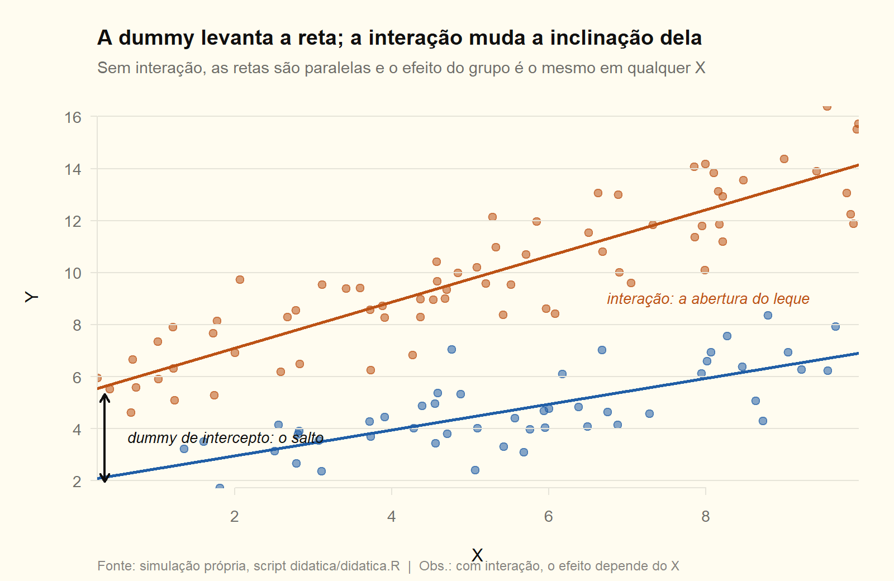

**O que olhar.** A dummy **levanta** a reta em bloco (salto de 3,36). A interação **abre o leque**: as retas deixam de ser paralelas e a diferença entre grupos passa a depender de $X$.

**A metáfora.** Dois elevadores. A dummy sozinha é **começar num andar mais alto**; a interação é **subir mais rápido**. Se só houver dummy, a distância entre os dois é a mesma em qualquer momento; com interação, a distância cresce.

**Onde quebra.** Elevadores sobem em linha reta; com interação e termo quadrático a "velocidade" muda ao longo do percurso, e a diferença entre grupos pode até inverter de sinal dentro do domínio dos dados.

→ [Módulo 09](../09_dummies_forma_funcional/09_teoria.md), D09.1 e D09.3.

| chave_R | nota |
|---|---|
| dtc_f14_salto_intercepto | 3,3558 |
| dtc_f14_dif_inclinacao | 0,39192 |

## 15. O perfil quadrático da experiência

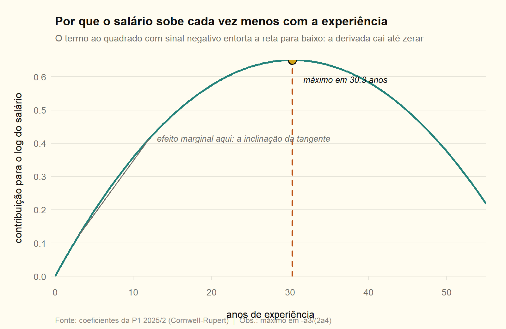

**O que olhar.** A curva sobe cada vez menos até o pico em **30,3 anos** e depois desce. A tangente desenhada é o efeito marginal naquele ponto: ele existe, mas muda a cada ano de experiência.

**A metáfora.** **Rendimentos decrescentes do aprendizado.** O primeiro ano de experiência ensina muito; o vigésimo, quase nada de novo — e, mais tarde, obsolescência e depreciação começam a pesar mais que o aprendizado.

**Onde quebra.** A parábola é **simétrica** e obriga a queda a espelhar a subida, o que é imposição da forma funcional, não dos dados. Além disso, o pico costuma cair fora ou na borda da amostra: extrapolar "o salário cai depois dos 30 anos" pode ser dizer mais do que os dados sustentam.

→ [Módulo 09](../09_dummies_forma_funcional/09_teoria.md) D09.5; é a Q1c da [P1 2025/2](../provas/p1_2025_2/README.md).

| chave_R | nota |
|---|---|
| dtc_f15_xstar | 30,307 |

## 16. Alavancagem

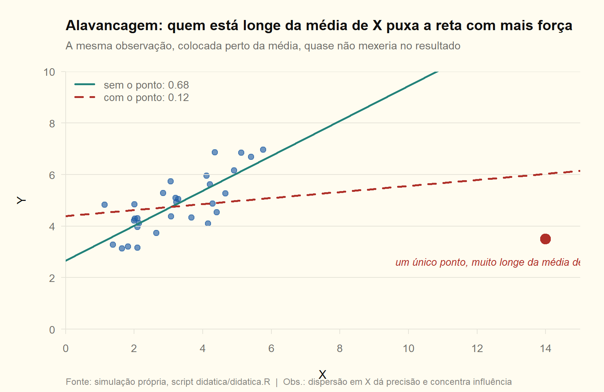

**O que olhar.** Uma única observação, longe da média de $X$, derruba a inclinação de 0,68 para 0,12. Sua alavancagem é 0,71 — sozinha, ela dita a maior parte do próprio ajuste.

**A metáfora.** Uma **gangorra**: quem senta na ponta move o conjunto com pouco esforço; quem senta perto do centro quase não muda nada, por mais que pese.

**Onde quebra.** Na gangorra, peso é peso. Aqui a influência depende de **duas** coisas: distância em $X$ (alavancagem) e tamanho do resíduo. Um ponto distante que cai exatamente sobre a reta tem alavancagem alta e influência nula.

E o detalhe elegante: é a mesma propriedade que torna a dispersão em $X$ desejável ($\operatorname{Var}(\hat\beta_2)=\sigma^2/S_{XX}$). Dispersão dá precisão — e concentra poder em quem está nas pontas.

→ [Módulo 02](../02_mqo_simples/02_teoria.md) D02.13; [módulo 06](../06_amostra_finita_multicol/06_teoria.md).

| chave_R | nota |
|---|---|
| dtc_f16_b_sem | 0,67799 |
| dtc_f16_b_com | 0,11648 |
| dtc_f16_alavancagem | 0,70805 |

---

## Mapa figura → módulo

| Figura | Conceito | Módulo |
|---|---|---|
| 1, 2 | reta, resíduos, critério de mínimos quadrados | [02](../02_mqo_simples/README.md) |
| 3 | decomposição da variação e $R^2$ | [05](../05_ajuste_restricoes/README.md) |
| 4, 5, 6 | viés, variância, distribuição amostral, Gauss-Markov | [00](../00_fundamentos/README.md), [06](../06_amostra_finita_multicol/README.md) |
| 7 | geometria da projeção, $P$ e $M$ | [03](../03_mqo_matricial/README.md) |
| 8 | Frisch-Waugh-Lovell | [04](../04_fwl_particionada/README.md) |
| 9 | viés de variável omitida | [02](../02_mqo_simples/README.md), [04](../04_fwl_particionada/README.md) |
| 10 | multicolinearidade e FIV | [06](../06_amostra_finita_multicol/README.md) |
| 11, 12 | erro de medição, endogeneidade e VI | [10](../10_endogeneidade_iv/README.md) |
| 13 | heterocedasticidade | [06](../06_amostra_finita_multicol/README.md), [11](../11_mqg_heterosk_autocorr/README.md) |
| 14, 15 | dummies, interação, forma funcional | [09](../09_dummies_forma_funcional/README.md) |
| 16 | alavancagem e influência | [02](../02_mqo_simples/README.md) |
