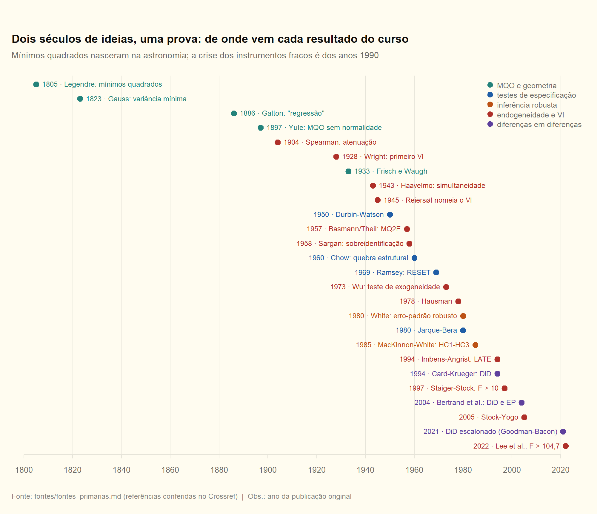

# Fontes primárias

O livro-texto entrega os resultados já polidos, sem autor e sem data. Esta nota faz o caminho inverso: para cada resultado da P1, **quem provou, onde, o que o artigo original fez de fato e em que ponto a versão do livro simplifica**. Sete desses resultados são reproduzidos em R por [fontes.R](fontes.R), com os números conferidos pelo `check_numbers`. A lista completa, com DOI, está em [referencias.md](referencias.md) e em [referencias.bib](referencias.bib), para importar no Zotero.

> [!IMPORTANT]
> **Para a P1, isto é aprofundamento, não matéria**
> O professor cobra derivação e interpretação, não história. Mas três pontos desta nota melhoram respostas de prova: o Wu-Hausman do `ivreg` é um teste de regressão aumentada ([módulo 10](#módulo-10-endogeneidade-e-variáveis-instrumentais)); o `bptest` do R não é o Breusch-Pagan original ([módulo 07](#módulo-07-testes)); e o coeficiente de uma dummy em modelo semilog não é o efeito percentual exato ([módulo 09](#módulo-09-dummies-forma-funcional-e-did)).

## Cinco leituras curtas que valem o tempo

| Leitura | Tamanho | Por que ler antes da prova |
|---|---|---|
| Lovell (2008), *Journal of Economic Education* | 4 páginas | a prova do FWL em poucas linhas: é a D04 vista de outro ângulo |
| Halvorsen e Palmquist (1980), *AER* | 2 páginas | corrige a leitura da dummy em modelo com log |
| Angrist e Krueger (2001), *JEP* | 17 páginas | VI explicado sem matrizes, de oferta e demanda até experimentos naturais |
| Stock e Trebbi (2003), *JEP* | 18 páginas | quem inventou o VI: lê como história de detetive e fixa a intuição |
| Bound, Jaeger e Baker (1995), *JASA* | 8 páginas | por que instrumento fraco é perigoso, num exemplo que ficou famoso |

---

## Módulos 00 e 02: mínimos quadrados e a palavra "regressão"

**O que os originais fizeram**

- **Legendre (1805)** publicou o método dos mínimos quadrados num apêndice de um livro sobre órbitas de cometas. Era uma regra prática para resolver sistemas com mais equações do que incógnitas, sem nenhuma justificativa probabilística.
- **Gauss (1809)** afirmou que usava o método desde 1795 e deu a primeira justificativa estatística: com erros normais, mínimos quadrados é a estimativa mais provável — em linguagem atual, **MQO é máxima verossimilhança sob normalidade**. A disputa de prioridade entre os dois é examinada por Stigler (1981).
- **Gauss (1823)** deu a segunda justificativa, agora **sem normalidade**: entre os estimadores lineares não viesados, mínimos quadrados tem a menor variância. É o teorema de Gauss-Markov. Na mesma obra aparece a divisão da soma dos quadrados dos resíduos por (observações − parâmetros), que é o $n-K$ de $E[e'e]=\sigma^2(n-K)$.
- **Fisher (1922)** fixou o vocabulário do módulo 00: consistência, eficiência e suficiência.
- **Galton (1886)** batizou a "regressão": filhos de pais muito altos tendem a ser, em média, menos altos que os pais. O nome descreve um **fenômeno** — inclinação menor que 1 entre variáveis padronizadas com correlação imperfeita —, não um método. Galton trabalhava com médias por classe e gráficos, não com mínimos quadrados.

**Onde o livro simplifica**

- O livro parte de "minimizar a SQR" e deduz as propriedades. A história foi ao contrário: a regra veio primeiro, e as duas justificativas vieram depois. Na prova, elas são as **duas rotas** que o professor cobra: máxima verossimilhança sob normalidade (h1–h5 mais A6) e Gauss-Markov (h1–h5 e variância esférica, sem normalidade).
- Gauss-Markov **não precisa** de normalidade nem de independência: basta média condicional zero, variância constante e erros não correlacionados. Listar A6 como hipótese de Gauss-Markov é erro de prova.

## Módulo 01: o paradigma e a projeção

**O que os originais fizeram**

- **Haavelmo (1944)** defendeu que um modelo econométrico só faz sentido como modelo **probabilístico**: os dados são uma realização de uma distribuição conjunta, e as relações econômicas valem em média, não exatamente. É a origem do "paradigma" do SL01.
- **Yule (1897)** mostrou que a reta de regressão é a melhor aproximação linear aos dados **mesmo sem normalidade**, ligando a correlação de Galton e Pearson aos mínimos quadrados.
- **White (1980, *International Economic Review*)** formalizou o ponto: se $E[y\mid x]$ não é linear, o MQO continua convergindo para algo bem definido, a **melhor aproximação linear** (a projeção). E esse alvo depende da distribuição de $x$: mudar a população de $x$ muda o "$\beta$" estimado, mesmo com a mesma $E[y\mid x]$.

**Reprodução.** Com $x\sim N(0,1)$ e $y=e^{x}+u$, a média condicional é exponencial. A projeção linear tem inclinação $\operatorname{Cov}(x,e^x)/\operatorname{Var}(x)=E[xe^x]=e^{1/2}$, porque $E[xe^{x}]=\frac{d}{dt}E[e^{tx}]\big|_{t=1}=te^{t^2/2}\big|_{t=1}$. O intercepto é $E[e^x]=e^{1/2}$. Com $n=200\,000$, o MQO acerta a projeção, e não a curva:

| chave_R | nota |
|---|---|
| fts_blp_b_teorico | 1,6487 |
| fts_blp_b_mqo | 1,6522 |
| fts_blp_a_mqo | 1,6457 |

**Onde o livro simplifica**

- "O MQO estima $E[y\mid x]$" só vale quando a média condicional é linear (h1 com h4). Sem isso, ele estima a projeção — que é exatamente o que o SL02 chama de paradigma da projeção. Nenhum teste $t$ ou $F$ acusa essa diferença; quem acusa é o RESET.

## Módulo 03: a álgebra matricial

**O que os originais fizeram**

- **Aitken (1936)** escreveu mínimos quadrados em notação matricial e generalizou Gauss-Markov para erros com covariância não esférica. É o teorema de Aitken, a base do MQG da P2.
- **Plackett (1950)** reuniu os teoremas de mínimos quadrados em forma matricial, incluindo a atualização das estimativas quando chega uma observação nova.
- **Hoaglin e Welsch (1978)** popularizaram o nome "matriz chapéu" para $P=X(X'X)^{-1}X'$ (ela põe o chapéu em $y$) e mostraram que a diagonal $h_{ii}$ mede a **alavancagem** de cada observação: $0\le h_{ii}\le 1$ e $\sum_i h_{ii}=K$.

**Onde o livro simplifica**

- No curso, $P$ e $M$ são ferramentas de demonstração. Em análise de dados, a diagonal de $P$ é o primeiro diagnóstico de influência: uma observação com $h_{ii}$ alto puxa a reta para si. Ver a [figura 16](../didatica/intuicao_visual.md) e o experimento 1 da [Bancada de Regressão](https://claude.ai/artifact/SP86pYTZzigmoEDA5YZ8ee).
- **Anscombe (1973)** mostrou quatro conjuntos de dados com médias, variâncias, correlação e reta de regressão praticamente iguais e gráficos completamente diferentes. A álgebra de $P$ e $M$ não substitui olhar o gráfico.

## Módulo 04: Frisch-Waugh-Lovell

**O que os originais fizeram**

- **Yule (1907)** criou a notação dos coeficientes parciais ($b_{12.3}$) e já mostrava como obter o efeito de uma variável depois de "purgar" as outras.
- **Frisch e Waugh (1933)** resolveram um problema concreto de séries temporais: incluir a tendência $t$ na regressão dá **o mesmo coeficiente** que destendenciar $y$ e $x$ antes e regredir um no outro.
- **Lovell (1963)** generalizou o resultado para qualquer conjunto de regressores, no contexto da dessazonalização: ajustar cada série pelas dummies sazonais e depois regredir equivale a incluir as dummies. Lovell (2008) deu uma prova de quatro páginas.
- **Basu (2023)** propõe chamar o resultado de teorema de Yule-Frisch-Waugh-Lovell, reconhecendo a precedência de Yule.
- **Ding (2021)** estendeu o teorema aos **erros-padrão**. A regressão parcial tem o mesmo coeficiente e os mesmos resíduos, mas o software divide a SQR por $n-K_2$ em vez de $n-K$. Por isso o erro-padrão "ingênuo" da regressão parcial sai menor por um fator exato de $\sqrt{(n-K)/(n-K_2)}$. Já o erro-padrão robusto de White (HC0) coincide exatamente.

**Reprodução do caso original.** São sessenta períodos, com $x$ e $y$ ambos com tendência. Com tendência, destendenciado e sem tendência:

| chave_R | nota |
|---|---|
| fts_fw_b_completa | 0,5569 |
| fts_fw_b_destendenciada | 0,5569 |
| fts_fw_b_sem_tendencia | 0,9436 |

A última linha é o que Frisch e Waugh queriam evitar: sem controlar a tendência, o coeficiente absorve a tendência comum e sobe cerca de 70%.

**Reprodução de Ding.** Aqui $n=60$, $K=3$ (constante, $x$, $t$) e $K_2=1$, então a razão teórica é $\sqrt{57/59}$:

| chave_R | nota |
|---|---|
| fts_ding_se_completa | 0,11192 |
| fts_ding_se_parcial_ingenuo | 0,11001 |
| fts_ding_razao | 0,98290 |
| fts_ding_razao_teorica | 0,98290 |
| fts_ding_hc0_completa | 0,12087 |
| fts_ding_hc0_parcial | 0,12087 |

**Onde o livro simplifica**

- O livro enuncia o FWL só para o coeficiente. Se a prova pedir o erro-padrão a partir da regressão parcial, é preciso corrigir: $\widehat{EP}_{\text{correto}}=\widehat{EP}_{\text{parcial}}\sqrt{(n-K_2)/(n-K)}$.

## Módulo 05: ajuste e critérios de informação

**O que os originais fizeram**

- O $\bar R^2$ costuma ser atribuído a **Ezekiel (1930)** e foi popularizado por **Theil (1961)**.
- **Akaike (1974)** propôs o AIC como estimativa da distância de Kullback-Leibler entre o modelo e a verdade — um critério de **previsão**.
- **Schwarz (1978)** derivou o BIC como aproximação da probabilidade a posteriori de cada modelo — um critério de **identificação** do modelo verdadeiro.
- **Theil e Goldberger (1961)** trataram restrições como informação estocástica ("estimação mista"). O MQ restrito do módulo 05 é o caso limite, com restrição exata.

**Onde o livro simplifica**

- O livro trata AIC e BIC como duas penalidades de tamanho diferente. Na verdade eles respondem perguntas diferentes. O BIC é **consistente**: se o modelo verdadeiro está entre os candidatos, é escolhido com probabilidade que tende a 1. O AIC não é consistente — continua escolhendo modelos grandes demais com probabilidade positiva —, mas é o melhor para prever. Com as penalidades por observação ($2K/n$ contra $K\ln n/n$), o BIC pune mais sempre que $\ln n>2$, isto é, a partir de $n=8$.

## Módulo 06: Gauss-Markov, $s^2$ e multicolinearidade

**O que os originais fizeram**

- **Markov (1900)** reapresentou o resultado de Gauss num livro-texto. **Neyman (1934)** o atribuiu a Markov, e o nome pegou. **Plackett (1949)** mostrou que o essencial já estava em Gauss.
- **Frisch (1934)** cunhou "multicolinearidade" ao estudar relações lineares **exatas** entre variáveis.
- **Farrar e Glauber (1967)** propuseram testes formais de multicolinearidade; **Marquardt (1970)** deu nome ao fator de inflação da variância; **Belsley, Kuh e Welsch (1980)** trouxeram o número de condição.
- **Goldberger (1991)**, no capítulo que chamou de "micronumerosidade", escreveu uma paródia dos capítulos de multicolinearidade dos livros da época, trocando o termo por "micronumerosidade" (amostra pequena): tudo continuava verdadeiro e igualmente inútil.

**Onde o livro simplifica**

- Multicolinearidade imperfeita **não viola nenhuma hipótese**. O MQO continua não viesado e BLUE; a variância é alta porque os dados informam pouco sobre efeitos separados. Não há correção sem informação nova (mais dados, restrição teórica). O FIV da [figura 10](../didatica/intuicao_visual.md) mostra o tamanho do estrago:

| chave_R | nota |
|---|---|
| dtc_f10_fiv_colinear | 23,1 |

## Módulo 07: testes

**O que os originais fizeram**

- A trindade: **Wald (1943)**, **Rao (1948)** com o teste escore e **Silvey (1959)**, que o reinterpretou como teste do multiplicador de Lagrange. **Engle (1984)** é a síntese para econometria.
- **Berndt e Savin (1977)** mostraram que, no modelo linear com erros normais, vale **sempre** $W\ge LR\ge LM$; **Breusch (1979)** estendeu o resultado. A prova cabe em três linhas. Seja $x=(SQR_r-SQR_u)/SQR_u\ge 0$. Então $W=nx$, $LR=n\ln(1+x)$ e $LM=nx/(1+x)$, e para todo $x\ge 0$ vale $x\ge\ln(1+x)\ge x/(1+x)$. Com os mesmos dados, os três podem dar decisões diferentes perto do valor crítico.
- **Bowman e Shenton (1975)** já tinham a estatística que combina assimetria e curtose. **Jarque e Bera (1980, 1987)** mostraram que ela é um teste LM dentro da família de Pearson e a aplicaram a resíduos de regressão. Como é assintótica, a aproximação $\chi^2(2)$ é ruim em amostras pequenas.
- **Ramsey (1969)** construiu o RESET com resíduos BLUS de Theil. A forma usada hoje — adicionar potências de $\hat y$ e fazer um $F$ — é uma simplificação posterior, discutida em Ramsey e Schmidt (1976).
- **Chow (1960)** tem **dois** testes: o de quebra estrutural, com as duas subamostras maiores que $K$, e o **preditivo**, para quando a segunda subamostra é pequena demais para estimar. Os dois supõem a mesma variância nos dois regimes; **Toyoda (1974)** mostrou que heterocedasticidade entre regimes distorce o tamanho do teste.
- **Breusch e Pagan (1979)** propuseram o teste LM de heterocedasticidade supondo erros normais. **Koenker (1981)** mostrou que, sem normalidade, o teste tem tamanho errado, e propôs a versão "studentizada" ($nR^2$ da regressão auxiliar), robusta à curtose. **White (1980)** deu o teste direto, com níveis, quadrados e produtos cruzados.
- **Durbin e Watson (1950, 1951)** tabelaram limites $d_L$ e $d_U$ porque a distribuição exata depende de $X$ — daí a zona inconclusiva. Com $y$ defasado como regressor, o DW não vale; **Durbin (1970)** propôs o $h$, e **Breusch (1978)** e **Godfrey (1978)** o teste LM geral.

**Reprodução de Berndt-Savin.** Com os dados `wage1`, o modelo de log-salário testa $H_0$: as quatro variáveis de experiência e tempo de casa são nulas. Aqui $n=526$ e $K=7$:

| chave_R | nota |
|---|---|
| fts_bs_W | 132,20 |
| fts_bs_LR | 117,93 |
| fts_bs_LM | 105,65 |
| fts_bs_F | 32,61 |

A ordem $W\ge LR\ge LM$ aparece exatamente, e $W=nqF/(n-K)$ liga o Wald ao $F$ do curso.

**Reprodução de Koenker.** Modelo de salário em nível, que é heterocedástico:

| chave_R | nota |
|---|---|
| fts_bp_koenker | 44,15 |
| fts_bp_original | 148,98 |

Os dois rejeitam, mas a estatística original é mais de três vezes maior porque a distribuição dos resíduos tem caudas pesadas.

**Onde o livro simplifica**

- O `bptest` do pacote `lmtest` usa **por padrão a versão de Koenker** (`studentize = TRUE`), e o output diz "studentized Breusch-Pagan test". Se a prova mostrar esse output, a hipótese nula é a mesma (homocedasticidade), mas o teste não supõe normalidade.
- O RESET testa **forma funcional**: $H_0$ é $E[y\mid X]=X\beta$. Ele só tem poder contra variáveis omitidas que se correlacionam com as potências de $\hat y$ — não é um teste geral de omissão. Veja também o [ex. 50 na errata](../formulario/errata_chave_lista1.md), em que a chave inverte a decisão.

## Módulo 08: assintótica e erro-padrão robusto

**O que os originais fizeram**

- **Mann e Wald (1943)** montaram a álgebra do limite em probabilidade ($o_p$, $O_p$ e funções contínuas de sequências convergentes) que o curso usa em toda prova de consistência. **Doob (1935)** está na origem do método delta; **Oehlert (1992)** é uma nota curta e didática sobre ele.
- **Eicker (1967)**, **Huber (1967)** e **White (1980)** chegaram de forma independente ao estimador sanduíche. Por isso o nome completo é Eicker-Huber-White.
- **MacKinnon e White (1985)** mostraram que o HC0 subestima a variância em amostras pequenas e propuseram HC1 (correção $n/(n-K)$), HC2 e HC3, este próximo do jackknife. **Long e Ervin (2000)** recomendam o HC3 com $n<250$.

**Reprodução.** Coeficiente de `educ` no modelo de salário em nível, com quatro erros-padrão:

| chave_R | nota |
|---|---|
| fts_hc_se_classico | 0,0493 |
| fts_hc_se_hc0 | 0,0609 |
| fts_hc_se_hc1 | 0,0612 |
| fts_hc_se_hc3 | 0,0622 |

**Onde o livro simplifica**

- "Robusto" quer dizer robusto à heterocedasticidade de forma desconhecida — **não** à endogeneidade nem a uma média mal especificada.
- Cada software entrega um "robusto" diferente. No R, `sandwich()` é o HC0 e `vcovHC()` usa o HC3 por padrão; o `robust` do Stata é o HC1. O script confere as duas identidades do R. O output do `ivreg` no ex. 67 usa `vcov = sandwich`, ou seja, **HC0**.

## Módulo 09: dummies, forma funcional e DiD

**O que os originais fizeram**

- **Suits (1957)** sistematizou o uso de dummies e a armadilha: uma dummy para cada categoria mais o intercepto gera colinearidade perfeita. Omita uma categoria ou imponha uma restrição.
- **Halvorsen e Palmquist (1980)**, em duas páginas: em $\ln y=\dots+cD$, o efeito percentual da dummy é $100(e^{c}-1)$, e não $100c$. **Kennedy (1981)** observou que $e^{\hat c}$ é viesado e propôs $100(e^{\hat c-\hat V(\hat c)/2}-1)$; **Giles (1982)** deu a versão exatamente não viesada.
- **Box e Cox (1964)** criaram a família de transformações que contém o nível e o log como casos particulares.
- DiD: **Snow (1855)** comparou mortes por cólera entre clientes de companhias de água antes e depois de uma delas mudar a captação — o exemplo fundador mais citado. **Ashenfelter (1978)** encontrou a queda de renda dos participantes **antes** de um programa de treinamento (o "Ashenfelter dip"), uma violação clássica da tendência paralela. **Card e Krueger (1994)** fizeram o 2×2 canônico: salário mínimo em Nova Jersey contra a Pensilvânia, em lanchonetes.
- **Bertrand, Duflo e Mullainathan (2004)**: com muitos períodos e correlação serial, o erro-padrão convencional do DiD é muito pequeno. Leis-placebo inventadas aparecem significativas a 5% em até 45% das simulações.
- **Goodman-Bacon (2021)**, **Callaway e Sant'Anna (2021)** e **de Chaisemartin e D'Haultfœuille (2020)** mostraram que, com adoção escalonada e efeitos heterogêneos, a regressão de efeitos fixos duplos usa unidades já tratadas como controle e pode ter pesos negativos. **Roth et al. (2023)** fazem a síntese.

**Reprodução de Halvorsen-Palmquist e Kennedy.** Diferencial de gênero no log-salário (`wage1`, com educação, experiência e tempo de casa):

| chave_R | nota |
|---|---|
| fts_hp_coef | −0,2965 |
| fts_hp_pct_ingenuo | −29,65 |
| fts_hp_pct_exato | −25,66 |
| fts_hp_pct_kennedy | −25,71 |

A leitura "ganham 29,7% menos" exagera em quatro pontos percentuais; o correto é cerca de 25,7%.

**Onde o livro simplifica**

- O livro apresenta o DiD como a regressão com interação. A identificação vem inteira da **tendência paralela**, que não é testável: pré-tendências paralelas são evidência indireta, não prova.
- Na prova, ao interpretar uma dummy em modelo log-nível, escreva a aproximação e, se o coeficiente for grande (acima de uns 0,1 em módulo), dê o valor exato $100(e^{c}-1)$.

## Módulo 10: endogeneidade e variáveis instrumentais

**O que os originais fizeram**

- **Wright (1928)**, no apêndice B de um livro sobre tarifas de óleos vegetais, estimou curvas de oferta e demanda com variáveis que deslocam só uma delas: é o primeiro estimador de VI. **Stock e Trebbi (2003)** usaram estilometria para investigar se o apêndice foi escrito por Philip Wright, o economista, ou por Sewall, o filho geneticista; a evidência aponta para o pai.
- **Reiersøl (1941)** desenvolveu a análise de confluência com momentos defasados, e o nome "variáveis instrumentais" vem do trabalho dele de 1945.
- **Haavelmo (1943, 1947)** mostrou o viés de simultaneidade. O artigo de 1947 usa justamente a função consumo keynesiana ($C=\alpha+\beta Y+u$, $Y=C+I$), o exemplo do [caderno de aula](../demonstracoes/caderno_aulas.md).
- **Spearman (1904)**, um psicólogo, derivou a atenuação por erro de medida e a correção dela, décadas antes de a econometria tratar o erro nas variáveis.
- O MQ2E foi proposto de forma independente por Theil, num memorando de 1953, e por **Basmann (1957)**. **Anderson e Rubin (1949)** já tinham o estimador LIML e um teste robusto a instrumento fraco, décadas antes de o problema ter nome.
- **Sargan (1958)** deu o teste de sobreidentificação; **Hansen (1982)** o generalizou (estatística $J$ do GMM).
- **Durbin (1954)**, **Wu (1973)** e **Hausman (1978)**: daí o nome Durbin-Wu-Hausman. O diagnóstico "Wu-Hausman" do `ivreg` é a versão por regressão aumentada: inclui os resíduos do primeiro estágio na equação estrutural e testa se são nulos com um $F$.
- Instrumentos fracos: **Nelson e Startz (1990)** mostraram o viés em direção ao MQO e a distribuição longe da normal. **Bound, Jaeger e Baker (1995)** refizeram Angrist e Krueger (1991) com trimestres de nascimento sorteados ao acaso — instrumentos inúteis por construção — e obtiveram estimativas parecidas com as originais. **Staiger e Stock (1997)** deram a regra $F>10$. **Stock e Yogo (2005)** tabelaram valores críticos: com um regressor endógeno, para que o teste de Wald a 5% não rejeite mais de 10% das vezes, o $F$ precisa passar de 16,38 com um instrumento e de 19,93 com dois.
- **Lee, McCrary, Moreira e Porter (2022)**: no caso exatamente identificado, o teste $t$ usual a 5% só tem o tamanho correto se $F>104{,}7$. Abaixo disso, é preciso um valor crítico maior que 1,96 (o procedimento $tF$).
- **Montiel Olea e Pflueger (2013)**: com erros heterocedásticos, o $F$ robusto não pode ser comparado com as tabelas de Stock e Yogo, que supõem homocedasticidade. Eles propõem o $F$ efetivo.
- **Imbens e Angrist (1994)**: com efeitos heterogêneos e monotonicidade, o VI identifica o **LATE**, o efeito médio entre os *compliers* — as unidades cujo tratamento o instrumento de fato muda.
- **Griliches (1977)** e **Card (2001)**: o viés de habilidade empurra o MQO para cima e o erro de medida o empurra para baixo. Estimativas de VI do retorno à educação costumam sair **maiores** que as de MQO — o contrário do que o viés de habilidade sozinho prevê. O LATE ajuda a explicar: quem é movido por instrumentos como a proximidade da faculdade tende a ter retorno marginal alto.

**Reprodução de Card (1995).** Log-salário contra educação, com proximidade de faculdade de quatro anos (`nearc4`) como instrumento. Controles: experiência, experiência ao quadrado, raça, área metropolitana e região. Dados do pacote `wooldridge`:

| chave_R | nota |
|---|---|
| fts_card_n | 3010 |
| fts_card_b_mqo | 0,0740 |
| fts_card_se_mqo | 0,0035 |
| fts_card_b_iv | 0,1323 |
| fts_card_se_iv | 0,0492 |
| fts_card_t_iv | 2,69 |
| fts_card_F_1estagio | 16,72 |

Leia com os critérios acima. O $F$ de 16,72 passa na regra de 10 e, por pouco, no 16,38 de Stock e Yogo. Mas está muito abaixo de 104,7: pelo critério de Lee et al., o valor crítico correto fica bem acima de 1,96, e a conclusão, que parecia confortável com $t=2{,}69$, passa a depender do ajuste. O erro-padrão do VI é 14 vezes o do MQO — é o preço da peneira da [figura 12](../didatica/intuicao_visual.md).

Compare com o output que o professor recicla ([ex. 67](../10_endogeneidade_iv/10_lista1.md)):

| chave_R | nota |
|---|---|
| m10_ex67_fraco_F_rob | 228,738 |

Com dois instrumentos, esse $F$ passa com folga em 10 e em 19,93. A ressalva de Montiel Olea e Pflueger vale aqui: é um $F$ robusto.

**Onde o livro simplifica**

- O livro supõe $\beta$ constante e diz que o VI "estima $\beta$". Com efeitos heterogêneos, estima o LATE — o efeito de quem o instrumento move —, e instrumentos diferentes estimam efeitos diferentes. É por isso que o teste de Sargan pode rejeitar mesmo com todos os instrumentos válidos.
- "$F>10$" virou dogma, mas é uma regra para o **viés** relativo, sob homocedasticidade. Para **inferência** com o teste $t$, a exigência é muito maior.

---

## Para continuar

- [cursos_e_livros.md](cursos_e_livros.md): cursos abertos (Stanford, MIT), livros gratuitos de nível de doutorado e o mapa capítulo a capítulo dos livros em `materiais/`.
- [referencias.md](referencias.md): as 104 referências, com DOI.
- [fontes.R](fontes.R): as reproduções desta nota.
